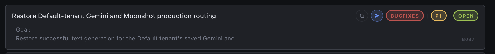

# Resolved Issue Archive

This is historical context, not an active backlog. `.mprlab/ISSUES.md`
contains only current active, blocked, planning, and recurring work.

Archive passes:

- 2026-07-24: Indexed 119 resolved issues from the `v0.2.43` release snapshot.
  Read their complete original entries with
  `git show v0.2.43:.mprlab/ISSUES.md`.
- 2026-08-10: Moved 84 resolved or retired entries from the active tracker
  after the durable-documentation and open-issue audits.

`CHANGELOG.md` remains the release-level history. This index keeps completed
issue titles discoverable without making the active tracker noisy.

## Archive conventions

- Resolved non-recurring issues remain under their original tracker section.
- The 2026-07-24 entries are a title index for the retained release snapshot.
- The 2026-08-10 entries preserve their complete bodies and resolution records.
- `M009` was historically entered as `M009R`, but it was a completed one-off
  consolidation with no recurring cadence and is archived under its canonical
  non-recurring identifier.

## BugFixes

- [x] [B068] Let text callers select a capability-validated reasoning effort.
- [x] [B001] Make management request examples copyable and provider-specific.
- [x] [B002] Present provider settings through a selected-provider editor.
- [x] [B003] Store text model and system prompt with each managed provider.
- [x] [B004] Populate management request examples before secret generation.
- [x] [B005] Move Pages deployment out of GitHub Actions and keep browser config backend-owned.
- [x] [B006] Make management admin configuration plural and deployable.
- [x] [B007] Make llm-proxy-client invalid-input tests immune to ambient client env.
- [x] [B008] Published production image accepts the current management config.
- [x] [B063] Activate the released v0.2.39 Pages artifact.
- [x] [B009] Validate management migration seed tenant defaults at startup.
- [x] [B010] Require expiration on management session JWTs.
- [x] [B011] Remove unsupported no-dictation default option from management UI.
- [x] [B012] GitHub Pages frontend remains unavailable until the workflow fix reaches master.
- [x] [B013] Fix F007 review issues in usage loading and usage queries.
- [x] [B014] Fix F007 usage dashboard follow-up review findings.
- [x] [B015] Gemini POST responses can return thought or partial text as successful output.
- [x] [B016] Long semantic-review POSTs fail transport while small requests pass.
- [x] [B017] OpenAI background semantic-review calls require manual timeout tuning.
- [x] [B018] Polled OpenAI terminal responses skip continuation and synthesis handling.
- [x] [B019] PR merge CI drops limiter coverage below 100%.
- [x] [B020] Adjust settings modal layout relative to header and footer.
- [x] [B021] Resolve Meta, upstream-rate, and release review regressions.
- [x] [B022] Validate the effective Pages push repository before deployment.
- [x] [B023] Preserve Pages release markers under branch publishing.
- [x] [B024] Prevent shell help deadlocks under constrained pipe limits.
- [x] [B025] Restore release pipeline tests after prepare release exits 2.
- [x] [B026] Retry management profile after MPR UI refreshes authentication.
- [x] [B027] Make TAuth session validation and deployment one canonical contract.
- [x] [B028] Present a direct LLM Proxy sign-in experience.
- [x] [B029] Exercise the real local TAuth and LLM Proxy session boundary in browser tests.
- [x] [B030] Keep the authenticated session until explicit sign-out.
- [x] [B031] Drive real-stack sign-in through the browser lifecycle.
- [x] [B032] Preserve sign-in button contrast on hover.
- [x] [B033] Let the verified legacy-token owner reach the dashboard after earlier sign-in created an empty account.
- [x] [B034] Hydrate the dashboard only from the canonical MPR UI authentication lifecycle.
- [x] [B035] Move workspace notifications above the footer.
- [x] [B036] Keep routing default provider/model pairs valid.
- [x] [B037] Declare the app-owned orchestration manifest completely.
- [x] [B038] Keep the DashScope catalog valid for the default endpoint.
- [x] [B039] Remove user query content from proxy request logs.
- [x] [B040] Keep invalid web-search query values out of structured logs.
- [x] [B041] {B020,B035} Render management notifications in the header immediately left of the avatar.
- [x] [B042] {B041,I014,I015} Place the LLM Proxy logo directly left of its shared-header title.
- [x] [B043] {B001} Replace the generated-secret bracket glyph with a standard copy icon.
- [x] [B044] Make GHCR and GitHub Pages publication verification wait on authoritative readiness.
- [x] [B045] {I026,F012} Make routing reasoning effort provider/model-specific and co-locate it with the text route.
- [x] [B046] {B041} Restore management notifications immediately left of the avatar or Sign in control.
- [x] [B047] {B041,B046} Auto-dismiss management notifications after the configured 10 seconds.
- [x] [B048] {M005R} Make the Go coverage client probe independent of stdin EOF.
- [x] [B049] {M005R,B048} Isolate the disposable live-provider harness from unrelated local listeners.
- [x] [B050] Compact selected-provider settings and inline key visibility.
- [x] [B051] Present Client access as a compact tenant/key row.
- [x] [B052] Add the standard `make up` local service command.
- [x] [B053] Make `make up` run the complete local browser orchestration.
- [x] [B054] Compact and align the Settings controls.
- [x] [B055] Simplify the Settings key surface.
- [x] [B056] Scope provider-key editor state to the selected provider.
- [x] [B057] Require complete client and provider key setup after authentication.
- [x] [B058] Autosave selected-provider settings and clarify retained client-key state.
- [x] [B059] Expose GPT-5 mini reasoning effort from the current OpenAI contract.
- [x] [B060] Autosave routing defaults and remove their manual save action.
- [x] [B061] Serialize Settings mutations and isolate local orchestration secrets.
- [x] [B062] Make signed-out notice expiry coverage deterministic.
- [x] [B064] Make live-harness proxy ownership coverage deterministic.
- [x] [B065] {F013} Improve selected usage-interval contrast.
- [x] [B066] {F013} Clarify the client-key replacement action.
- [x] [B067] Make local environment projection readiness deterministic.


### Complete entries archived 2026-08-10

- [x] [B129] (P2) Correct I045 cancellation and managed response-flush telemetry.
  Goal:
  Make I045 progress events and phase totals agree with the request outcome.
  Evidence:
  - OpenAI progress mapped `context.Canceled` and `context.DeadlineExceeded` to
    `completion_signal=failure`. The terminal summary mapped these errors to a
    canceled or timed-out request outcome.
  - Managed usage flushed the response before the response-formatting timer and
    the managed-usage timer. A slow flush appeared only in total request time.
  Requirements:
  - Map OpenAI context cancellation and deadline errors to
    `completion_signal=canceled` before the generic failure case.
  - Measure a managed response flush as response formatting. Start the
    managed-usage enqueue phase after the flush finishes.
  - Preserve all request budgets, provider lifecycles, public payloads, and
    managed usage data.
  Validation:
  - Drive the public handler through canceled OpenAI create and poll requests.
    Prove each progress event uses `completion_signal=canceled`.
  - Use a managed public request with a delayed response flush. Prove the delay
    enters `response_formatting_ms` and not `managed_usage_enqueue_ms`.
  - Run the required baseline and final
    `timeout -k 350s -s SIGKILL 350s make ci` pair.
  Resolution:
  - OpenAI transport cancellation and deadline errors now emit the canceled
    completion signal for create and poll progress events, consistent with the
    continuation event and terminal request outcome.
  - Managed response flushing now contributes to response formatting before
    managed usage enqueue timing begins. Public-handler coverage delays the
    flush and verifies both phase totals.
  - The required pre-change and final `make ci` runs passed all 11 gates with
    100.0% Go statement coverage. The final run completed in 118 seconds.

- [x] [B097] (P1) Return typed sanitized failures from the official Go client.
  Goal:
  Let server-side callers classify authentication, rate-limit, proxy
  work-budget, and upstream-availability failures without parsing formatted
  error strings or retaining raw response bodies.
  Evidence:
  - `pkg/llmproxyclient` returns only `ErrClientHTTPFailure` plus a formatted
    `status=<n> body=<raw>` string for every non-2xx response.
  - The public proxy publishes four stable JSON error codes for invalid request
    timeouts, provider failures, provider rate limits, and proxy work-budget
    expiry.
  Requirements:
  - Return one typed official-client failure for every completed non-2xx HTTP
    response, with read-only HTTP status and recognized stable proxy error-code
    accessors.
  - Preserve `errors.Is(error, ErrClientHTTPFailure)` while supporting
    `errors.As` for the typed failure.
  - Exclude raw response bodies from the returned error.
  - Keep transport and read failures distinct from completed HTTP responses.
  Validation:
  - Exercise the public Go client through a fake HTTP server for structured and
    unstructured non-2xx responses.
  - Prove typed status and code values, sentinel identity, sanitized error text,
    and rejection of unknown or malformed error codes.
  - Run final `timeout -k 350s -s SIGKILL 350s make ci`.
  Resolution:
  - Completed non-2xx responses now return a sanitized `HTTPFailure` with
    read-only status and recognized proxy error-code accessors while preserving
    `ErrClientHTTPFailure` identity. Raw bodies remain outside the returned
    error, and transport and response-read failures retain their distinct path.
  - Fake-server coverage passes for all four published codes and for
    unstructured, malformed, and unknown bodies. The focused Go gate passed at
    100.0% statement coverage, and final `make ci` passed all 11 gates in 102
    seconds with 100.0% Go statement coverage.

- [x] [B125] (P1) {I219} Isolate and stop public-capability test servers.
  Goal:
  Keep frontend and Pages artifact validation deterministic and free of
  background capability-server processes.
  Evidence:
  - The Playwright renderer setup starts the capability server through
    `go run`, then stops only the Go driver while its compiled CLI child keeps
    listening after the temporary test directory is removed.
  - The Pages artifact gate always starts and probes port 8080, so a running
    local stack can satisfy readiness or prevent the test-owned server from
    binding.
  Requirements:
  - Build a temporary CLI binary and run that binary directly in both test
    launchers so the recorded process is the actual server process.
  - Give the Pages artifact gate a temporary capability configuration with an
    ephemeral loopback port instead of the local runtime port.
  - Stop and wait for every test-owned server before removing its temporary
    files, and prove its HTTP listener is closed.
  - Keep validation on the real `--public-capabilities-only` CLI and
    `/api/public/capabilities` HTTP boundaries.
  Validation:
  - Focused Playwright coverage and the Pages artifact target pass without
    leaving a capability-server process or listener.
  - Run final `timeout -k 350s -s SIGKILL 350s make ci` after the last code
    edit; reuse the current exact-code passing result as the baseline.
  Resolution:
  - One frontend-owned helper now creates private temporary capability
    configurations on ephemeral loopback ports for both launchers. Each
    launcher builds and starts the actual temporary CLI binary, stops that
    exact process, waits for exit, and rejects a listener that remains open.
  - The focused Pages artifact target passed while an unrelated HTTP service
    held port 8080. The complete 89-scenario Playwright target passed with no
    matching capability-server process before or after the run. Four orphan
    servers left by the prior harness were stopped.
  - Final `make ci` passed all 11 gates in 120 seconds with 89 frontend browser
    scenarios and 100.0% Go statement coverage.

- [x] [B124] (P1) Anchor the Settings close control in the title row.
  Goal:
  Keep the Settings close control at the right edge of the title row and
  vertically centered with the title at every supported width.
  Evidence:
  - The title, conditional notification region, and close control rely on
    automatic three-column grid placement.
  - When the notification region is hidden, it leaves grid layout and the close
    control moves into the middle column beside `Settings` instead of remaining
    at the right edge.
  Requirements:
  - Give the title, notification region, and close control explicit positions
    in the Settings header grid.
  - Align the close control to the header's right content edge and center it on
    the title's vertical center whether the notification is hidden or visible.
  - Preserve notification containment, close behavior, pending-state locking,
    focus behavior, and narrow-screen layout.
  Validation:
  - Browser coverage proves right-edge and title-center geometry with the
    notification hidden and visible at desktop, compact, and mobile widths.
  - Run the required final
    `timeout -k 350s -s SIGKILL 350s make ci` after the last code edit; reuse the
    current exact-code passing result as the baseline.
  Resolution:
  - Named header grid areas now keep the title, conditional notification, and
    close control in fixed columns. The close control is aligned to the right
    content edge and centered on the title regardless of notification state.
  - The browser geometry regression failed against the prior hidden-notification
    layout with an 836.6875-pixel right-edge difference, then passed for hidden
    and visible notifications at 1280x720, 480x780, and 390x780 viewports.
  - Desktop, compact, and mobile screenshots confirm the close control remains
    in the title row's upper-right corner without overlap or overflow.
  - Final `make ci` passed all 11 gates in 121 seconds with 89 frontend browser
    scenarios and 100.0% Go statement coverage.

- [x] [B123] (P1) {B121} Initialize routing from a pending provider default.
  Goal:
  Preserve the newly selected provider default model when the same provider is
  chosen for routing before its provider-settings autosave returns.
  Evidence:
  - Provider model edits update only the provider editor while their serialized
    profile mutation is pending.
  - Routing-provider selection reads `providers[].text_model` from the last
    applied profile, so it can queue the previous model behind the provider save
    and persist that stale model as an explicit routing override.
  Requirements:
  - Wait for a matching pending provider autosave before initializing the
    routing provider/model pair from the returned current profile.
  - Keep unrelated provider and routing mutations independently editable and
    preserve the existing serialized whole-profile mutation contract.
  - Reject a delayed initialization after the tenant, authentication, Settings,
    or routing-selection context changes.
  Validation:
  - Browser coverage holds a provider-model save open, selects that provider as
    the routing default, and proves the queued defaults mutation uses the saved
    new model.
  - Run the required final
    `timeout -k 350s -s SIGKILL 350s make ci`.
  Resolution:
  - Matching routing-provider selection now waits for the provider autosave,
    rereads the current profile model, and rejects stale tenant,
    authentication, Settings, and routing-selection completions.
  - The new browser regression failed against the previous behavior with
    `gpt-4.1` instead of `gpt-5-mini`, then passed after the fix.
  - Final `make ci` passed all 11 gates in 117 seconds with 100.0% Go statement
    coverage and 87 frontend browser scenarios.

- [x] [B122] (P1) Show Settings activity notifications in the Settings title.
  Goal:
  Keep feedback from Settings actions visible while the modal obscures and
  de-emphasizes the application header.
  Evidence:
  - The application has one notification region in the MPR header.
  - The Settings overlay sits above that header, so Settings save and failure
    notices are not visibly associated with the active window.
  Requirements:
  - Render notifications caused by Settings activities in the Settings title
    row while Settings is open.
  - Keep notifications caused by page activities in the MPR header.
  - Preserve the existing live-region semantics and automatic dismissal.
  - Keep both placements usable at supported desktop and narrow widths.
  Validation:
  - Browser coverage proves a Settings success and failure appear in the
    Settings title rather than the MPR header.
  - Browser coverage proves page activity continues to use the MPR header.
  - Run the required final
    `timeout -k 350s -s SIGKILL 350s make ci`.
  Resolution:
  - Added an explicit page-versus-Settings notification surface contract and a
    live notification region inside the Settings title row.
  - Settings success and failure feedback now replaces the obscured header
    notice while page activity continues to use the MPR header.
  - Browser coverage verifies placement, live-region semantics, automatic
    dismissal, and desktop and narrow-screen containment.
  - `timeout -k 350s -s SIGKILL 350s make ci` passed all 11 gates with 100.0%
    Go statement coverage and 86 passing frontend browser tests.

- [x] [B121] (P1) Clarify and synchronize provider and routing defaults.
  Goal:
  Make a saved provider default-model change immediately update the tenant's
  active text routing model when that tenant currently routes through the same
  provider, while keeping the two default scopes explicit and independently
  editable.
  Evidence:
  - Settings can show OpenAI provider default `gpt-5.6-terra` while Routing
    defaults still shows OpenAI model `gpt-4.1`.
  - The provider-settings transaction uses eligibility-only reconciliation,
    so it preserves any model while the active provider still has a saved key.
  Requirements:
  - Add accessible help tooltips that explain when provider defaults and
    routing defaults apply.
  - Update the active same-provider routing model in the provider-settings
    database transaction and return the synchronized profile.
  - Preserve a routing default owned by another provider.
  - Preserve a compatible reasoning effort and clear an incompatible effort
    when the active route's model changes.
  - Keep explicit routing-default edits as the canonical override operation;
    do not add a second request, compatibility path, or read-time repair.
  Validation:
  - Black-box management API coverage proves same-provider synchronization,
    other-provider preservation, and incompatible-effort clearing.
  - Browser coverage proves the returned provider-save profile updates the
    visible Routing defaults model, both help tooltips expose their canonical
    explanations, and a user can then override the routing model independently.
  - Run the required final
    `timeout -k 350s -s SIGKILL 350s make ci`.
  Resolution:
  - Added keyboard- and hover-accessible help tooltips for both default scopes,
    including narrow-screen containment coverage.
  - A changed provider default model now updates the active same-provider route
    atomically, preserves compatible reasoning effort, clears incompatible
    effort, and leaves inactive-provider routes and later route overrides
    unchanged.
  - `timeout -k 350s -s SIGKILL 350s make ci` passed all 11 gates with 100.0%
    Go statement coverage and 86 passing frontend browser tests.

- [x] [B120] (P0) {B114} Keep production browser authentication on the public TAuth origin.
  Goal:
  Make the hosted MPR UI login, nonce, session restore, refresh, and logout
  requests use the browser-reachable HTTPS TAuth API.
  Evidence:
  - Production `https://llm-proxy-api.mprlab.com/config-ui.yaml` currently
    exposes `tauthUrl: "http://tauth-api:8080"`.
  - The browser blocks `/auth/nonce` as mixed content, and `tauth-api` is a
    Docker-only service alias that public clients cannot resolve.
  - Gateway capability component `url` intentionally renders the provider's
    runtime endpoint as `scheme://host:port`; `tauth.http` is therefore the
    correct container-to-container capability and the wrong hosted browser
    profile value.
  Requirements:
  - Bind `LLM_PROXY_MANAGEMENT_TAUTH_URL` to the canonical public TAuth origin
    `https://tauth-api.mprlab.com` in the selected production manifest.
  - Keep MPR UI and TAuth as the sole browser authentication owners; do not add
    an application-side auth request, proxy fallback, alias, or compatibility
    path.
  - Preserve the internal `tauth.http` capability for runtime consumers that
    actually need container-to-container traffic; do not change gateway
    capability semantics.
  Validation:
  - Lifecycle black-box coverage rejects any non-public binding for the
    browser-facing TAuth URL.
  - Run focused lifecycle validation and the required final
    `timeout -k 350s -s SIGKILL 350s make ci`.
  - Recheck the hosted config and public TAuth TLS boundary without claiming
    the source correction is deployed before the operator lifecycle completes.
  Resolution:
  - The production manifest now injects `https://tauth-api.mprlab.com` as the
    browser-facing TAuth origin while leaving the internal `tauth.http`
    capability unchanged for container consumers.
  - The lifecycle regression failed first on the internal capability binding
    and now locks the hosted profile to the canonical public HTTPS origin.
  - Focused Go validation passes with exact 100% statement coverage. The live
    v0.2.59 profile remains unchanged until the operator-owned release,
    publication, and deployment lifecycle activates this source correction.

- [x] [B119] (P1) {B118,I215} Keep selected models in one readable column.
  Goal:
  Make every selected provider's exact model versions read as one ordered
  vertical branch on the routing diagram.
  Requirements:
  - Render the selected provider's model leaves in one column at desktop,
    tablet, and mobile widths.
  - Preserve the compact desktop ingress, narrow provider leaves, generated
    catalog order, selected connector endpoints, and responsive containment.
  Validation:
  - Browser black-box coverage proves the OpenAI model group has exactly one
    rendered grid column at the desktop acceptance width.
  - Rebuild and visually inspect a provider with many models, then run the
    applicable validation from `.mprlab/POLICY.md`.
  Resolution:
  - Model groups now render as one 280-pixel-wide column at every supported
    width, preserving the compact provider stage and exact generated model
    order.
  - Increased the desktop diagram's reserved height by 40 pixels so OpenAI's
    11-row list fits without changing provider positions when a shorter model
    list is selected.
  - The browser regression failed first with two rendered model columns. It
    then exposed the 19.8-pixel provider-branch shift caused by the taller
    OpenAI list; after reserving the complete list height, all 86 focused
    browser scenarios passed with stable provider and connector endpoints.
  - Headed browser inspection verified the generated OpenAI route with all 11
    model versions in one narrow column. The final run passed all 11 CI gates
    in 122 seconds with the real TAuth black-box scenario, live-provider
    preflight, and exact 100% Go statement coverage.

- [x] [B118] (P1) {B117,I215} Compact and center the desktop routing fork.
  Goal:
  Make the full-width desktop routing map read as one compact left-to-right
  Product to Proxy to Providers to Models flow.
  Requirements:
  - Shorten the visible Product-to-Proxy connection to at most 24 pixels at the
    desktop acceptance width.
  - Reduce provider leaves from 300 pixels to at most 220 pixels so the desktop
    map reserves more width for exact model leaves.
  - Vertically center the Product and Proxy nodes against the complete provider
    branch list while keeping the selected provider in its catalog position.
  - Preserve the generated catalog, selected connector endpoints, tablet and
    mobile stacking, keyboard interaction, and responsive containment.
  Validation:
  - Browser black-box coverage proves the four desktop stages are ordered left
    to right, the Product-to-Proxy gap and provider width stay within their
    limits, and the Product and Proxy centers align with the provider-list
    center within one CSS pixel.
  - Rebuild and visually inspect the desktop routing map, then run the
    applicable validation from `.mprlab/POLICY.md`.
  Resolution:
  - Replaced the desktop two-row map with a compact left-to-right ingress,
    provider, and model grid. The Product-to-Proxy gap is 20 pixels, provider
    leaves are at most 220 pixels wide, and both ingress nodes align with the
    full provider-list center within one CSS pixel.
  - The connector canvas now selects horizontal proxy-to-provider Bézier curves
    for the desktop stage order while retaining the stacked tablet curve path;
    provider selection remains in catalog order and the highlighted
    provider-to-model curve still touches both selected leaves.
  - The browser regression failed first with 300-pixel provider leaves, a
    208.8-pixel Product-to-Proxy gap, and 322.4-pixel center offsets. All 86
    focused browser scenarios then passed after the layout change.
  - Headed browser inspection selected DeepSeek and verified the compact
    Product-to-Proxy ingress plus both highlighted Bézier stages. The
    satisfactory 129-second CI result was reused as the unchanged-input
    baseline; the final run passed all 11 gates in 117 seconds with 86 browser
    tests, the real TAuth black-box scenario, live-provider preflight, and exact
    100% Go statement coverage.

- [x] [B117] (P1) {I215} Keep the selected provider in place and draw its model fan.
  Goal:
  Preserve the approved routing fork so selecting any provider visibly draws
  that provider's outgoing Bézier fan to its supported model leaves.
  Evidence:
  - The selected provider receives `order: -1`, so every selection moves to the
    top of the provider list instead of keeping the generated catalog order.
  - Existing browser coverage proves only that the canvas is nonempty; it does
    not prove the selected provider remains in place or that an accent curve
    leaves its model-facing edge.
  Requirements:
  - Keep provider leaves in their generated catalog order across pointer and
    keyboard selection.
  - Draw the selected provider-to-model fan from the selected provider's
    model-facing edge, matching the approved working visualization.
  - Preserve dynamic catalog generation, exact model selection, responsive
    behavior, and compact provider and model leaves.
  Validation:
  - Add browser black-box coverage that first fails with the current selected
    provider reordering, then proves multiple provider selections retain their
    positions and expose accent pixels at the selected provider and model
    connector endpoints.
  - Run the applicable validation from `.mprlab/POLICY.md`.
  Resolution:
  - Removed the selected-provider order override, so every generated provider
    remains in its catalog position while selection changes only its visual
    state and active model group.
  - The browser regression failed first by proving Moonshot swapped positions
    with OpenAI. It now proves keyboard and pointer selections keep all provider
    positions fixed and samples the rendered canvas for accent pixels at both
    the selected provider's outgoing edge and the selected model's incoming
    edge.
  - Headed browser inspection selected Zhipu in its original final position and
    verified the highlighted proxy-to-provider curve plus the outgoing
    provider-to-`glm-5.1` Bézier fan.
  - The satisfactory 119-second CI result was reused as the unchanged-input
    baseline. The final run after the last source and test edits passed all 11
    gates in 129 seconds with 86 browser tests, 36 Python tests, the real TAuth
    black-box scenario, live-provider preflight, and exact 100% Go statement
    coverage.

- [x] [B116] (P1) {I214,B114} Keep the real mobile sticky footer compact.
  Goal:
  Preserve the canonical sticky footer without letting its hydrated MPR UI
  surface consume excess mobile viewport height.
  Evidence:
  - At 390 by 780 pixels, the real `mpr-ui@latest` footer is fixed and reserves
    its in-flow footprint, but its controls wrap into a 78.6-pixel surface while
    the canonical compact-footer contract allows at most 56 pixels.
  - The application Playwright fixture renders a 48-pixel hand-built footer, so
    its compact-height assertion does not exercise the deployed component path.
  Requirements:
  - Retain the supported MPR footer attributes, all canonical links, the exact
    `Built by Marco Polo Research Lab` project-catalog label, theme control,
    semantic no-JavaScript fallback, and sticky spacer behavior.
  - Keep the hydrated footer at or below 56 pixels without horizontal overflow
    at 390 pixels wide, and preserve desktop geometry.
  - Verify compact geometry through the real MPR UI black-box browser path; do
    not claim deployed footer correctness through the application-owned mock.
  Validation:
  - Rebuild and inspect representative routes through `http://localhost:4179/`
    at desktop and 390-pixel widths.
  - Run the required baseline and final
    `timeout -k 350s -s SIGKILL 350s make ci` pair.
  Resolution:
  - The supported public wrapper now keeps every footer control on one compact
    row while retaining the full project label and existing MPR UI inputs.
  - The real TAuth/MPR UI browser test waits for hydration, then asserts fixed
    positioning, all viewport anchors, the shared 56-pixel limit, and no footer
    overflow at 390 pixels wide.
  - The canonical landing and docs routes at `http://localhost:4179/` rendered
    54.2-pixel footers at 390 by 780 pixels; every visible control remained
    inside the viewport, and the project drop-up opened with its full catalog.
  - The required baseline passed all 11 gates in 110 seconds. The final run
    passed all 11 gates in 113 seconds with 85 browser tests, 36 Python tests,
    the real TAuth black-box scenario, live-provider preflight, and exact 100%
    Go statement coverage.

- [x] [B115] (P1) {F019,I213} Align public capability-catalog table rows.
  Goal:
  Keep every provider, model, and capabilities cell on the same visual row
  boundary in the generated public catalog.
  Evidence:
  - At the canonical local landing page, catalog rows are about 67 pixels tall
    while the Model cell computes as a 42-pixel `display: flex` box, so its
    bottom border ends above the Provider and Capabilities cell borders.
  Requirements:
  - Preserve the semantic table and server-rendered no-JavaScript catalog.
  - Keep each `td` in the table formatting context and move model identifier
    and default-badge wrapping and spacing into an inner content wrapper.
  - Preserve the responsive model-to-default-badge gap at desktop and mobile
    widths.
  Validation:
  - Browser black-box coverage proves that all three cells retain table-cell
    display and share their row's top and bottom boundaries at desktop and
    mobile widths.
  - Rebuild and inspect the catalog through `http://localhost:4179/`.
  - Run the required baseline and final
    `timeout -k 350s -s SIGKILL 350s make ci` pair.
  Resolution:
  - The generated Model cell remains a semantic table cell, while the new
    inner `catalog-model__content` wrapper owns badge wrapping and spacing.
  - Browser coverage now checks every catalog cell at desktop and mobile
    widths for table-cell display and exact row-boundary alignment while
    retaining the eight-pixel default-badge gap.
  - The rebuilt canonical local page at `http://localhost:4179/` rendered all
    58 rows and 174 cells with zero top or bottom boundary deviation at 1210
    and 390 pixels wide; the desktop visual inspection showed continuous rules.
  - The required baseline passed all 11 gates in 112 seconds. The final run
    passed all 11 gates in 101 seconds with 85 browser tests, 36 Python tests,
    the TAuth black-box scenario, live-provider preflight, and exact 100% Go
    statement coverage.

- [x] [B114] (P1) {B111,B112,B113} Restore the single MPR UI authentication path and correct the shared public contract.
  Goal:
  Keep browser authentication fully owned by MPR UI while preserving the
  authenticated landing redirect, shared responsive footer, and accurate
  privacy disclosure.
  Evidence:
  - The generated shell loads `tauth.js` directly before `mpr-ui-config.js`,
    creating an application-owned authentication bootstrap outside the
    canonical `/config-ui.yaml` contract.
  - The real browser test invokes the exposed TAuth credential-exchange global
    instead of exercising the shared MPR UI login control.
  - Narrow-screen footer CSS targets private `.mpr-footer__*` markup and
    `data-mpr-footer` internals that are not part of the MPR UI DSL.
  - The Privacy page says LLM Proxy cannot read HttpOnly authentication
    cookies, although the backend receives and validates the configured session
    cookie through TAuth's published `sessionvalidator`.
  Requirements:
  - Remove the direct TAuth browser script and every generated/static assertion
    that requires or invokes its global API. Keep `/config-ui.yaml`,
    `mpr-ui-config.js`, declarative MPR UI markup, and documented auth lifecycle
    events as the only browser authentication path.
  - Exercise interactive authentication through the visible MPR UI login
    surface and retain real session restoration, refresh-cookie recovery,
    authenticated landing replacement, and explicit logout coverage.
  - Remove host styling and test selectors that depend on private MPR UI footer
    markup. Configure the shared footer only through supported component
    attributes and verify observable accessibility and geometry.
  - State accurately that browser JavaScript cannot read HttpOnly cookies while
    the backend receives and validates the session cookie only to authorize
    protected LLM Proxy resources.
  Validation:
  - Static generation rejects direct `tauth.js` loading and private MPR UI
    footer selectors across every generated page.
  - Browser black-box coverage authenticates through the visible shared control
    and proves the existing login, restore, refresh, route, and logout outcomes.
  - Regenerated legal pages contain the corrected cookie boundary.
  - Run the required baseline and final
    `timeout -k 350s -s SIGKILL 350s make ci` pair.
  Resolution:
  - All public and application pages now load only the canonical MPR UI
    configuration and runtime. Shared-shell generation and Go/browser static
    coverage reject any application-authored `tauth.js` bootstrap.
  - The real browser black box activates the visible MPR UI login control,
    receives real TAuth HttpOnly cookies through the seeded provider adapter,
    opens `/app/`, restores and refreshes the session across navigation, and
    signs out through the visible shared control without manual auth events or
    application-owned TAuth calls.
  - The footer uses MPR UI's supported `wrapper-class` attribute. Host CSS and
    geometry assertions no longer depend on private MPR UI markup or data
    attributes.
  - The generated Privacy page now distinguishes the browser JavaScript cookie
    boundary from backend authorization through TAuth's published validator,
    and integration documentation describes MPR UI as the sole browser-auth
    owner.
  - The required baseline passed before implementation. The final CI run passed
    all 11 gates in 99 seconds with 85 browser tests, 36 Python tests, the real
    TAuth management black box, live-provider preflight, and exact 100% Go
    statement coverage.

- [x] [B113] (P1) {B111,B112,F019} Prevent authenticated sessions from rendering the anonymous landing page.
  Goal:
  Make `/` an anonymous-only route and `/app/` the only authenticated
  application route, including when MPR UI restores an existing TAuth session.
  Evidence:
  - MPR UI restores the session and renders the authenticated user profile on
    `/`, but `sign-in-redirect-url` intentionally runs only after an interactive
    sign-in, so the public landing remains visible.
  - Existing browser coverage proves interactive login and authenticated reload
    only after the browser is already on `/app/`; it never opens `/` with an
    authenticated or refresh-cookie-backed session.
  Requirements:
  - Register the landing route policy before the shared MPR UI bootstrap can
    emit its authenticated lifecycle and replace `/` with `/app/` for every
    documented `mpr-ui:auth:authenticated` event.
  - Keep login, session restoration, refresh, cookies, and logout fully owned by
    MPR UI and its internal TAuth integration. Do not add TAuth requests, cookie or
    storage inspection, protected-API probes, or an application authentication
    state machine.
  - Keep interactive login from documentation, resource, privacy, and terms
    pages on MPR UI's documented `sign-in-redirect-url` contract; authenticated
    users may continue to read those public routes.
  - Use history replacement for the authenticated landing transition so browser
    Back and the authenticated brand link cannot reintroduce `/`.
  Validation:
  - Browser integration coverage proves anonymous `/` remains public,
    interactive login replaces it with `/app/`, and a restored authenticated
    visit to `/` cannot render or remain on the landing page.
  - The real MPR UI/TAuth black box proves both access-cookie restoration and
    refresh-cookie recovery from `/` replace the route with `/app/`, while
    explicit sign out remains on anonymous `/`.
  - Static coverage proves only the landing route owns the authenticated route
    guard and all other public routes preserve the canonical interactive login.
  - Run the required baseline and final
    `timeout -k 350s -s SIGKILL 350s make ci` pair.
  Resolution:
  - The generated landing header now registers one route-specific guard before
    MPR UI bootstrap. It consumes the documented authenticated lifecycle and
    replaces `/` with `/app/`; it performs no TAuth request, cookie inspection,
    storage inspection, or session management.
  - Documentation, resource, privacy, and terms routes retain MPR UI's
    canonical `sign-in-redirect-url` for interactive login, while the landing
    route has one authenticated redirect owner.
  - Browser coverage proves anonymous landing access, history-replacing
    interactive login, restored authenticated landing replacement, anonymous
    application rejection, and shared-shell route ownership. The real
    MPR UI/TAuth black box proves access-cookie restoration, refresh-cookie
    recovery from `/`, and explicit logout back to the anonymous landing.
  - Backend authorization remains on TAuth's published Go `sessionvalidator`;
    no TAuth communication or validator was added to the LLM Proxy contract.
  - The required baseline and final CI runs passed all 11 gates with 85 browser
    tests, 36 Python tests, the real TAuth management black box, live-provider
    preflight, and exact 100% Go statement coverage.

- [x] [B112] (P1) {B111,F019} Restore the authenticated dashboard through the canonical MPR UI and TAuth session.
  Goal:
  Make successful public authentication open `/app/` and keep the user
  authenticated across ordinary page refreshes while all browser-side TAuth
  communication remains delegated to MPR UI.
  Evidence:
  - A real Google credential exchange returns `200` and the shared header shows
    the authenticated profile, but the page remains on `/`.
  - Browser `GET /auth/session` requests return `403`; the same endpoint returns
    `204` only when a synthetic `Origin` header is added.
  - Browser same-origin `GET` requests do not send `Origin`. MPR UI's TAuth
    integration sends the configured `X-TAuth-Tenant` header, but the local TAuth
    tenant-header override is disabled, so session restore cannot resolve the
    tenant.
  Requirements:
  - Load the canonical MPR UI configuration and runtime on every auth-aware
    public and application page. LLM Proxy must not load a separate TAuth
    browser client or implement auth endpoint requests, credential exchange,
    cookie handling, session restoration, refresh, logout, or auth redirect
    recovery.
  - Keep `/auth` and `/me` behind the local same-origin frontend proxy and make
    the local TAuth profile resolve the explicit TAuth client tenant header.
  - Verify startup with the exact MPR UI session request headers,
    without a synthetic `Origin`, and keep nonce verification aligned with the
    MPR UI request contract.
  - Exercise the black-box browser flow through the same-origin auth proxy,
    invoke credential exchange through the visible MPR UI control, prove the
    shared-component post-auth redirect to `/app/`, and prove ordinary reload
    plus refresh-cookie recovery remain authenticated.
  - Keep backend request authorization on TAuth's published Go
    `sessionvalidator`; LLM Proxy may enforce only its resource-specific
    management invariants after validation.
  Validation:
  - Operational coverage rejects a local TAuth profile without explicit
    tenant-header resolution and rejects readiness probes that hide the
    browser request shape.
  - The real MPR UI/TAuth black-box test uses MPR UI for login, session
    restoration, refresh, and logout through the frontend
    origin, verifies the session request headers, opens `/app/` after the
    authenticated lifecycle, and survives refresh.
  - Backend coverage exercises the published TAuth validator through the
    protected management API boundary.
  - Run the required baseline and final
    `timeout -k 350s -s SIGKILL 350s make ci` pair.
  Resolution:
  - Every auth-aware page now loads the canonical MPR UI configuration and
    runtime. LLM Proxy application modules contain no separate TAuth client,
    TAuth endpoint, cookie, storage, credential-exchange, restore, refresh,
    logout, or redirect implementation.
  - Local TAuth resolves MPR UI's explicit tenant header for same-origin
    session requests, and startup verifies the exact client session and nonce
    request shapes through the frontend proxy.
  - The real browser black box now exchanges a seeded credential through the
    visible MPR UI control, follows MPR UI's authenticated redirect to `/app/`,
    restores the session after reload, recovers with the refresh cookie, and
    signs out through the visible shared control.
  - Backend authorization remains on TAuth's published Go `sessionvalidator`;
    no second token parser or TAuth protocol was added to LLM Proxy.
  - The required baseline and final CI runs passed. The final run passed all
    11 gates in 97 seconds with 84 browser tests, 36 Python tests, the real
    TAuth management black box, live-provider preflight, and exact 100% Go
    statement coverage.

- [x] [B111] (P1) {F019,P004,P005} Make public Log In authenticate directly and unify the site footer.
  Goal:
  Present LLM Proxy as one application by starting the canonical MPR UI/TAuth
  login from every public page, opening `/app/` only after authentication, and
  publishing one compact site footer across public, legal, and app surfaces.
  Evidence:
  - Public `Log In` controls are plain links to `/app/`, so an anonymous user
    reaches a second screen that asks them to sign in again.
  - The anonymous `/app/` panel duplicates the header authentication control
    and makes the public site and authenticated workspace appear unrelated.
  - Public pages hide the legal link while `/app/` renders a different footer;
    `/privacy/` and `/terms/` are not published.
  Requirements:
  - Make the shared public MPR header the declarative `/config-ui.yaml` owner,
    label its authentication action `Log In`, and redirect successful
    interactive authentication to `/app/` through the documented MPR UI
    contract.
  - Redirect an anonymous direct `/app/` visit to `/` after the documented MPR
    UI unauthenticated lifecycle event. Remove the anonymous app panel and do
    not add application-owned session, token, cookie, or TAuth requests.
  - Render one compact non-sticky footer on public pages, `/app/`, `/privacy/`,
    and `/terms/`. Include Resources, Privacy, Terms, GitHub, and an active
    `Built by Marco Polo Research Lab` drop-up with the maintained MPR project
    catalog.
  - Publish deterministic `/privacy/` and `/terms/` documents from one
    repository-owned legal-page source with semantic static content and the
    MPR legal-document component.
  - Rewrite every generated auth-aware header to the absolute production API
    config URL while preserving the local same-origin `/config-ui.yaml`
    contract.
  Validation:
  - Browser integration coverage proves public `Log In` owns the interactive
    authentication flow and redirects to `/app/` only after success.
  - Browser coverage proves an anonymous direct `/app/` visit returns to `/`,
    the obsolete anonymous panel is absent, and authenticated app startup still
    waits for the documented MPR UI lifecycle.
  - Static and hydrated coverage proves all published HTML surfaces use the
    canonical header/footer, legal routes are present in the sitemap, and the
    portfolio drop-up is keyboard accessible at desktop and mobile widths.
  - The site-render contract proves every auth-aware generated page uses the
    production API config URL.
  - Run the required baseline and final
    `timeout -k 350s -s SIGKILL 350s make ci` pair.
  Resolution:
  - The canonical MPR header now owns public authentication and redirects to
    `/app/` only after success. Anonymous direct app visits return to `/`, so
    the duplicate sign-in screen and app-owned authentication path are gone;
    static coverage rejects direct public `/app/` anchors.
  - One generated non-sticky footer now publishes Resources, Privacy, Terms,
    GitHub, the theme control, and the keyboard-accessible MPR project drop-up
    across public, legal, resource, and authenticated app surfaces, with a
    crawlable native fallback when JavaScript is unavailable.
  - Deterministic Privacy and Terms pages now provide semantic fallback copy,
    the MPR legal-document component, canonical metadata, and sitemap entries;
    rendered auth config URLs are rewritten across every generated HTML page.
  - The required baseline passed all 11 gates immediately before the final
    correction. The final run passed all 11 gates in 100 seconds with 84
    browser tests, 36 Python tests, the TAuth
    black-box scenario, live-provider preflight, and exact 100% Go statement
    coverage.

- [x] [B110] (P1) {F019,B105,B109} Resolve the remaining public-site review correctness findings.
  Goal:
  Make the public-site validation and local cleanup contracts fail visibly when
  their authoritative inputs or lifecycle state are invalid.
  Requirements:
  - Type-check every production browser module in the binding frontend lint
    gate and resolve the complete module graph without weakening diagnostics.
  - Reject capability catalogs containing an identifier that has no public
    presentation definition.
  - Remove the temporary local-site artifact only after Compose shutdown
    succeeds, and return a failure when automatic shutdown fails.
  Validation:
  - Static frontend validation covers every production browser JavaScript file.
  - Go integration coverage proves unknown capability identifiers fail the site
    render contract.
  - Operational coverage proves failed shutdown retains the mounted artifact
    and exits unsuccessfully.
  - Run the required baseline and final
    `timeout -k 350s -s SIGKILL 350s make ci` pair.
  Resolution:
  - Frontend lint now discovers every generator and production browser module,
    normalizes browser-only cache query specifiers in a temporary mirror, and
    runs `tsc --noEmit` across the complete tree. The resulting JSDoc fixes are
    published with coherent application revision `20260806b110`.
  - Site rendering now rejects every capability identifier without exactly one
    public presentation definition and reports the provider and model context
    through `site_render_failed`.
  - Automatic local shutdown now retains the mounted site artifact and exits
    unsuccessfully when Compose shutdown fails; black-box operational coverage
    proves both the retained directory and visible failure receipt.
  - The required baseline passed all 11 gates in 104 seconds. The first
    post-edit run found one stale `b109` cache assertion; after correcting that
    assertion, the final run passed all 11 gates in 101 seconds with 82 browser
    tests, 36 Python tests, the TAuth black-box scenario, live-provider
    preflight, and exact 100% Go statement coverage.
- [x] [B109] (P1) {F019,I209} Resolve the public-site review validation findings.
  Goal:
  Keep cached authenticated-app module graphs coherent, enforce JSDoc
  type-checking in the frontend lint gate, and publish current documentation
  freshness metadata.
  Requirements:
  - Bump one revision across both authenticated-app entrypoints and the complete
    first-party ES-module graph after the renamed integrity-error export.
  - Run `tsc --noEmit` from the binding frontend lint command for edited browser
    JavaScript and add `// @ts-check` to the edited syntax checker.
  - Set the generated `/docs/` sitemap `lastmod` to the current significant
    update date and regenerate the sitemap.
  Validation:
  - Static browser coverage rejects stale or inconsistent authenticated-app
    module revisions.
  - The frontend lint gate passes TypeScript checking and generated-resource
    drift checks.
  - Run the required baseline and final
    `timeout -k 350s -s SIGKILL 350s make ci` pair.
  Resolution:
  - Both authenticated-app entrypoints and every first-party runtime import now
    use revision `20260806b109`; static browser coverage rejects an unversioned
    or stale module-graph edge.
  - Frontend lint now runs TypeScript 7 `tsc --noEmit` against the edited
    production browser and generator modules. The syntax checker has
    `// @ts-check`, JSDoc sort unions are explicit, and generator data is
    narrowed before use.
  - The canonical contract-documentation date is `2026-08-06`; regenerated
    resource metadata and `site/sitemap.xml` publish that date for `/docs/`.
  - The required baseline passed all 11 gates in 97 seconds. After correcting
    two stale date assertions found by the first post-edit run, the final run
    passed all 11 gates in 95 seconds with 82 browser tests, 36 Python tests,
    the TAuth black-box scenario, live-provider preflight, and exact 100% Go
    statement coverage.
- [x] [B108] (P1) {F019,I209} Toggle capability filters from the catalog search control.
  Goal:
  Match Kamu's reversible search disclosure so the magnifying-glass control can
  both reveal and collapse the advanced capability filters.
  Requirements:
  - Make consecutive magnifying-glass activations alternate the filter panel
    between visible and hidden states with matching `aria-expanded` state.
  - Preserve automatic disclosure when search input begins or receives focus,
    Escape collapse, Enter disclosure, capability-badge activation, selected
    filters, search results, and sorting state.
  - Keep the complete no-JavaScript catalog and compact responsive layout.
  Validation:
  - Playwright exercises repeated pointer activation, keyboard disclosure and
    collapse, accessibility state, filtering, and narrow-screen containment
    through the rendered public site.
  - Run the required baseline and final
    `timeout -k 350s -s SIGKILL 350s make ci` pair.
  Resolution:
  - The magnifying-glass control now alternates the advanced capability panel
    between visible and hidden states and keeps `aria-expanded` synchronized.
  - Search focus, typing, and Enter still disclose filters; Escape collapses
    them. Selected capabilities, filtered results, and table sorting survive a
    collapse-and-reopen cycle, and the full catalog remains available without
    JavaScript.
  - Playwright covers pointer toggling, keyboard behavior, accessibility state,
    preserved filter state, and mobile containment. A headed Chromium check
    confirmed the rendered panel and accessibility state on both clicks.
  - The required baseline passed all 11 gates in 95 seconds. The final
    post-edit run passed all 11 gates in 96 seconds with 82 browser tests, 36
    Python tests, the TAuth black-box scenario, live-provider preflight, and
    exact 100% Go statement coverage.
- [x] [B107] (P1) Add the standard `make down` local service command.
  Goal:
  Provide a symmetric public shutdown command for every local Compose resource
  started by `make up`.
  Requirements:
  - Declare `down` as a phony Make target and route it through the exact local
    Compose project and file owned by `make up`.
  - Stop the local containers, project network, and orphaned services through
    `docker compose down --remove-orphans` while retaining the named local data
    volumes.
  - Keep the Compose identity in one canonical declaration shared by startup
    and shutdown, and fail visibly when Docker Compose or shutdown fails.
  - Let shutdown run independently from private local-environment preparation.
  Validation:
  - Exercise the real `make down` boundary with a fake Docker edge and prove the
    target remains phony, selects the exact local project and Compose file,
    removes orphans, and does not delete named volumes.
  - Run the required baseline and final
    `timeout -k 350s -s SIGKILL 350s make ci` pair.
  Resolution:
  - `make down` is a phony public target that stops the exact
    `llm-proxy-local` Compose project with orphan cleanup and retains its named
    TAuth and management data volumes.
  - Startup and shutdown consume one shared Compose project and file identity.
    Shutdown validates Docker Compose, runs independently from private local
    environment preparation, propagates failures, and prints a terminal
    shutdown receipt on success.
  - Black-box Make coverage proves the target runs even when a `down` file is
    present and invokes the exact project/file command without a volume-removal
    option. The required baseline and final `make ci` runs each passed all 11
    gates in 95 seconds with 82 browser tests, 36 Python tests, and exact 100%
    Go statement coverage.
- [x] [B106] (P1) {F019} Remove workspace terminology from the web site.
  Goal:
  Present one public product site and one authenticated LLM Proxy app without
  exposing a separate workspace concept anywhere in browser-served content.
  Evidence:
  - The shared public shell already links to `/app/` as `Log In`, but landing,
    app lifecycle, metadata, and generated resource copy still say workspace.
  - One generated resource URL and several frontend identifiers also publish
    the obsolete term in static site bytes.
  Requirements:
  - Use `Log In` for public navigation to `/app/`, `App` for application
    lifecycle copy, `account` for signed-in ownership, and `tenant` for exact
    technical isolation or persistence contracts.
  - Remove the obsolete term from every browser-served HTML, JavaScript, CSS,
    XML, metadata, structured-data, and URL artifact under `site/`.
  - Update canonical generators and product documentation, regenerate the
    resource cluster, and delete the obsolete resource URL without an alias.
  Validation:
  - Add a static publication guard and browser coverage that fail on any
    case-insensitive occurrence in the served site.
  - Verify the public shell and authenticated app copy in Chromium.
  - Run the required baseline and final
    `timeout -k 350s -s SIGKILL 350s make ci` pair.
  Resolution:
  - Every browser-served artifact now uses `Log In` for `/app/`, `App` for
    lifecycle copy, `account` for signed-in ownership, and `tenant` for exact
    isolation and persistence contracts. The obsolete term has zero
    case-insensitive occurrences under `site/`.
  - Canonical generators and product documentation were updated. The resource
    URL is now `/resources/multi-tenant-ownership-migration/` without an alias;
    its evidence, metadata, sitemap date, publication brief, and migration
    runbook CTA passed the independent SEO evaluation.
  - Static publication validation and the 80-test Playwright suite reject any
    recurrence. Chromium verified the landing `Log In` navigation and the
    authenticated app sign-in state.
  - The required baseline passed all 11 gates in 91 seconds. The final run
    passed all 11 gates in 90 seconds with 80 browser tests, 36 Python tests,
    the TAuth black-box scenario, exact OpenAPI Pages publication,
    live-provider preflight, and exact 100% Go coverage.
- [x] [B105] (P1) {F019} Populate the local landing capability matrix.
  Goal:
  Make the localhost landing page publish the current validated provider and
  model capability catalog instead of an empty section.
  Evidence:
  - Release rendering replaces `<!-- llm-proxy-capability-catalog -->` with the
    sanitized catalog projected from `configs/config.yml`.
  - `make up` mounts the unrendered `site/` source directly into ghttp, so the
    local `/` page retains only the marker and displays no matrix.
  Requirements:
  - Keep `proxy.NewPublicCapabilityCatalog` and the Go site renderer as the
    single validated catalog path.
  - Render a temporary local site artifact from the active configuration before
    ghttp starts, and serve that artifact through `http://localhost:4179/`.
  - Remove the temporary artifact when local orchestration stops.
  Validation:
  - Exercise the local orchestration contract and prove its served landing page
    contains the generated provider/model matrix without private provider data.
  - Verify the populated matrix in Chromium.
  - Run the required baseline and final
    `timeout -k 350s -s SIGKILL 350s make ci` pair.
  Resolution:
  - `make up` now renders an isolated temporary public-site artifact from the
    active `configs/config.yml` through the existing validated Go catalog
    renderer. The API health gate rejects a missing or unrendered matrix before
    ghttp serves the artifact read-only, and shutdown removes the artifact.
  - The orchestration contract verifies generated matrix content, rejects
    private provider configuration, and proves cleanup after interruption.
    Chromium verified the live localhost catalog with 12 text providers, 53
    text routes, 4 dictation providers, and 5 dictation routes.
  - The required baseline passed all 11 gates in 93 seconds. The final run after
    the last code edit passed all 11 gates in 97 seconds with 79 browser tests,
    36 Python tests, the TAuth black-box scenario, exact OpenAPI Pages
    publication, live-provider preflight, and exact 100% Go coverage.
- [x] [B104] (P1) {F019} Expose explicit OpenAPI view and download actions.
  Goal:
  Let a visitor inspect the canonical OpenAPI manifest in the browser or
  download its exact YAML bytes from the existing human-readable reference.
  Evidence:
  - `/docs/` is already generated from `docs/openapi.yaml`, but its
    `Download exact schema` link has no `download` contract and opens the raw
    YAML instead.
  - The shared footer links directly to `/openapi.yaml`, bypassing the
    human-readable reference and leaving no explicit view-versus-download
    choice.
  Requirements:
  - Keep `docs/openapi.yaml` as the only hand-maintained schema source.
  - Use `/docs/` as the schema viewer and expose separate raw-view and YAML
    download actions backed by `/openapi.yaml`.
  - Route the shared public OpenAPI navigation to the viewer actions.
  Validation:
  - Prove the generated viewer and downloaded file equal the canonical source
    byte for byte and use an explicit download filename.
  - Keep the generated documentation provenance and drift checks current.
  - Run the required baseline and final
    `timeout -k 350s -s SIGKILL 350s make ci` pair.
  Resolution:
  - `/docs/#openapi-schema` is the public schema action surface. Its generated
    reference offers `View YAML`, a bounded inline viewer containing the full
    canonical manifest, and `Download YAML`, which downloads `/openapi.yaml`
    as `llm-proxy-openapi.yaml`.
  - The viewer content, human-readable operations, source digest, and download
    all derive from `docs/openapi.yaml`; no second editable schema or external
    viewer was introduced. The shared public footer now opens these actions.
  - Playwright verifies the inline viewer text and downloaded bytes equal the
    canonical source exactly, including the explicit filename. The required
    baseline passed all 11 gates in 92 seconds, and the final run after the
    last code edit passed all 11 gates in 96 seconds with 79 browser scenarios,
    the TAuth black-box scenario, exact OpenAPI Pages publication,
    live-provider preflight, and exact 100% Go coverage.
- [x] [B103] (P1) {F019} Use the shared MPR header and footer on every public page.
  Goal:
  Give `/docs/` and every public page the same declarative MPR shell.
  Evidence:
  - `/docs/` and generated resource pages use custom native header and footer
    wrappers instead of `mpr-header` and `mpr-footer`.
  - The landing page uses `mpr-footer` but still owns a separate native header.
  Requirements:
  - Define one canonical public `mpr-header` and compact `mpr-footer` contract.
  - Apply it to `/`, `/docs/`, `/resources/`, and every generated resource page.
  - Load the MPR UI stylesheet and bundle on every public route family.
  - Preserve exactly one header, one main region, and one footer in document
    order without changing the authenticated `/app/` shell.
  Validation:
  - Prove the generated HTML contains only the shared components and no custom
    public shell wrappers.
  - Exercise component hydration, navigation, document order, and compact
    responsive geometry through Playwright.
  - Run the required baseline and final
    `timeout -k 350s -s SIGKILL 350s make ci` pair.
  Resolution:
  - One shared renderer now publishes the exact same compact `mpr-header` and
    `mpr-footer` on the landing page, `/docs/`, `/resources/`, and all 46
    generated resource articles. Every public route loads the MPR UI assets,
    and the page-specific native shell wrappers and their CSS are removed.
  - The landing-shell and OpenAPI generators reject drift from the canonical
    renderer. Playwright verifies byte-identical shell markup across all 49
    sitemap HTML pages and hydrated desktop and mobile behavior for every
    public route family, including header-main-footer order and compact footer
    geometry. The authenticated `/app/` shell remains unchanged.
  - The required baseline and post-change `make ci` runs pass. The final run
    followed the last code edit and passed all 11 gates in 90 seconds: exact
    100% Go coverage, 36 Python tests, 78 browser scenarios, the TAuth
    black-box scenario, exact OpenAPI Pages publication, and live-provider
    preflight.
- [x] [B102] (P1) {F019} Publish the authenticated web application only at `/app/`.
  Goal:
  Make `/app/` the single canonical route for the authenticated web application.
  Evidence:
  - The authenticated site source currently lives under a management-named
    directory, and generated landing, API, and resource links use that route.
  Requirements:
  - Move the authenticated site source and release renderer to `/app/`.
  - Update canonical metadata, generators, documentation, and public links to
    use `/app/`.
  - Do not retain a second application route, redirect, alias, or compatibility
    path.
  - Keep the authenticated application out of the public sitemap and retain its
    `noindex` metadata.
  Validation:
  - Prove `/app/` renders the authenticated application and the removed route
    returns `404`.
  - Prove generated OpenAPI and resource pages link only to `/app/`.
  - Run the required baseline and final
    `timeout -k 350s -s SIGKILL 350s make ci` pair.
  Resolution:
  - The authenticated source and rendered release artifact now live only at
    `site/app/index.html` and `/app/`; the removed route has no source,
    redirect, alias, or compatibility handler and returns `404`.
  - Landing, OpenAPI, resource, README, canonical metadata, and generated SEO
    references now point to `/app/`. The application remains `noindex` and is
    excluded from the public sitemap.
  - Renderer, static-site, Playwright, and TAuth black-box coverage exercise
    `/app/` and explicitly reject the removed route where applicable.
  - The required baseline and post-change `make ci` runs pass. After formatting
    was applied, the final run followed the last code edit and passed all 11
    gates in 90 seconds: exact 100% Go coverage, 36 Python tests, 76 browser
    scenarios, the TAuth black-box scenario, exact OpenAPI Pages publication,
    and live-provider preflight.
- [x] [B101] (P1) {I029,F019} Serve the canonical OpenAPI schema from local ghttp.
  Goal:
  Make `http://localhost:4179/openapi.yaml` serve the same current OpenAPI file
  used by release publication without introducing a second schema source.
  Evidence:
  - Local ghttp mounts only `site/`, where `openapi.yaml` is intentionally
    absent, so the landing-page OpenAPI links return `404` under `make up`.
  - Release rendering already stages exact `docs/openapi.yaml` bytes and CI
    rejects both publication drift and a tracked `site/openapi.yaml` duplicate.
  Requirements:
  - Mount `docs/` read-only in a schema-only ghttp service and proxy the exact
    `/openapi.yaml` path through the local frontend.
  - Keep `site/openapi.yaml` forbidden and retain `docs/openapi.yaml` as the
    only hand-maintained schema.
  - Make local startup verify the schema route and make browser coverage
    exercise the rendered artifact rather than a test-only schema handler.
  Validation:
  - Prove the local Compose mount and startup probe through the operational
    black-box test.
  - Prove the rendered public schema remains byte-equivalent to the canonical
    source through Playwright and the Pages artifact gate.
  - Run the required baseline and final
    `timeout -k 350s -s SIGKILL 350s make ci` pair.
  Resolution:
  - Local Compose now mounts `docs/` read-only in a schema-only ghttp service
    and proxies only `/openapi.yaml` through the public local frontend, keeping
    `docs/openapi.yaml` as the sole editable contract.
  - `make up` now requires the schema service and a successful public schema
    probe before reporting ready. A real-stack acceptance returned `200`, and
    the response matched `docs/openapi.yaml` byte-for-byte.
  - Operational coverage proves the mount, proxy, service, and readiness
    contracts. Playwright stages the real Pages artifact and serves its schema
    from disk, while the existing publication gate continues to reject drift
    and any tracked `site/openapi.yaml` duplicate.
  - The required baseline and post-change `make ci` runs pass. The final run
    followed the last code edit and passed all 11 gates in 89 seconds: exact
    100% Go coverage, 36 Python tests, 76 browser scenarios, the TAuth black-box
    scenario, exact OpenAPI Pages publication, and live-provider preflight.
- [x] [B100] (P0) Make declared frontend validation self-contained in a clean checkout.
  Goal:
  Make the public `make test` and `make ci` contracts install their exact pinned
  frontend dependencies and Chromium before invoking Playwright.
  Evidence:
  - Agentic execution of recurring issue M001R at exact remote revision
    `95457e317a93e85b6b225babd9064284089dab1d` passed Go and Python baseline
    validation, then failed with `playwright: not found` and zero provider
    requests.
  - The GitHub workflow installs npm dependencies and Chromium before calling
    `make ci`, while the repository Make targets assume that untracked state
    already exists.
  Requirements:
  - Give Make one canonical dependency-preparation target using the pinned npm
    lock and the declared Chromium browser.
  - Make clean `make test`, `make lint`, focused frontend targets, and `make ci`
    cross that preparation boundary before frontend validation.
  - Remove workflow-only duplicate setup so hosted and Agentic execution use
    the same public contract.
  - Keep dependency state untracked and do not add an alternate validation
    path or fallback browser.
  Validation:
  - Add a black-box Make regression that invokes the public targets with an
    empty dependency state and records exact npm preparation/test ordering.
  - Run the focused regression and the required final
    `timeout -k 350s -s SIGKILL 350s make ci`.
  Resolution:
  - Make now installs the exact lockfile graph and invokes its pinned Playwright
    binary to install Chromium into ignored project-local state before any
    frontend validation target runs.
  - The preparation stamp makes recursive `make ci` stages reuse that exact
    state, while a changed package manifest or lockfile requires preparation
    again.
  - Black-box Make fixtures prove clean focused frontend, `make test`, and
    `make ci` executions prepare dependencies exactly once and in the required
    order. Hosted CI now delegates the same setup to `make ci` instead of
    maintaining a second workflow-only path.
  - The focused dependency-contract target, real pinned dependency and browser
    preparation, 75 frontend browser tests, and one TAuth browser black-box
    test passed. The required final `make ci` returned zero with all 11 gates
    complete and exact 100% Go statement coverage.
- [x] [B098] (P0) Make canonical CI completion fail closed and visible.
  Goal:
  Make `make ci` prove that every declared gate completed in the current run,
  show the enforced coverage at the terminal tail, and return nonzero whenever
  orchestration stops before that proof is complete.
  Evidence:
  - A captured successful baseline returned zero after all current gates, but
    its `total: ... 100.0%` coverage line appeared at line 533 while the final
    line 650 was only the live-provider harness preflight message.
  - The dependency-only `ci` target has no start/end receipt, active-stage
    failure report, fresh run identity, or terminal success assertion.
  - A future summary that reads the repository-level ignored `coverage.out`
    could accept stale evidence when a coverage command exits zero without
    producing a current artifact.
  - Hosted CI selects Go `1.25.12` independently while `go.mod` and both
    production builders require Go `1.26.5`.
  Requirements:
  - Run the canonical gates sequentially through one top-level runner even when
    the caller supplies parallel Make flags.
  - Treat every exit before terminal completion as failure, including an
    accidental zero exit from the runner, and identify the active stage.
  - Require a fresh run-scoped coverage artifact and independently verify exact
    100% Go statement coverage after all test gates.
  - Print one terminal table containing every completed gate, the coverage
    result, elapsed time, and an unambiguous `CI PASSED` line only after the
    complete contract succeeds.
  - Select the hosted Go toolchain from `go.mod` instead of a second version
    declaration.
  Validation:
  - Add black-box runner scenarios for complete success, a nonzero child gate,
    and a child that returns zero without producing current coverage evidence.
  - Prove failure output names the interrupted stage and never prints the
    success receipt.
  - Run the required final
    `timeout -k 350s -s SIGKILL 350s make ci`.
  Resolution:
  - `make ci` now owns one sequential ten-stage runner with an exit trap that
    converts every incomplete exit into failure and names the active gate.
  - Go coverage is written to a private artifact created for that invocation,
    verified at its producer and again after the final test stage, then removed.
    A zero-exit stage without current coverage evidence fails before completion.
  - The terminal output now contains per-gate receipts, elapsed time, exact Go
    coverage, and an explicit `CI PASSED` line emitted only after private
    run-state cleanup succeeds. Cleanup failure remains a named failing stage
    and cannot print the terminal summary or success receipt.
  - Black-box process coverage proves complete success, exact propagation of a
    child exit 23, rejection of a zero-exit test sequence missing its current
    coverage artifact, and rejection of cleanup failure after every declared
    gate completes. Hosted CI now selects its Go version directly from
    `go.mod`.
  - The required final `timeout -k 350s -s SIGKILL 350s make ci` returned zero
    after the last code edit with exact 100% Go statement coverage, 33 Python
    tests, 75 browser tests, one TAuth browser black-box test, the OpenAPI Pages
    artifact check, and the live-provider harness preflight. Its terminal table
    reported all 11 gates passed in 86 seconds.
- [x] [B096] (P0) Make deployment self-contained in the application repository.
  Goal:
  Preserve the exact `make release`, `make publish`, `make deploy` operator
  surface without requiring an installed MPRLab controller, an
  `mprlab-gateway` source checkout, or any sibling repository.
  Evidence:
  - The merged B095 implementation reduced `make deploy` to
    `mprlab-deploy`, and a clean operator invocation failed with
    `make: mprlab-deploy: No such file or directory`.
  - Installing a content-addressed executable under `~/.local/bin` repaired
    that machine but made application deployment depend on hidden,
    machine-global MPRLab state.
  - The release gate also intermittently failed its asynchronous `make up`
    orchestration fixture because the test reused a five-second help-command
    deadline for complete Compose startup and shutdown.
  - A fresh CI run rewrote tracked generated Python `*.egg-info` metadata from
    version `0.1.0` to the canonical project version `0.2.0`, dirtying the
    worktree that release admission requires to remain clean.
  Requirements:
  - Execute only tracked files from this repository plus ordinary documented
    tools such as Git, Docker, Python/uv, Ansible, SSH, and GitHub CLI.
  - Keep deployment playbooks, tasks, inventory documentation, and resource
    declarations under `.mprlab/deploy`; do not locate, download, install, or
    execute an MPRLab binary, gateway checkout, bundle, or sibling repository.
  - Preserve exact sealed-release and published-artifact admission before any
    remote mutation.
  - Keep retries convergent and conflicts fail-closed.
  - Give asynchronous orchestration acceptance its own bounded timeout so
    machine load cannot make an unchanged release nondeterministic.
  - Keep generated Python build metadata untracked.
  - Keep production deployment user-owned.
  Validation:
  - Add black-box Make scenarios proving dry-run and deployment delegation use
    only the current repository's tracked Ansible entrypoint.
  - Prove an absent `mprlab-deploy`, absent gateway checkout, and malformed
    sibling repository cannot affect the transaction.
  - Run the required final
    `timeout -k 350s -s SIGKILL 350s make ci`.
  Resolution:
  - `make deploy`, `make deploy-dry-run`, and `make deploy-syntax` now execute
    the complete tracked `.mprlab/deploy/ansible` transaction through pinned
    `ansible-core`; no MPRLab-specific executable, controller bundle, gateway
    checkout, repository-parent selector, or sibling repository is resolved.
  - Admission proves clean `master`, the exact sealed release commit and
    annotated tag, the published branch, equal version/`latest` image digests,
    the published Pages artifact, and regular mode-`0600` private inputs before
    remote mutation.
  - The convergent transaction replaces only llm-proxy's TAuth tenant and
    owned origins, validates the complete Caddy route set before activation,
    pulls only a missing immutable image, converges one Compose service,
    verifies both declared public boundaries, and activates Pages last.
  - Black-box coverage runs the real playbook twice against an isolated target,
    preserves unrelated TAuth/Caddy state, proves one image pull/restart/reload,
    and remains successful with a malformed sibling plus obsolete external
    selector variables.
  - The local-orchestration acceptance test now has its own bounded 30-second
    deadline, and generated Python `*.egg-info` files are no longer tracked, so
    ordinary CI load and package metadata generation do not dirty or randomly
    fail the release gate.
  - The ignored operator inventory was migrated in place at mode `0600`; the
    rejected orphaned controller cache was moved to Trash. No production
    deployment command was run.
  - The required final `timeout -k 350s -s SIGKILL 350s make ci` passes with
    exact 100% Go statement coverage, 33 Python tests, 75 browser tests, one
    TAuth browser black-box test, 57 release/deployment tests, and the
    live-provider harness preflight.
- [x] [B095] (P0) Keep deployment declarations app-owned and execution platform-owned.
  Goal:
  Preserve the standard `make release`, `make publish`, `make deploy` lifecycle
  while making every retry convergent and removing deployment-resource
  orchestration from llm-proxy.
  Evidence:
  - The prior deploy flow selected sibling checkouts and failed on unrelated
    app manifests.
  - A proposed app-bundled gateway archive moved platform implementation into
    llm-proxy and introduced direct TAuth/Caddy awareness instead of removing
    the coupling.
  Requirements:
  - Keep only declarative deployment resource and Ansible inventory YAML in
    `.mprlab/deploy`.
  - Make `make deploy` invoke one installed neutral controller with no
    selectors, gateway paths, image arguments, or resource-specific flags.
  - Resolve exactly the current Git repository; never scan or validate sibling
    checkouts during this app deployment.
  - Verify immutable release and publication state before mutation, reuse exact
    matches, reject conflicts, and converge when any lifecycle command is
    repeated.
  - Keep TAuth runtime integration in the published client/session boundary and
    keep TAuth/Caddy deployment reconciliation outside application code.
  Validation:
  - Add black-box repeated zero-argument Make delegation and declaration-only
    repository contracts.
  - Validate the target-neutral gateway controller and its idempotent installer
    without production contact.
  - Run the required final
    `timeout -k 350s -s SIGKILL 350s make ci`.
  Resolution:
  - `make deploy` is now a zero-argument handoff to the installed
    `mprlab-deploy` controller. It carries no product selector, gateway
    checkout, image override, or repository-parent input.
  - The app-owned deployment surface is limited to the committed resource
    manifest and conventional Ansible inventory YAML. App-bundled controller
    archives, locks, playbooks, shell/Python orchestration, and capacity
    readers were removed.
  - Black-box contracts prove repeated delegation remains exact, obsolete
    environment inputs cannot change the handoff, controller failures
    propagate, and only the declaration files remain tracked.
  - The gateway controller and installer gates pass without production
    contact. The required final repository `make ci` passes.
- [x] [B094] (P1) Run the full CI suite once per release lifecycle.
  Goal:
  Make `make release` the sole full-suite validation stage while requiring
  `make publish` and `make deploy` to prove they continue that exact sealed
  release.
  Evidence:
  - `tools/gitrelease/scripts/prepare_release.sh` runs `make ci` before it
    seals `.git/mprlab-release`.
  - `make publish` already consumes and validates that sealed manifest.
  - `scripts/deploy.sh` reruns `make ci` before deployment and exposes
    `--skip-ci` plus a deploy-only CI timeout, even though it separately checks
    the release tag, published image, and Pages artifact.
  Requirements:
  - Keep the complete `make ci` gate in `make release`.
  - Remove the deploy-time CI run, skip flag, and deploy-only CI timeout.
  - Make deployment fail before gateway, registry, or Pages work unless the
    local sealed manifest identifies the exact release tag and commit being
    deployed.
  - Keep publication and deployment artifact verification intact; do not add a
    fallback, compatibility path, or manually asserted success marker.
  Validation:
  - Add black-box lifecycle scenarios for a missing sealed release, a sealed
    version mismatch, and a valid continuation that reaches the gateway
    without invoking the fixture `ci` target.
  - Run the required baseline and final
    `timeout -k 350s -s SIGKILL 350s make ci` pair.
  - Run the gateway `make verify-app-workflows` cross-repository contract
    without production contact.
  Resolution:
  - `make release` remains the lifecycle's sole full `make ci` gate.
    Deployment no longer has a CI invocation, CI timeout, or `--skip-ci`
    bypass.
  - `make deploy` now requires `local-release-state` to report `sealed` and
    requires its version and release commit to match the selected annotated
    tag and deploy `HEAD` before any gateway, registry, or Pages work.
  - Black-box coverage rejects a missing seal, mismatched version, mismatched
    commit, the removed CI bypass, and a noncanonical tag; the valid sealed
    continuation reaches the gateway without invoking the fixture CI target.
  - The required baseline and final repository `make ci` runs pass. The final
    run includes exact 100% Go statement coverage, 33 Python tests, 75 browser
    tests, the authentication black-box test, 58 release-tool tests, and the
    live-provider harness preflight.
  - Gateway `make verify-app-workflows` reports llm-proxy ready and passes the
    cross-repository lifecycle contract without production contact.
- [x] [B093] (P0) Publish prepared OCI platform indexes without rejecting attestations.
  Goal:
  Make `make publish` converge when current Docker Buildx publishes each
  prepared platform image as an OCI index containing the runnable image
  manifest and its provenance attestation.
  Evidence:
  - The real `make release` completed for `v0.2.50`, including all CI gates,
    both platform archives, the Pages archive, the changelog-only release
    commit, annotated tag, and sealed manifest.
  - The first `make publish` pushed `master`, `v0.2.50`, the GitHub Release,
    `manifest.json`, `pages.tar.gz`, and the prepared amd64 platform tag before
    failing with `published platform tag is not a single immutable image
    manifest`.
  - Standard `docker buildx imagetools inspect --raw` proves the platform tag
    is an OCI index whose digest exactly equals the prepared local image ID. It
    contains one `linux/amd64` image manifest and one `unknown/unknown` SLSA
    attestation manifest that references the runnable manifest.
  - The publisher assumes a bare image manifest and compares its config digest
    with the local image ID. With the current Docker containerd image store,
    that local ID identifies the complete platform index instead.
  Requirements:
  - Treat one OCI index with exactly one declared Linux platform image and its
    matching provenance attestation as the canonical platform artifact.
  - Require the remote platform-index digest to equal the prepared local image
    ID before reusing it.
  - Validate a version index as the exact union of the descriptors from every
    prepared platform index, including their attestations.
  - Preserve partial publication and reuse exact remote state; do not rebuild,
    replace, delete, or retag an immutable published object.
  - Continue using only standard Docker CLI publication and inspection
    boundaries.
  Validation:
  - Cover fresh publication, exact retry, missing version/latest recovery,
    uncertain inspection, and immutable conflict through the black-box release
    suite.
  - Run the required final
    `timeout -k 350s -s SIGKILL 350s make ci` after the last code edit.
  - Merge through a ready PR with hosted CI, then verify the forward release
    with exact `make release && make publish` retries on clean `master`.
  Resolution:
  - Platform publication now accepts only the canonical OCI index containing
    exactly one runnable Linux image descriptor and its matching provenance
    attestation, and requires the remote index digest to equal the prepared
    image ID.
  - Version publication now validates the exact descriptor union from every
    prepared platform index, preserving immutable partial state across retries.
  - The 54-scenario black-box release suite, direct standard-Docker inspection
    of the published platform index and composed version index, and the final
    repository `make ci` all pass.
- [x] [B092] (P0) Make the container inspection-bound test deterministic.
  Goal:
  Verify that every registry inspection is independently bounded without
  coupling the release gate to nested wall-clock timers.
  Evidence:
  - B091's final `make ci` proved the repaired operational test under a
    22.777-second Go package run, then failed in
    `test_container_manifest_digest_bounds_each_inspection_attempt`.
  - The container test expected two fake Docker attempts but observed one
    during a 151.503-second release-suite run.
  - The fixture wraps two real one-second `timeout` calls and a real one-second
    delay inside an outer five-second timeout. Host scheduling can consume the
    outer budget before the second process starts, so the assertion measures
    scheduler timing rather than the script's per-attempt command contract.
  Requirements:
  - Replace real nested timers with fake `timeout` and `sleep` process
    boundaries that capture and validate the exact arguments.
  - Require two independently bounded Docker inspection commands and one
    configured inter-attempt delay.
  - Do not increase a timeout or change the production registry-readiness
    script.
  Validation:
  - Run the focused release suite and the required final
    `timeout -k 350s -s SIGKILL 350s make ci`.
  - Do not run `make release`, `make publish`, or `make deploy`.
  Resolution:
  - Replaced the nested real timers with fake `timeout` and `sleep`
    executables that capture the public command boundary.
  - The test now requires two exact one-second Docker inspection bounds, one
    configured inter-attempt delay, Docker exit `124` reporting, and the final
    unreadable-manifest error without depending on scheduler timing.
  - All 54 repository-owned release tests passed in 87.971 seconds under the
    same contended host conditions.
- [x] [B091] (P0) Remove synthetic local-orchestration latency from the release gate.
  Goal:
  Keep the black-box `make up` contract deterministic when `make release` runs
  the complete CI suite under host contention.
  Evidence:
  - The user-run release gate failed after five seconds waiting for the fake
    management-boundary `curl-ready` file even though the proxy tests around
    it continued to pass.
  - Ten isolated runs of
    `TestOperationalMakeUpStartsLocalWebOrchestration` passed in
    1.95–2.08 seconds, while the same Go package took 25.444 seconds in the
    failing release gate.
  - The fixture deliberately sleeps 150 ms in every fake `awk` invocation,
    even though it already reads the invocation capture and rejects more than
    seven processes. The sleep adds no contract evidence and turns unrelated
    host scheduling into readiness behavior.
  - The required pre-change `make ci` passed, but showed the same host
    contention: the Go `tests` package took 16.562 seconds and the release
    suite took 106.887 seconds.
  Requirements:
  - Remove the fake `awk` sleep and its environment control. Do not increase
    the five-second diagnostic guard.
  - Retain the real `make up` entrypoint, fake Docker/HTTP boundaries, exact
    readiness assertions, and the process-count guard that detects
    per-variable environment projection.
  - Do not change production `scripts/up.sh`; its batched environment
    projection and readiness sequence are not the failing contract.
  Validation:
  - Run the focused black-box operational test repeatedly.
  - Run the required final
    `timeout -k 350s -s SIGKILL 350s make ci` after the last code edit.
  - Do not run `make release`, `make publish`, or `make deploy`.
  Resolution:
  - Removed the fake `awk` delay and its environment control without changing
    the five-second diagnostic guard or production `scripts/up.sh`.
  - The test still exercises the real `make up` entrypoint and asserts the
    exact Compose, HTTP readiness, scoped-environment, cleanup, and maximum
    process-count contracts.
  - Thirty consecutive focused black-box runs passed in 36.283 seconds.
- [x] [B090] (P0) Make release, publication, and deployment retries converge on one sealed release.
  Goal:
  Make the canonical `make release && make publish && make deploy` lifecycle
  safe to rerun after any completed or partially completed phase.
  Evidence:
  - Local and refreshed `origin/master` both point at release commit
    `2b8202753f4e2022a0d58d47c575cf6a3472fae8`, and the annotated `v0.2.49`
    tag resolves to that same commit.
  - A second `make release` selected `v0.2.50`, initialized a replacement
    staging area, rebuilt at least the Pages payload, and then failed because
    `v0.2.49..HEAD` contains no commits. The retry erased the sealed local
    `v0.2.49` manifest, notes, and container payloads instead of recognizing
    the exact release at `HEAD`.
  - GitHub already has the non-draft `v0.2.49` release with matching
    `manifest.json` and `pages.tar.gz`. GHCR has readable `v0.2.49` and
    `latest` manifests at the same digest. The public Pages marker still names
    `v0.2.48`, so the lifecycle is legitimately between publication and Pages
    activation.
  - Publication currently edits an existing GitHub Release, uploads assets
    with `--clobber`, and republishes every container platform and manifest on
    every retry. These are mutable replays rather than exact-state reuse and
    immutable-conflict rejection.
  Requirements:
  - Treat a validated release manifest and its exact tag/release/source commit
    relationship as the authoritative sealed local release. An exact retry at
    that release commit must return success without selecting a new version,
    rerunning CI, rebuilding payloads, changing Git, or replacing artifacts.
  - Prepare a new release outside the last sealed artifact directory and
    activate it only after its manifest, notes, payload inventory, release
    commit, and annotated tag are complete. Preserve the prior sealed artifact
    after any failed preparation.
  - Make publication resumable and immutable: skip exact GitHub Release
    metadata/assets and exact platform/version manifests, publish only missing
    state, update `latest` only when needed, and reject any existing immutable
    tag, release metadata, asset, platform, or version-manifest conflict.
  - Keep deployment convergent: reuse an exact Pages branch and matching
    configuration, wait on an existing queued/building build, and request
    exactly one replacement build when the matching commit has no build or its
    newest build failed. Never create duplicate work while a matching build is
    active.
  - Keep the backend deployment on the app-owned gateway target. Reapplying
    the exact published image remains an idempotent desired-state operation;
    do not add an alternate deployment route, mutable source checkout, or
    manual recovery command.
  Validation:
  - Add black-box lifecycle tests for an exact `make release` retry, failed
    preparation preserving the prior sealed artifact, interrupted-phase
    recovery, exact and conflicting GitHub Release assets, exact and
    conflicting container manifests, partial publication resume, repeated
    Pages activation, active Pages builds, and one failed/missing build retry.
  - Run the required baseline and final
    `timeout -k 350s -s SIGKILL 350s make ci` pair. Do not run production
    release, publish, Pages activation, or gateway deployment commands.
  Resolution:
  - Exact release commits now reuse their validated sealed manifest, while new
    payloads are prepared separately and atomically activated only after the
    changelog-only commit, annotated tag, notes, and payload inventory agree.
    An interrupted release commit resumes from its prepared payloads and a
    failed new preparation leaves the prior sealed release unchanged.
  - GitHub Release metadata/assets and GHCR platform/version manifests now
    reuse exact existing state, publish only confirmed-missing state, and
    reject immutable conflicts. Ambiguous registry reads fail closed and
    `latest` changes only when its digest differs.
  - Pages activation now reuses an exact branch/configuration and built or
    active matching build, with one bounded replacement request for a missing
    or failed matching build.
  - The repository-owned black-box release suite covers exact retries,
    interrupted/partial resumes, conflict rejection, fail-closed registry
    inspection, and repeated Pages activation.
- [x] [B089] (P1) Return sanitized, correlated provider errors at the public proxy boundary.
  Goal:
  Let clients distinguish a proxy status from the exact upstream provider
  condition without exposing provider-controlled error bodies or messages.
  Requirements:
  - Replace provider-originated plaintext `429` and `502` bodies with one
    canonical JSON envelope containing `code`, canonical `provider`,
    `upstream_status`, `retryable`, proxy-owned `request_id`, and
    `retry_after`.
  - Keep every field present. Use `null` for `upstream_status` when no usable
    unsuccessful provider HTTP response exists and for `retry_after` when the
    provider omitted it or supplied an invalid value.
  - Preserve upstream `429` as public `429`; continue mapping every other
    provider failure to public `502`, with the exact received status carried
    separately in `upstream_status`.
  - Set `retryable` only for upstream HTTP `408`, `425`, `429`, `500`, `502`,
    `503`, and `504`. Document that this classification does not make LLM
    requests idempotent or remove duplicate-work and billing risk.
  - Accept only unsigned delta seconds or parseable HTTP dates from an
    upstream `Retry-After`, normalize the value, and return it in both JSON and
    the response header. Drop malformed values.
  - Generate the request ID inside the proxy, return it in
    `X-LLM-Proxy-Request-ID`, and record the same value with sanitized
    provider metadata in structured logs.
  - Apply the contract to OpenAI Responses and dictation,
    OpenAI-compatible providers, Gemini, and Anthropic. Never retain a raw
    provider error body in the public response or provider-failure log.
  Validation:
  - Exercise the public router against controlled OpenAI, Anthropic, Meta,
    Gemini, Moonshot, and dictation failures. Assert exact proxy and upstream
    statuses, retryability, normalized and rejected `Retry-After` values,
    request-ID correlation, JSON schema, and raw-body non-disclosure.
  - Validate the canonical OpenAPI document and generated reference against
    the new `429` and `502` contract.
  - Run the required baseline and final
    `timeout -k 350s -s SIGKILL 350s make ci` pair.
  Resolution:
  - Added typed provider HTTP metadata across every provider adapter and a
    single public error writer that returns the six-field sanitized envelope.
  - Added proxy-owned request IDs to response headers and structured request,
    response, authentication-failure, and provider-failure logs.
  - Removed OpenAI raw response-body and response-text logging and retained
    only validated `Retry-After` data for provider failures.
  - Added public-boundary coverage for all five live-test providers plus
    dictation and response-protocol failures, and updated README/OpenAPI
    documentation and generated API reference.
- [x] [B086] (P1) Make Default-tenant production live tests repeatable.
  Goal:
  Provide one paid, production-boundary command that proves the Default tenant
  can route text through its saved provider credentials without putting any
  upstream credential in the local test environment.
  Requirements:
  - Add `make live-test`, separate from the disposable local provider harness
    and excluded from `make ci`.
  - Require only the canonical `LLM_PROXY_SECRET` tenant client secret. The
    command must call `https://llm-proxy-api.mprlab.com`, must not load a dotenv
    file, and must never read, accept, or send local provider API keys.
  - Use that secret to select the Default tenant and test exactly OpenAI,
    Anthropic, Meta, Gemini, and Moonshot through canonical `POST /v2` calls
    with each provider's saved Default-tenant model.
  - For every listed provider, send one short echo-marker request. Also send
    the same deterministic, large completion request through OpenAI,
    Anthropic, and Meta. The OpenAI Responses case must remain open through
    the server-owned background polling lifecycle before returning its final
    marker; the Anthropic and Meta cases must wait for their canonical
    synchronous provider completions.
  - Run every case even after a failure, redact all credentials and response
    bodies from output, and return nonzero when any case does not return the
    expected completed response.
  Validation:
  - Add black-box operational coverage for `make live-test` using a fake curl
    boundary. Prove all eight canonical requests use the production origin,
    Default-tenant secret query authentication, exact provider selection, no
    explicit model, and all three large-completion request shapes.
  - Run the required baseline and final
    `timeout -k 350s -s SIGKILL 350s make ci` pair, then execute the paid
    `make live-test` command and record its exact safe provider outcomes.
  Resolution:
  - Extended the production-only harness to eight cases: five echo requests
    plus the identical large completion request through OpenAI, Anthropic, and
    Meta. The OpenAI result retains its explicit background-polling case name;
    Anthropic and Meta retain explicit long-completion case names.
  - The fake-curl operational boundary proves all eight calls use only the
    production origin, Default-tenant client secret, saved provider default
    model, required request budget, and final completion marker.
  - The required baseline and final `make ci` checks passed. The paid run
    returned `200` for the OpenAI, Anthropic, and Meta echoes; Gemini echo
    returned `502`, Moonshot echo returned `429`, OpenAI long completion
    returned `504`, and Anthropic and Meta long completions returned `502`.
    The harness completed all eight cases, redacted their bodies, and correctly
    returned nonzero. The historical echo failures are resolved by this issue;
    the long-completion failures remain tracked in B088.
- [x] [B087] (P1) Restore Default-tenant Gemini and Moonshot production routing.
  Goal:
  Restore successful text generation for the Default tenant's saved Gemini and
  Moonshot provider routes without weakening the production live-test contract.
  Evidence:
  - The current eight-case `make live-test` production run returned `200` for
    OpenAI, Anthropic, and Meta echo cases using the same Default-tenant client
    secret. Gemini echo returned safe HTTP `502`; Moonshot echo returned safe
    HTTP `429`. The independent long-completion failures are tracked in B088.
  - The I036 disposable managed-key run authenticated the supplied Kimi
    credential against Moonshot's model catalog (`200`), where the configured
    former default was absent. The same credential verified and completed its
    smoke request with cataloged `kimi-k2.6` (`200`/`200`), isolating the
    credential from the existing default-route repair.
  - An authenticated catalog recheck on 2026-07-28 again returned `200`,
    confirmed the former default remains absent, and confirmed `kimi-k2.6` is
    present. The checked-in catalog now removes the obsolete model and promotes
    `kimi-k2.6`. The disposable managed-key harness then verified that new
    default and completed its smoke request (`200`/`200`); the production
    Default-tenant saved route remains unverified.
  Requirements:
  - Diagnose the exact Default-tenant Gemini `502` and Moonshot `429` at the
    public proxy/provider boundary without exposing secrets, prompts, response
    bodies, or client credentials.
  - Restore the affected provider routes through their canonical saved tenant
    credentials and provider configuration; do not add a local provider-key
    path, fallback provider, retry loop, or test-only bypass.
  - Preserve `make live-test` as an honest production boundary: it must retain
    all five providers, the short marker requests, the OpenAI polling case, and
    the Anthropic and Meta long-completion cases.
  Validation:
  - Run `make live-test` with the Default-tenant client secret and prove the
    Gemini and Moonshot echo cases return HTTP `200` with their required
    completion markers while retaining the complete eight-case matrix.
  - Run the required baseline and final
    `timeout -k 350s -s SIGKILL 350s make ci` pair for any code change.
  Resolved 2026-08-04:
  - The paid production `make live-test` run returned HTTP `200` with the
    required echo marker for both the Default-tenant Gemini and Moonshot
    routes. It retained the complete eight-case matrix without printing
    response bodies or credentials.
  - The independent B088 cases remain open: Anthropic long completion passed,
    while OpenAI returned HTTP `200` without the required completion marker and
    Meta returned HTTP `504`.
- [x] [B085] (P1) {B080} Complete truncated provider output through one shared coordinator.
  Goal:
  Make every configured text provider recover from output-budget truncation
  inside the caller's existing blocking request, using one provider-neutral
  completion lifecycle instead of recording a recoverable partial result as an
  upstream failure.
  Evidence:
  - The production Meta Muse Spark path returns HTTP `200` with
    `finish_reason=length` when the caller selects a 256-token completion
    budget, while the same prompt completes with `finish_reason=stop` at 1200
    tokens. B080 currently converts the recoverable first response into a
    public `502` and a failed managed usage event.
  - The configured provider catalog contains 12 text providers implemented by
    four transports: OpenAI Responses; shared OpenAI-compatible Chat
    Completions for Meta, DeepSeek, DashScope, Qwen Cloud, Moonshot, MiniMax,
    SiliconFlow, Zhipu, and Grok; Gemini `generateContent`; and Anthropic
    Messages.
  - Each transport reports output-budget exhaustion explicitly:
    OpenAI `status=incomplete` with `reason=max_output_tokens`, Chat
    `finish_reason=length`, Gemini `finishReason=MAX_TOKENS`, and Anthropic
    `stop_reason=max_tokens`.
  - The current adapters classify those four signals independently as terminal
    errors. OpenAI pending-response polling is also embedded in its adapter, so
    there is no shared owner for completion state, continuation accounting, or
    the request deadline.
  Requirements:
  - Introduce one provider-neutral completion coordinator used by every
    configured text provider. It must keep the original public request open and
    continue provider work until the normalized state is complete, the request
    context ends, or a non-recoverable provider state occurs.
  - Normalize only exact output-budget exhaustion as recoverable:
    OpenAI `incomplete/max_output_tokens`, Chat `length`, Gemini `MAX_TOKENS`,
    and Anthropic `max_tokens`. Safety/content filtering, refusals, tool calls,
    context-window exhaustion, missing or unknown states, failed/cancelled
    work, malformed responses, and provider HTTP failures remain canonical
    upstream failures.
  - Use one continuation transcript contract for every transport: retain the
    original messages, append any accumulated assistant output, and request
    only the missing suffix. Provider adapters may translate that canonical
    transcript to their wire format but must not own separate retry loops or
    provider-name-specific continuation policy.
  - Treat public `max_tokens` as the initial per-attempt output budget for this
    completion lifecycle, not permission to return a truncated answer. Reuse
    it for suffix-producing attempts. When an incomplete attempt produces no
    visible progress, increase the next attempt budget generically, bounded by
    the configured model output limit when one is known and by integer safety;
    the overall request timeout remains the hard lifecycle bound.
  - Keep upstream worker admission and configured origin rate limits on every
    provider operation. Waiting between explicit incomplete observations must
    not occupy a worker.
  - Aggregate token usage across distinct continuation attempts while retaining
    cumulative-snapshot replacement for repeated observations of one OpenAI
    response id. A recovered lifecycle produces one successful managed usage
    event and no failure row. A request that exhausts its overall deadline
    produces one canonical `504 request_timeout` event with usage accumulated
    before the deadline.
  - Never expose an intermediate partial response, raw provider body, provider
    error, prompt, response, or credential through the public error or managed
    failure-detail contract.
  - Supersede B080's terminal-incomplete and no-hidden-continuation decision in
    README, the canonical OpenAPI contract, the generated API reference, and
    provider-routing documentation. Keep the client-facing operation blocking;
    do not add a client polling endpoint, durable job queue, compatibility
    path, or provider-specific public option.
  Validation:
  - Exercise every canonical text provider selector through the public
    `POST /v2` boundary with an output-budget truncation followed by a complete
    suffix, and prove each returns one complete HTTP `200` result.
  - Prove the four transport families use the same coordinator contract,
    preserve ordered/system/user/assistant messages, concatenate suffixes
    without returning an intermediate response, and aggregate exact usage.
  - Reproduce the Meta no-visible-output case and prove the generic progress
    budget increases before the next attempt without exceeding a configured
    model limit.
  - Prove repeated incomplete observations continue until an explicit complete
    signal, while deadline expiry returns the canonical `504` and a safety,
    refusal, tool, context-window, missing, or unknown state still returns
    `502` without another continuation request.
  - Prove recovered managed requests add only one successful usage event and do
    not appear in account-wide or tenant failure details.
  - Run the required baseline and final
    `timeout -k 350s -s SIGKILL 350s make ci` pair.
  Resolution:
  - Resolved 2026-07-27: one provider-neutral coordinator now continues exact
    output-budget signals across all 12 configured providers and all four
    transports until canonical completion or the public request deadline.
    Adapters only normalize native provider state and translate the shared
    continuation transcript.
  - A recovered lifecycle records one success with usage aggregated across
    distinct attempts; repeated OpenAI snapshots for one response id replace
    prior snapshots. Deadline expiry records one canonical `504` with usage
    accumulated before the deadline. Non-recoverable states remain `502`
    failures and never expose partial text.
  - The required baseline and post-change `make ci` runs passed. Public
    black-box coverage exercises every configured provider, repeated and
    zero-progress continuations, transcript and suffix assembly, exact usage
    accounting, deadline expiry, and representative non-recoverable states.
- [x] [B084] (P1) {I029} Restore the generated API reference after OpenAPI contract merges.
  Goal:
  Keep the committed human-readable API reference derived from the exact
  canonical OpenAPI source after forward-only branch merges.
  Evidence:
  - Merge commit `39869d3` combined OpenAPI changes from both parents into
    `docs/openapi.yaml` but retained `site/docs/index.html` from a parent.
  - The canonical contract SHA-256 is
    `796cff4216584bde8fb94cdadee195a0e715d3590a43f407c0f7ba60708b5c78`,
    while the committed reference records
    `5a6683d01dc04a10d6e045df3c3c265cd6b66aa43d9f39518ec9ecfa47c39b88`.
  - The required baseline `make ci` passes Go and Python static checks, then
    fails frontend lint with `openapi_docs_out_of_date`.
  Requirements:
  - Regenerate `site/docs/index.html` from the current `docs/openapi.yaml`
    through the canonical generator.
  - Do not change the canonical contract, generator, runtime behavior, or add
    another schema or documentation source.
  Validation:
  - Verify the reference records the exact canonical source digest.
  - Run the required final
    `timeout -k 350s -s SIGKILL 350s make ci` after the last code edit.
  Resolved 2026-07-27:
  - Regenerated `site/docs/index.html` from the unchanged canonical
    `docs/openapi.yaml`; its three provenance fields now record the exact
    `796cff4216584bde8fb94cdadee195a0e715d3590a43f407c0f7ba60708b5c78`
    source digest.
  - The full final `make ci` passes after the generated-document check, exact
    100% Go coverage, Python, rendered-browser, TAuth black-box, release, and
    live-provider harness gates.
- [x] [B083] (P1) Keep tracked environment examples out of runtime use.
  Goal:
  Preserve sample environment files as deliberately unrealistic documentation
  while requiring real runtime values only from ignored private dotenv files.
  Evidence:
  - `configs/.env.local.example` and `configs/.env.sample` now identify
    themselves as documentation-only and contain non-operational values.
  - The prior local startup contract copied the tracked local example into
    `configs/.env.local`, which allowed documentation to become runtime
    configuration and contradicted the private-env boundary.
  - The runtime and orchestration tests now use an explicitly created
    `configs/.env.local`, but README still documents the obsolete copy behavior.
  Requirements:
  - Never source, copy, or infer runtime configuration from a tracked sample.
  - Require the operator to create the ignored real `configs/.env.local`
    explicitly with private values and mode `0600`.
  - Fail before Docker startup when the private file is absent.
  - Keep `configs/.env`, `configs/.env.local`, and generated service-scoped
    dotenv files ignored and excluded from container build context.
  Validation:
  - Exercise the missing-private-env failure and the complete local
    orchestration path through the public `make up` boundary.
  - Verify both tracked sample files retain the documentation-only banner and
    deliberately unrealistic values.
  - Run the required baseline and final
    `timeout -k 350s -s SIGKILL 350s make ci` pair, with the final run after the
    last tracked edit.
  Resolved 2026-07-26:
  - Both tracked examples now remain visibly documentation-only with
    deliberately unrealistic values and cannot seed local runtime state.
  - `make up` requires the ignored real `configs/.env.local` before checking
    Docker, enforces mode `0600`, and creates only ignored service projections.
  - Operational coverage verifies the sample-file boundary, missing-file
    failure, generated local secrets, scoped projections, and complete
    orchestration flow.
- [x] [B082] (P1) {F014} Restore persisted-routing and dictation-size enforcement.
  Goal:
  Make management startup reject catalog-invalid persisted state and make the
  public dictation endpoint enforce its published upload limit.
  Evidence:
  - Schema-version-2 startup verifies the usage outcome column and index, then
    returns without validating persisted tenant routing defaults against the
    active provider/model catalogs.
  - F014 preflight resolves legacy provider aliases and models but persists the
    original values, so a noncanonical provider row can survive migration under
    an identifier the runtime does not use.
  - `/dictate` maps `http.MaxBytesReader` failures to `400` and does not reject
    an audio part that exceeds `server.max_input_audio_bytes` while the complete
    multipart body remains inside its separate overhead allowance, despite the
    canonical OpenAPI `413` response.
  Requirements:
  - Validate every current-schema tenant routing default at startup and fail
    with owner, tenant, endpoint, provider, and model context; never repair or
    infer persisted routing state.
  - Reject noncanonical legacy provider and text-model values before the F014
    migration transaction; persist only exact canonical provider/model
    identifiers.
  - Return `413 Payload Too Large` when either the audio part exceeds
    `server.max_input_audio_bytes` or the bounded multipart reader overflows,
    and do not call an upstream transcription provider.
  Validation:
  - Exercise restart through the real router construction boundary with an
    invalid current-schema tenant, legacy preflight with alias/case variants,
    and `/dictate` with both audio-part and total-body overflow.
  - Run the required baseline and final
    `timeout -k 350s -s SIGKILL 350s make ci` pair, with the final run after the
    last tracked edit.
  Resolved 2026-07-26:
  - Current-schema startup now rejects catalog-invalid routing rows, legacy
    preflight rejects noncanonical provider/model values, and `/dictate`
    returns `413` for either audio-part or bounded-body overflow.
  - Router-boundary, migration, and public dictation scenarios cover the
    corrected contracts.
- [x] [B081] (P1) {F014,B079} Keep managed routing defaults on providers with saved tenant keys.
  Goal:
  Ensure every managed routing default is immediately usable by the owning
  tenant instead of retaining a catalog default for a provider whose API key is
  absent.
  Requirements:
  - Treat a saved tenant provider key as a hard eligibility boundary for
    managed routing defaults. Preserve an existing text or dictation default
    only while its exact provider remains keyed and supports that endpoint.
  - When a provider-key save or removal invalidates a default, reconcile it
    atomically to a deterministic eligible keyed provider. Use the saved
    provider text model for an automatically selected text route and the
    catalog dictation default model for an automatically selected dictation
    route.
  - Represent an endpoint with no eligible keyed provider as one canonical
    unset provider/model pair. In particular, disable managed dictation when
    none of the tenant's keyed providers supports dictation; never retain an
    unkeyed or unsupported dictation provider as a placeholder.
  - Restrict the Settings routing selectors to keyed eligible providers and
    show the unset dictation state explicitly. Do not special-case any provider
    name, infer credentials from global configuration, or add a read-time
    fallback.
  - Migrate existing managed tenants once into the keyed-default contract and
    reject noncanonical persisted state after migration.
  - Keep static-configuration tenant defaults unchanged; this contract applies
    only to managed tenants and their tenant-owned provider keys.
  Validation:
  - Exercise the real management API and public proxy with arbitrary keyed
    providers, including a sole text-only provider, multiple eligible
    providers, removal of the active default, and restart after migration.
  - Prove Settings exposes only keyed routing candidates, disables dictation
    with no eligible keyed provider, and re-enables it from the complete
    profile returned by a successful provider-key mutation.
  - Run the required baseline and final
    `timeout -k 350s -s SIGKILL 350s make ci` pair, with the final run after the
    last tracked edit.
  Resolved 2026-07-26:
  - Managed defaults now remain on deterministic keyed providers, reconcile
    atomically with provider-key mutations, and persist one canonical unset
    pair when no eligible provider exists.
  - Settings exposes only keyed routing candidates and disables dictation when
    no keyed provider supports it; provider-agnostic API/runtime, migration,
    restart, and rendered-browser coverage verifies the contract.
- [x] [B080] (P1) Reject incomplete OpenAI responses that contain partial text.
  Goal:
  Make every successful text-provider result complete so callers never receive
  a provider-truncated prefix or intermediate result as an HTTP 200 response,
  while keeping asynchronous job handling explicit to each supported adapter.
  Evidence:
  - Fruits of the Quill Story Plan generation failed in production at
    `2026-07-27 00:14:16 UTC` after its strict JSON decoder reported
    `unexpected EOF`.
  - The matching LLM Proxy usage row recorded `response_tokens=2048`,
    `total_tokens=3647`, `status_code=200`, and `success=1`. The caller's exact
    2048-token output budget was exhausted, but LLM Proxy classified the
    incomplete result as successful.
  - `resolveIncompleteOpenAIResponse` currently returns
    `responseSnapshot.generation()` whenever an incomplete response contains
    nonblank text, bypassing the existing incomplete-response error path.
  - Multiple production rows reached the same exact 2048-token cap, so this is
    a repeatable transport-contract defect rather than an isolated malformed
    model response.
  - The shared OpenAI-compatible Chat Completions adapter does not inspect
    `finish_reason`, so `length` and other non-complete choices can currently
    return partial text for DeepSeek, DashScope, Qwen Cloud, Moonshot, MiniMax,
    SiliconFlow, Zhipu, Meta, and Grok.
  - The Anthropic Messages adapter does not inspect `stop_reason`, so
    `max_tokens`, `pause_turn`, and other non-complete results can currently
    return text. Gemini already requires `finishReason=STOP` but discards
    reported usage when rejecting another reason.
  - Only the OpenAI Responses adapter uses a pollable lifecycle. The shared
    `server.queue_size` facility is HTTP-operation admission control, not a
    durable provider-job-id queue, and the configured synchronous provider
    routes do not imply each provider's separate deferred or batch API.
  - This issue is the upstream owner for the dependent Story Service correction
    tracked as `story-generator` B007.
  Requirements:
  - Define HTTP success for the OpenAI Responses adapter as a provider response
    whose terminal status is complete. An upstream `status=incomplete` must
    never return partial text, an HTTP 2xx response, or a successful usage
    event merely because text is nonblank.
  - Poll an OpenAI response id only from the adapter's explicit background
    lifecycle and documented `queued` or `in_progress` states. Reject missing
    and unknown states instead of treating every non-terminal value as pending.
  - Treat usage reported across observations of one OpenAI response id as
    cumulative snapshots: retain the newest nonempty snapshot instead of
    summing it with earlier observations. Sum usage only across a genuinely
    distinct synthesis response id.
  - Define complete success for the shared Chat Completions adapter as
    `finish_reason=stop`, Gemini as `finishReason=STOP`, and Anthropic Messages
    as `stop_reason=end_turn` or `stop_sequence`. Reject missing, truncated,
    tool/intermediate, refused, and unknown reasons without returning their
    text.
  - Do not invent generic polling from an arbitrary `id`. A provider-specific
    deferred, batch, or asynchronous API requires its own explicit transport
    and lifecycle contract.
  - Map every incomplete terminal response, including
    `incomplete_details.reason=max_output_tokens`, to the canonical upstream
    failure response and status. Do not expose the provider body or partial
    generated text.
  - Remove hidden continuation or synthesis of incomplete output. The caller's
    explicit `max_tokens` value remains the upper bound for that request and
    must not trigger an undisclosed additional paid generation.
  - Record the request as unsuccessful with the canonical upstream failure
    outcome while retaining safe normalized metadata and available token usage;
    never persist prompts, responses, or raw provider errors.
  - Update the canonical OpenAPI and provider-routing documentation in the same
    change so HTTP 200 continues to mean a complete response at every public
    text endpoint.
  - Include B080 in the next immutable release prepared by B077. Production
    activation remains operator-owned.
  Validation:
  - Exercise the real public `POST /v2` handler against a fake OpenAI endpoint
    that returns HTTP 200, `status=incomplete`, nonempty partial output,
    `reason=max_output_tokens`, and exact token usage.
  - Prove the proxy returns the canonical non-2xx upstream failure, emits no
    partial generated text, and records a failed normalized usage event with
    the provider-reported token counts.
  - Prove a terminal completed OpenAI response still returns its exact text and
    successful usage record.
  - Exercise the shared Chat Completions, Gemini, and Anthropic adapters through
    public `POST /v2` with partial/intermediate stop signals. Prove each returns
    `502`, exposes no partial text or token headers, and retains exact
    provider-reported token counts in failed managed usage.
  - Prove unknown OpenAI states with ids do not trigger polling and that
    documented `queued` and `in_progress` states still poll to completion.
  - Prove repeated usage snapshots for one polled OpenAI response id retain the
    latest exact counts on both success and managed failure instead of
    double-counting earlier snapshots.
  - Run the required baseline and final
    `timeout -k 350s -s SIGKILL 350s make ci` pair.
  Resolution:
  - OpenAI Responses now accepts only exact `status=completed` as success,
    polls only explicit `queued` or `in_progress` work, and rejects incomplete,
    missing, unknown, failed, or cancelled states without leaking partial text
    or starting a hidden continuation.
  - The shared Chat Completions adapter requires exact
    `finish_reason=stop`, Gemini requires exact `finishReason=STOP`, and
    Anthropic requires exact `stop_reason=end_turn` or `stop_sequence`.
    Truncated, tool/intermediate, refused, missing, and unknown reasons return
    the canonical upstream failure.
  - Polling remains owned by the OpenAI Responses adapter and the active client
    request. `server.queue_size` remains HTTP-operation admission control; no
    generic or durable provider-job queue was invented for synchronous routes.
  - Failed managed usage retains available provider-reported token counts
    without exposing token headers, prompts, responses, or raw provider bodies.
    Repeated observations of one OpenAI response id replace its cumulative usage
    snapshot; only a separately created synthesis response is additive.
  - Public `POST /v2` coverage proves the exact OpenAI
    `1599/2048/3647` incomplete case and representative Chat, Gemini, and
    Anthropic partial cases return `502`; completed responses and documented
    OpenAI pending-state polling remain successful.
  - The README, canonical OpenAPI, generated API reference, and provider-routing
    documentation describe the same completion and async-ownership contract.
  - The managed-routing public proxy fixture now returns the required
    `finish_reason=stop` completed Chat Completions response, and the full final
    `make ci` passes.
- [x] [B079] (P1) {B074,B076,F014} Consolidate tenant and client-key lifecycle into one Settings row.
  Goal:
  Make the selected Settings tenant and its client key one compact, logical
  control surface without exposing a standalone key-deletion state.
  Problem:
  Settings currently repeats the selected tenant across a selector row and a
  separate identity row, then separates the same tenant's client key into a
  third row. Rename expands inline, key replacement happens without an
  explicit invalidation confirmation, and the client key has a revoke action
  even though the intended lifecycle is replacement or deletion of the owning
  tenant.
  Requirements:
  - Replace the Settings-tenant selector, tenant identity row, and client-key
    row with one semantic compact row containing the selected tenant dropdown,
    Rename, key state and one-time reveal/copy controls, confirmed Replace key,
    confirmed Delete tenant, and Create tenant.
  - Treat the selected dropdown value as the current Settings editor context;
    do not add another active-tenant state, activation flag, URL parameter,
    immutable-id banner, or compatibility selection path. Preserve the
    independent Usage tenant filter and simultaneous operability of every
    tenant.
  - Move rename into a keyboard- and focus-managed modal with canonical
    validation and conflict feedback. Preserve the unsaved-Settings discard
    decision when switching tenants.
  - Require confirmation before replacing an existing client key. State that
    the prior key stops working immediately, then preserve the one-time masked
    reveal, Show, Copy, close guard, stale-response isolation, and retryable
    Create key state after an automatic creation failure.
  - Remove standalone client-key revocation from the browser, management
    router, OpenAPI contract, persistence surface, documentation, and tests.
    Provider API-key removal remains a separate provider-settings contract.
  - Keep final-tenant deletion disabled with an accessible explanation and
    retain the named deletion confirmation, complete tenant cleanup, Usage
    filter reset, and deterministic next-tenant selection.
  - Keep the row on one line at desktop width and use one bounded responsive
    wrap on narrow screens. Preserve semantic custom elements, centralized
    copy, visible focus, keyboard operation, and unclipped modal geometry.
  - Run the required baseline and final
    `timeout -k 350s -s SIGKILL 350s make ci` pair, with the final run after the
    last tracked edit.
  Validation:
  - Exercise selection independence, modal rename success/conflict/cancel,
    confirmed key replacement and cancellation, one-time key reveal/copy,
    missing-key retry, final-tenant protection, confirmed tenant deletion, and
    stale-response isolation through the rendered Playwright interface.
  - Prove the real management router and canonical OpenAPI inventory no longer
    expose `DELETE /api/management/tenants/{tenant_id}/secrets`.
  - Prove the combined row remains contained and ordered across desktop,
    compact, and mobile viewports.
  Resolved 2026-07-26:
  - Replaced the repeated tenant selector, identity, and key rows with one
    semantic `Tenant access` row. Desktop stays on one line; narrow screens
    preserve the same control order in one bounded two-line wrap.
  - Moved rename and client-key replacement into focus-managed dialogs,
    centralized nested Escape handling, retained one-time reveal/copy and
    missing-key retry behavior, and kept final-tenant deletion protected.
  - Removed standalone client-key revocation from the browser, management
    router/store, canonical OpenAPI inventory, generated API reference,
    current documentation/resources, mocks, and tests. Replacement now proves
    immediate invalidation of the prior key; tenant deletion remains the only
    other client-key removal path.
  - Extended rendered Playwright coverage for rename validation/conflict,
    replacement confirmation/cancellation/pending state, selection
    independence, lifecycle cleanup, and desktop/compact/mobile geometry.
  - Refined the final tenant-lifecycle action to a large icon-only plus beside
    the trash action at every viewport while retaining `Create tenant` as its
    accessible name and tooltip.
  - Standardized the generated client-key Copy control on the Material Symbols
    `content_copy` glyph and removed its custom inline SVG while retaining the
    existing accessible clipboard behavior.
- [x] [B078] (P1) {F014,B075} Fail visibly when the management application runtime is blocked.
  Goal:
  Make local browser startup terminate in either the management application or
  an actionable error instead of leaving the MPR authentication transition
  visible forever.
  Problem:
  The local ghttp frontend publishes no cache policy and every application
  module has an unversioned URL. Chrome can therefore combine modules cached
  before B076 with current files from the mounted working tree. The observed
  page loaded current `keyManagement.js` with an older `backendClient.js` that
  did not export `fetchAccountUsageFailures`, so module linking failed before
  the application entrypoint evaluated. MPR UI authenticated independently,
  but LLM Proxy never mounted Alpine, requested the management account, or
  dispatched `llm-proxy:management-ready`; the user remained on
  `Opening LLM Proxy` indefinitely.
  Requirements:
  - Revise the complete first-party module graph once so browser copies cached
    before the local cache policy cannot mix with current files.
  - Serve the local browser surface with `Cache-Control: no-store` so an
    ordinary reload cannot combine stale and current ES modules while `make up`
    is mounted to the working tree. Revise the entry-module URL once to evict
    browser copies cached before that policy existed.
  - Keep the pinned Alpine 3.13.5 jsDelivr module as the single canonical
    dependency. Do not add a fallback CDN, compatibility loader, bundled copy,
    retry loop, or timeout.
  - Guard application-module linking and Alpine loading so a rejected runtime
    renders a semantic error surface with the exact allow-and-reload recovery
    action.
  - Complete the MPR UI transition after the failure surface is ready, without
    issuing a protected management request or reinterpreting the MPR UI
    authentication state.
  - Preserve the current authenticated, unauthenticated, and already-settled
    authentication lifecycle when Alpine loads.
  - Add black-box rendered-browser coverage for an incompatible cached
    first-party module and a rejected Alpine request. Prove both show the
    recovery state and emit the management-ready completion event.
  - Document that `make up` service readiness cannot override a browser-side
    block and identify the exact CDN origin that local Chrome must allow.
  - Run the required baseline and final
    `timeout -k 350s -s SIGKILL 350s make ci` pair, with the final run after the
    last tracked edit.
  Resolved 2026-07-26:
  The local frontend now disables browser caching and uses one revised URL
  across the complete first-party ES-module graph, preventing the observed
  current-`keyManagement.js`/stale-`backendClient.js` link failure. A separate
  startup guard owns application-link and pinned-Alpine failures, renders the
  semantic allow-and-reload surface, and completes the existing MPR UI
  transition without a protected management request. The 65-scenario rendered
  browser suite passes, including both failure boundaries, and clean reloads in
  real Chrome and the in-app browser reach the signed-out application with
  `data-llm-proxy-application="ready"` and no startup error.
- [x] [B076] (P1) {F014,I029,I031} Separate active tenants from Settings and Usage selection.
  Goal:
  Keep every owned tenant simultaneously operational while making Settings the
  sole tenant-management surface and making Usage Overview an account-wide
  report by default with an independent tenant filter.
  Problem:
  F014 introduced one global `active tenant` that simultaneously chooses the
  Settings profile, Usage Overview scope, URL workspace, and tenant lifecycle
  target. The toolbar therefore implies that only one tenant is active, exposes
  tenant management outside Settings, and makes the default usage report show
  only the oldest tenant. The product contract is instead that every tenant's
  secret remains active independently; UI selection chooses only what the user
  is editing or reporting.
  Requirements:
  - Delete the global active-tenant toolbar, `Active tenant` copy, immutable-id
    banner, create action, and URL/history-owned workspace contract. Do not add
    an activation flag, status, server-side selected tenant, compatibility
    query, or fallback selection path. Every tenant remains independently
    routable through its own generated secret.
  - Put tenant selection and `Create tenant` inside Settings with the existing
    rename, guarded delete, client key, provider settings, defaults, and request
    examples. The Settings tenant is an editor context only. Switching it must
    preserve the unsaved-edit decision, clear one-time/revealed credentials,
    and never change Usage Overview's filter.
  - Add one accessible Usage tenant selector immediately left of the ordered
    `ALL`, `30 days`, `7 days`, and `1 day` interval controls. Its first option
    is `All tenants`, it defaults to that option on every authenticated
    workspace load, and the interval independently continues to default to
    `30 days`. Refresh and interval changes retain the Usage tenant selection.
  - Add canonical owner-only `GET /api/management/usage` and
    `GET /api/management/usage/failures` operations for all owned tenants.
    Preserve the existing tenant-scoped operations for an explicitly selected
    tenant; these are distinct canonical scopes, not aliases or fallback
    reads. Require the same exact interval and failure pagination query
    contracts and return `Cache-Control: no-store`.
  - Compute owner-wide usage in the database/store boundary from every usage
    row whose tenant belongs to the authenticated owner, using one captured
    server timestamp. Preserve exact bucket, provider, model, status, token,
    success, and request aggregation; calculate average latency from the
    complete event set rather than averaging tenant averages. Never fetch each
    tenant from the browser and combine partial responses.
  - Make the existing failed-request action follow the Usage selector.
    Owner-wide pages use one stable newest-first snapshot/cursor across all
    owned tenants and add only the owning tenant's safe id and display name to
    each row. Tenant-scoped pages retain their current safe shape. Bind cursors
    to their exact owner-wide or tenant scope so they cannot cross scopes.
  - Keep Settings and Usage request identity/cancellation independent. A late
    profile, usage, failure, create, rename, or delete response cannot overwrite
    another Settings tenant or Usage scope. Deleting the tenant currently used
    by the Usage filter resets that filter to `All tenants` and refreshes the
    owner-wide snapshot; other deletions retain the current filter.
  - Preserve the account/tenant persistence model, owner isolation, final
    tenant guard, admin aggregate-only boundary, mandatory setup behavior,
    credential secrecy, semantic components, centralized copy, focus handling,
    and unclipped desktop/mobile layout.
  - Update the canonical OpenAPI source, README, implementation documentation,
    generator-owned public usage resource, and unresolved F014-dependent issue
    wording to distinguish `Settings tenant`, `Usage tenant`, and `All tenants`
    from operational tenant activity. Do not hand-edit a generated artifact.
  Validation:
  - Add real management-router and OpenAPI scenarios proving exact owner-wide
    totals/buckets/breakdowns, weighted latency, all-time bounds, empty usage,
    strict queries, no-store headers, owner isolation, distinct tenant scope,
    stable scope-bound failure pagination, safe tenant context, and absence of
    credentials, prompts, responses, raw errors, or other owners' data.
  - Add Playwright scenarios proving the missing global toolbar, Settings-only
    lifecycle controls, default `All tenants` plus `30 days`, selector placement
    immediately before `ALL`, scope-preserving Refresh/interval behavior,
    independent Settings and Usage selections, creation/deletion behavior,
    stale-response rejection, failure drill-down scope, keyboard/screen-reader
    semantics, and desktop/mobile geometry.
  - Extend the real TAuth black-box flow to prove the default owner-wide
    dashboard includes two independently routable tenants while Settings can
    manage either without changing the report.
  - Run the required baseline and final
    `timeout -k 350s -s SIGKILL 350s make ci` pair, with the final run after the
    last code edit.
  Resolved 2026-07-26:
  The global active-tenant toolbar and URL/history workspace state are removed.
  Tenant selection and creation now live in Settings as an editor-only context,
  while Usage Overview independently defaults to `All tenants` and `30 days`
  with its tenant selector immediately before the interval controls. Every
  tenant secret remains independently routable.
  Canonical owner-wide usage and failure operations now aggregate every owned
  tenant at the database boundary under one captured time/snapshot contract.
  Tenant-scoped operations remain distinct; all-tenant failure rows add only
  safe tenant attribution, and opaque cursors cannot cross scopes. OpenAPI,
  README, implementation guidance, generated public resources, and dependent
  backlog wording now describe the same forward-only contract.
  The required pre-change and post-change `make ci` runs pass. Exact-coverage Go
  scenarios, 63 Playwright scenarios, and the real TAuth black-box prove
  aggregation, isolation, simultaneous routing, independent Settings and Usage
  selection, stale-response rejection, failure pagination, accessibility, and
  desktop/mobile layout.
- [x] [B075] (P1) {F014} Keep local browser authentication on the ghttp front door.
  Goal:
  Make the canonical `make up` browser login path reach the TAuth container
  regardless of unrelated host processes.
  Problem:
  The local runtime config publishes `http://localhost:8082` while Compose
  binds TAuth only on IPv4 `127.0.0.1:8082`. An unrelated process can own the
  IPv6 `localhost` listener on that port. The browser then reaches that process,
  receives no TAuth CORS headers, and cannot restore a session or request a
  nonce even though `make up` reports ready because readiness checks IPv4
  directly.
  Requirements:
  - Keep production's explicit split-origin contract unchanged.
  - Publish the ghttp `http://localhost:4179` front door as the local TAuth URL
    and proxy `/auth/*` plus `/me` to TAuth on the Compose network.
  - Remove the host TAuth port from the canonical local topology so it cannot
    conflict with unrelated IPv4 or IPv6 listeners.
  - Verify static, config, API, same-origin session, nonce, and management API
    boundaries through the exact `localhost` origins used by the browser.
  - Keep aggregate local environment files out of containers and retain
    service-scoped secret ownership.
  - Prove the operational contract, the real Compose stack, and the browser
    login bootstrap, then pass the required final `make ci`.
  Resolved 2026-07-26:
  Local browser authentication now stays on the ghttp front door. Compose owns
  the canonical `/auth/*` and `/me` proxy mappings plus the browser-facing
  `tauthUrl`, so stale ignored local environment entries cannot restore the
  obsolete direct-port topology. TAuth remains internal to the Compose network
  and production's split-origin configuration is unchanged.
  `make up` now verifies the exact `localhost` URLs used by the browser,
  including `GET /auth/session` and `POST /auth/nonce`. The real stack reached
  ready with session `204`, nonce `200`, anonymous management `401`, and no
  host TAuth port. Reloading the real local UI and activating **Sign in**
  produced a same-origin nonce request in TAuth without the prior CORS or
  `:8082` browser requests.
  The required pre-change and post-change `make ci` runs pass. The final run
  follows the last tracked edit and passes static analysis, exact 100% Go
  coverage, 33 Python tests, package installation, 63 browser scenarios, the
  TAuth black-box test, 47 release tests, and live-provider preflight.
- [x] [B074] (P1) {F014} Make tenant context and lifecycle controls compact.
  Goal:
  Make multi-tenant context immediately legible without presenting the active
  tenant as a permanently open edit form.
  Problem:
  The active-tenant toolbar stacks its label above the selector and separates
  the immutable id into a wide second column. In Settings, the tenant name is
  always rendered as a full-width input with save/delete actions and two help
  lines. This gives stable tenant identity the visual weight of a pending form,
  pushes the client key away from its owning context, and makes the final-tenant
  guard read like an error during ordinary use.
  Requirements:
  - Keep the canonical F014 account, URL, isolation, and tenant lifecycle
    behavior unchanged; this is one frontend presentation and interaction fix.
  - Render the global active-tenant label, selector, immutable id, and create
    action as one dense MPR toolbar on desktop with a bounded two-row mobile
    layout.
  - Render Settings tenant identity as a compact idle row with the display name
    primary and immutable id secondary. Enter an inline name editor only after
    an explicit Rename action, focus it deterministically, and return focus
    after save or cancel.
  - Keep deletion adjacent to the tenant it affects. Use a compact destructive
    action, retain the named confirmation, and present the undeletable final
    tenant as concise protected state with an accessible explanation.
  - Keep the client-key row separate and preserve one-time reveal, copy,
    replacement, revocation, mandatory-setup, and credential-clearing behavior.
  - Preserve centralized copy, semantic custom elements, visible focus,
    keyboard operation, screen-reader naming, and unclipped desktop/mobile
    geometry.
  - Extend Playwright coverage through the real rendered interface and pass the
    required final `make ci` after the last code edit.
  Resolved 2026-07-26:
  The global tenant selector, immutable id, and create action now share one
  dense context toolbar. Settings renders the active tenant as a compact
  name/id row with an `Only tenant` protection chip and colocated destructive
  action; the name input appears only after Rename and returns focus after save
  or cancel.
  The client-key contract remains a separate row with unchanged one-time
  reveal, copy, replace, revoke, and mandatory-setup behavior. Its narrow
  layout now gives key status the full row before placing the create/replace
  action below it, avoiding the prior squeezed vertical copy.
  Browser coverage proves lifecycle behavior, stale-response isolation, focus,
  final-tenant protection, and bounded desktop/compact/mobile geometry. The
  required pre-change and post-change `make ci` runs pass. The final run
  followed the last code edit and passed static analysis, exact 100% Go
  coverage, 33 Python tests, package installation, 63 browser scenarios, the
  TAuth black-box test, 47 release tests, and live-provider preflight.
- [x] [B073] (P1) {B070,F014,I031} Migrate persisted caller-cancellation usage outcomes.
  Goal:
  Let existing management databases containing valid caller-cancellation
  usage rows start and migrate to the canonical outcome schema.
  Problem:
  Runtime usage recording already persists caller cancellation as status `499`
  with outcome `request_timeout`, but the bounded historical mapper accepts
  only status `504` for that outcome. A persisted schema-1 or pre-F014 `499`
  row therefore fails migration preflight and prevents router startup.
  Requirements:
  - Map historical status `499` to `request_timeout` through the existing
    canonical caller-cancellation status constant.
  - Exercise persisted `499` rows through both the schema-1-to-2 and pre-F014
    SQLite startup migration paths while retaining rejection of unknown
    historical statuses.
  - Document that caller cancellation `499` and proxy-budget expiry `504`
    share the normalized `request_timeout` outcome.
  - Pass the required post-edit `make ci`.
  Resolved 2026-07-26:
  The historical outcome mapper now uses the canonical caller-cancellation
  status constant to map persisted `499` rows to `request_timeout`, matching
  current runtime recording and presentation. Unknown historical statuses
  remain rejected before mutation.
  The schema-1-to-2 and pre-F014 disposable SQLite startup migrations both
  contain caller-cancellation rows and prove their status and normalized
  outcome survive the bounded upgrade. README and implementation runbooks now
  state that `499` caller cancellation and `504` proxy-budget expiry share the
  canonical outcome without conflating their HTTP meanings.
  The required pre-change and post-change `make ci` runs pass. The final run
  followed the last code edit and passed static analysis, exact 100% Go
  coverage, 33 Python tests, package installation, 63 browser scenarios, the
  TAuth black-box test, 47 release tests, and live-provider preflight.
- [x] [B072] (P1) {F014,B071} Preserve legacy SQLite index names through the ownership migration.
  Goal:
  Let `make up` start against an existing pre-F014 SQLite volume without
  deleting tenant, provider-key, or usage data.
  Problem:
  The deployed one-workspace schema contains
  `idx_managed_tenant_records_secret_digest` and
  `idx_managed_usage_created_at`. SQLite keeps those global index names when
  GORM renames the legacy tables, so creating the current tables fails with
  `index ... already exists`. The disposable migration fixture omitted the
  historical index tags and therefore did not reproduce the real volume.
  Requirements:
  - Make the disposable legacy SQLite fixture reproduce the exact historical
    tenant and usage indexes from the pre-F014 GORM models.
  - Inside the existing all-or-nothing migration transaction, rename only the
    two colliding legacy indexes through the GORM Migrator before renaming
    tables and creating the current schema. Do not add raw SQL or delete data.
  - Prove the current schema receives its canonical indexes and every injected
    migration failure restores the legacy tables and original index names.
  - Update the migration runbook, pass the required final `make ci`, then run
    `make up` against the preserved named volume and verify every readiness
    boundary.
  Resolved 2026-07-26:
  The ownership migration now renames the two colliding historical indexes
  through the GORM Migrator inside its existing transaction before it renames
  the legacy tables. No runtime raw SQL, alternate database, compatibility
  path, or data deletion was added.
  The disposable legacy fixture now recreates the exact pre-F014 GORM indexes.
  Migration coverage proves the current tables receive their canonical index
  names and every injected failure restores the original legacy table and
  index shape.
  The pre-change `make ci` baseline reached two existing local-orchestration
  timing failures after the immediately preceding full gate had passed. The
  required post-change `make ci` passed static analysis, exact 100% Go
  coverage, 33 Python tests, package installation, 63 browser scenarios, the
  TAuth black-box test, 47 release tests, and live-provider preflight.
  `make up` then migrated the preserved named SQLite volume and passed static,
  runtime-config, API, TAuth-session, and management-session readiness. A
  normal interrupt removed the containers and network while preserving
  `llm-proxy-local_llm_proxy_local_data`.
- [x] [B071] (P1) {F014,I029,I031} Restore the SQLite-only GORM management database contract.
  Goal:
  Select the management database by its SQLite location and keep all runtime
  persistence behind GORM model APIs, without a PostgreSQL or raw-SQL path.
  Requirements:
  - Replace `management.database_dialect` and `management.database_dsn` with
    one required `management.database_path` field and the matching
    `LLM_PROXY_MANAGEMENT_DATABASE_PATH` placeholder.
  - Open the configured SQLite location with the pure-Go GORM dialector. Keep
    injected GORM dialectors only as test boundaries; do not expose another
    runtime database selector.
  - Delete the PostgreSQL driver, raw sequence SQL, disposable PostgreSQL
    harness, workflow service, and database-specific tests.
  - Update current repository, operator, generated public, and issue
    documentation to the forward-only SQLite contract without aliases or
    compatibility reads.
  - Preserve the real SQLite migration and management API coverage, then pass
    the required post-edit `make ci`.
  Resolved 2026-07-26:
  Replaced the dialect/DSN pair with the required `management.database_path`
  and `LLM_PROXY_MANAGEMENT_DATABASE_PATH` contract. Runtime persistence now
  opens that SQLite location through GORM, while injected GORM dialectors
  remain test-only boundaries.
  Removed the PostgreSQL driver and transitive dependencies, raw identity
  sequence SQL, PostgreSQL workflow service and environment, disposable
  PostgreSQL harness, target, and database-specific tests. Updated the current
  configuration examples, local and deployment environment files, repository
  guidance, migration runbooks, issue records, and generated public resources
  to the SQLite-only contract without an alias or fallback.
  The required pre-change `make ci` established a failing exact-coverage
  baseline at two `management_usage.go` branches. After the final code edit,
  `make ci` passed static analysis, exact 100% Go coverage, 33 Python tests,
  package installation, 63 browser scenarios, the TAuth black-box test, 47
  release tests, and live-provider preflight.
- [x] [B070] (P1) {F014,I029,I031} Correct review-discovered management presentation and OpenAPI gaps.
  Goal:
  Keep canonical failure presentation and OpenAPI conformance aligned with the
  released multi-tenant management contract.
  Requirements:
  - Present the persisted caller-cancellation status `499` through the same
    strict status-label and tenant-scoped failure-detail paths as every other
    canonical failure.
  - Document and validate the existing empty `api_key` request that retains a
    stored credential while updating its provider model or system prompt.
  - Enforce declared integer `maximum` values in the canonical OpenAPI
    conformance validator.
  - Cover each correction through the real-router, OpenAPI, and Playwright
    integration boundaries, then pass the required post-edit `make ci`.
  Resolved 2026-07-26:
  Persisted caller cancellation now renders as canonical status `499 Client
  closed request` in both usage breakdowns and tenant-scoped failure details.
  The real management router proves cancellation persists only the normalized
  `request_timeout` outcome, while Playwright proves the complete response
  remains usable and secret-safe.
  The canonical OpenAPI request describes empty `api_key` as the existing
  retain-credential operation, its generated reference is synchronized, and a
  real provider-settings request passes both schema and server validation.
  Integer `maximum` values are enforced, with the documented failure-page
  limit rejecting `101` in both the conformance gate and real handler.
  The required pre-change and post-change `make ci` runs pass. The final run
  followed the last code edit and passed exact 100% Go coverage, 33 Python
  tests, 63 management-browser tests, TAuth black-box coverage, release
  checks, and live-provider preflight.
- [x] [B069] (P1) Make upstream request timeouts an explicit, bounded client-to-proxy contract.
  Goal:
  Let each client choose the exact bounded amount of time LLM Proxy may spend
  on one upstream request, while keeping caller cancellation, provider work,
  and gateway protection under distinct owners.
  Problem:
  A production-sized F001 `POST /v2` request reached the caller's independent
  300-second HTTP deadline before LLM Proxy returned either a result or its own
  360-second timeout. The owned gateway was staged with 420-second outer
  deadlines. The Go CLI and Python package separately use 390 seconds, but that
  number has no product, protocol, provider, or deployment significance.
  The defect is not that one of these constants is too small. The defect is
  that the caller, proxy, provider adapters, and gateway each own an implicit
  clock, so a client cannot ask LLM Proxy for the work budget its request needs
  and cannot know which layer ended the request.
  Consequence:
  Kamu F001 cannot safely retry its Bulgarian source-world review. The failed
  one-shot request produced no response or durable completion receipt, and the
  available aggregate usage count cannot establish whether provider work later
  completed or the proxy eventually reached its deadline.
  Evidence:
  - A small `gpt-5.5` request with explicit `reasoning_effort: "high"` returned
    `200` in about 2.6 seconds, so the released field, route, credentials, and
    basic service path work.
  - The approximately 16 KB `neblagodarnost` source-world request ended after
    300 seconds with `Client.Timeout exceeded while awaiting headers`; no
    source-world artifact was promoted and the caller did not retry.
  - The current runtime uses `server.request_timeout_seconds: 360`; staged
    gateway `response_header_timeout` and `read_timeout` values are 420
    seconds. The Go CLI, README example, and Python client introduce a separate
    390-second convention, while the reusable Go package requires every caller
    to invent its own positive HTTP timeout.
  - LLM Proxy currently constructs a global timeout for provider clients,
    creates another deadline in the text handler, and lets dictation rely on
    provider-local deadlines. There is no single request-ingress deadline
    shared consistently by every upstream operation.
  Contract:
  Define one optional request header for every public operation that can start
  upstream work:
  ```text
  X-LLM-Proxy-Request-Timeout-Seconds: <positive whole number>
  ```
  It applies to `GET /`, `POST /`, `POST /v2`, and `POST /dictate`; management
  and static-site operations are out of scope.
  The header is the maximum wall-clock budget LLM Proxy may spend on the
  authenticated request. It begins before request-body parsing and includes
  validation, admission/queue wait, the provider call, OpenAI background
  polling, and response construction. It is a ceiling, not a promise that the
  operation will run for that long: validation, queue saturation, provider
  failure, or explicit caller cancellation may finish it earlier.
  - If the header is omitted, use `server.request_timeout_seconds` as the
    effective budget.
  - Add `server.max_request_timeout_seconds` as the operator-owned capacity
    limit. Accept a requested value exactly when it is within the inclusive
    range `1..max`; never round, clamp, replace, or silently fall back.
  - Reject a blank, repeated, signed, fractional, nonnumeric, zero, negative,
    or over-limit value with `400` before queue admission or any provider call.
    Return `application/json` with the exact safe envelope
    `{"error":{"code":"invalid_request_timeout","max_request_timeout_seconds":M}}`.
  - Return the effective value on every accepted response, including errors,
    in `X-LLM-Proxy-Request-Timeout-Seconds`.
  - When the accepted budget expires, cancel queued/provider/polling work and
    return `504 application/json` with the exact safe envelope
    `{"error":{"code":"request_timeout","request_timeout_seconds":N}}`, where
    `N` is the effective timeout. Do not report it as a provider failure.
  - Create the deadline once at authenticated request ingress and propagate
    that context unchanged. Provider adapters must not start a fresh timeout or
    extend the remaining budget.
  Caller cancellation is a separate concern. A Go context, process signal, or
  explicitly configured transport policy may cancel a request sooner, in which
  case no response is guaranteed. Bundled clients must not hide such a policy
  behind the server-budget setting or impose an unrelated total-response
  deadline by default.
  The owned gateway is the final outer guard. Its response-header and read
  deadlines must be strictly greater than
  `server.max_request_timeout_seconds`, with the relationship validated from
  deployment configuration. The gateway must not use a client-specific magic
  number.
  Requirements:
  1. Validate the server default and maximum at startup: both effective values
     are positive and the default does not exceed the maximum. An explicitly
     invalid value fails startup rather than being reset.
  2. Enforce the header and one ingress-owned context identically across all
     four upstream public operations. Preserve the one-shot REST lifecycle:
     no async receipt, retry, prompt chunking, provider-specific timeout field,
     tenant mutation, direct provider call, or product-only exception.
  3. Move timeout selection into each Go and Python messages request and
     serialize it as the canonical header. Replace the CLI's ambiguous
     `--timeout` with `--request-timeout-seconds`. Remove the 390-second
     constants and config-level total-response timeout, and replace the
     390-second README example. Continue to honor the Go caller's context and
     injected transports as separate cancellation mechanisms.
  4. Record the effective timeout and terminal outcome in safe structured
     request evidence without prompts, audio, credentials, provider response
     bodies, or free-form error text. Production correlation must distinguish
     success, proxy deadline, provider failure, and caller cancellation.
  5. Update the owning documentation in the same change:
     - `README.md` defines the header, default/max behavior, client examples,
       status codes, and the distinction between work budget and cancellation.
     - `CHANGELOG.md` records the externally visible header, errors, client API
       change, and removal of the arbitrary supported-client deadline.
     - `configs/config.yml` declares the current operator-selected default and
       maximum. The accepted request budget is at most the proxy maximum, which
       remains strictly below the owned gateway's outer guard; caller
       cancellation is independent of that ordering.
     - This repository currently has no `PRD.md` or `ARCHITECTURE.md`. Do not
       create partial timeout-only placeholders. M013 owns the product-context
       document decision and must carry this final behavior into any canonical
       documents it introduces. I029 will subsequently freeze the wire
       contract in canonical OpenAPI.
  Deployment dependency:
  The current gateway schema-v1 `caddy_route` declaration cannot express
  transport timeout values and rejects unknown fields. Do not invent an
  llm-proxy-only manifest field or extend that obsolete shape. Production
  activation requires a companion `mprlab-gateway` change or the forward-only
  I204 `caddy_fragment` migration to make the edge guard greater than the
  configured proxy maximum, plus non-deploying validation of the assembled
  Caddy configuration. Production deployment itself remains user-owned.
  Validation:
  - Add black-box tests proving omission uses the server default; a shorter
    accepted value times out and cancels work; a value longer than the default
    can succeed after the default would have expired; and malformed, repeated,
    or over-limit values return `400` without an upstream request.
  - Exercise `GET /`, both JSON POST routes, and `/dictate`; prove queue time and
    OpenAI background polling consume the same non-resetting budget.
  - Exercise the Go package, Python package, and CLI against a real test server;
    prove each sends the requested header, omits it when not requested, receives
    the server's effective response header, and has no hidden 390-second
    deadline.
  - Validate startup invariants and reject a deployment whose gateway outer
    deadline cannot outwait the configured server maximum.
  - Re-run a production-comparable approximately 16 KB `gpt-5.5`,
    explicit-`high` request with a deliberately selected budget above the
    deployed default and within the deployed maximum. Correlate it through a
    final body or the canonical proxy `504`; it must not end at an opaque
    bundled-client `awaiting headers` timeout. Retain the small explicit-`high`
    `200` control.
  - Run the required baseline and final `make ci` pair, with the final run after
    the last code edit. Verify the released artifact and deployed timeout
    relationship before F001 retries the request.
  Implemented 2026-07-24:
  LLM Proxy now accepts the canonical request-scoped header on all four
  upstream routes, validates the configured default and maximum, starts one
  cause-preserving deadline before body parsing, echoes the effective budget,
  and returns exact safe `400` and `504` envelopes. Queue wait, provider work,
  dictation, and OpenAI background polling share that deadline without adapter
  resets. Safe terminal evidence distinguishes validation failure, success,
  proxy timeout, proxy overload, provider failure, and caller cancellation.
  The Go package, Go CLI, and Python package now serialize the budget per
  request and impose no hidden total-response deadline. Go integrations move
  `ConfigInput.Timeout` to
  `MessagesRequestInput.RequestTimeoutSeconds`; Python client `0.2.0` moves
  `ClientConfig.timeout_seconds` to
  `ClientMessagesRequest.request_timeout_seconds`; the CLI uses only
  `--request-timeout-seconds`. README, changelog, implementation plans,
  generated public client guides, and upgrade commands document the migration.
  The app deployment preflight reads its tracked maximum and supplies it to the
  companion gateway verifier. The gateway parses only its own Caddy
  configuration, rejects outer guards that are not strictly greater, and sets
  the response-header, upstream-read, and client-write guards to 3660 seconds
  for the current 3600-second service capacity. The connection-idle policy
  remains independent. Focused Go coverage is 100%, Python checks pass, the
  complete gateway test suite and pinned-container Caddy validation pass, and
  no production deployment command was run.
  The required pre-change and post-change `make ci` runs pass. The final run
  followed the last code edit and passed exact 100% Go coverage, 34 Python
  tests, 51 management-browser tests, the black-box authentication test,
  release-contract checks, and the live-provider harness preflight.
  Review follow-up 2026-07-24:
  Response bodies are now fully constructed and checked against the request
  context before success is selected. Managed-usage persistence runs only
  after the selected response is written and flushed; its store-lock
  acquisition and GORM operations use the same request context. Cancellation
  can therefore leave terminal log evidence without a managed-usage row, which
  is documented in README, but persistence can no longer outwait the accepted
  request budget or change the selected response.
  Explicit YAML `null` and empty timeout values now fail startup instead of
  selecting defaults, while true omission still selects the compiled default.
  Queue saturation records `proxy_overload` rather than
  `provider_failure`. The canonical Python package metadata reports client
  version `0.2.0`, with a package-metadata regression test. The required
  review-follow-up baseline and final `make ci` runs pass; the final run follows
  the last tracked edit.
  Packaging contract cleanup 2026-07-24:
  `python/pyproject.toml` is the sole Python distribution definition. The
  root-level package-install check stages that project in a temporary directory,
  installs it as a normal package, and verifies both its public import surface
  and installed version against the canonical metadata. Setuptools and coverage
  outputs remain generated, ignored local artifacts rather than tracked sources.
  Gateway review correction 2026-07-24:
  The final `deploy-llm-proxy-backend` invocation now receives the same
  app-owned maximum that was read once from the tracked configuration and
  supplied to the early verifier. The gateway target itself requires that
  value, so direct or aggregate gateway deployment cannot bypass the
  request-capacity contract. The public deployment fixture and final
  post-edit `make ci` pass without production contact.
  Flag-free gateway correction 2026-07-24:
  The app deploy script no longer reads or forwards the capacity. Gateway now
  discovers the canonical LLM Proxy checkout, verifies the exact committed
  reader and tracked config, and derives the maximum inside its sealed
  ready-fleet plan. The app invokes the verifier and deployment target without
  `LLM_PROXY_MAX_REQUEST_TIMEOUT_SECONDS`; focused operational coverage rejects
  any reintroduction of that environment handoff.
  Resolved 2026-07-25:
  - The coordinated app and gateway changes were released and deployed by the operator; released client `v0.2.46` exposes the request-level budget without a hidden total-response deadline.
  - A live `gpt-5.6-terra` / `max` control returned `OK` with a 900-second request budget.
  - A production-sized Bulgarian source-world request using the same model, effort, and budget remained connected beyond the former 300-second caller deadline and the 360-second proxy default, then returned a complete passing review after roughly 6.5 minutes.
  - Kamu F001 can therefore resume with the declared 900-second budget; no retry, direct-provider path, prompt chunking, or tenant mutation is required.


- [x] [B099] (P0) Retire the exact legacy llm-proxy Compose service.
  Goal:
  Make the first schema-v2 deployment remove the obsolete llm-proxy container
  from the shared legacy Compose project without deleting its retained data
  volume or affecting another application.
  Evidence:
  - The current production service is still identified as
    `mprlab-nginx-gateway/llm-proxy`.
  - The schema-v2 manifest owns the replacement runtime and retains the
    existing `mprlab-nginx-gateway_llm-proxy-data` volume, but did not declare
    the old service that the gateway must retire.
  Requirements:
  - Declare exactly the legacy project `mprlab-nginx-gateway` and service
    `llm-proxy` on the selected runtime resource.
  - Keep the existing data volume retained.
  - Prove the declaration structurally and document the bounded first-deploy
    transition.
  Validation:
  - Run the required final
    `timeout -k 350s -s SIGKILL 350s make ci`.
  Resolved 2026-08-10:
  - Pull request 243 merged commit
    `44303b3d3d7cdfc7f2c045ede0ef114d87799417`.
  - The current schema-v3 manifest retains the exact retired service and data
    volume. The lifecycle integration test enforces both declarations.

- [x] [B077] (P1) Publish and activate the merged LLM Proxy contract.
  Goal:
  Make the production API and management UI run the same canonical contract
  that is merged and marked resolved in this repository, with immutable release
  provenance that can be verified before dependent provider work resumes.
  Evidence:
  - The production `umna-moma-i-tsar` Creative Director canary selected
    `gpt-5.6-terra`, reasoning effort `max`, and the explicit 900-second request
    timeout, then received `HTTP 504` with an empty response body at the
    source-world review boundary on 2026-07-26.
  - The current production gateway configuration and deployed Caddy global
    timeout guards are already 3660 seconds, so the earlier gateway-timeout
    diagnosis is disproved.
  - On 2026-07-26, both
    `ghcr.io/tyemirov/llm-proxy:v0.2.46` and
    `ghcr.io/tyemirov/llm-proxy:latest` resolve to
    `sha256:f2593f7a55e6e7bde5f37fe36edaa027fcee96700c48cdcb19c1e3e718b9009c`.
    That release predates the 2026-07-26 merged F014/I029/I031 management
    contract and its failure-details implementation.
  - The live tenant-scoped
    `GET /api/management/tenants/{tenant_id}/usage/failures` path returns a
    router-level `404 page not found`, while the merged canonical API defines
    that operation. The refreshed production management UI likewise lacks the
    merged failed-request inspection action.
  - The missing live failure-details operation prevents retrieval of the
    normalized failure record needed to distinguish an LLM Proxy timeout from
    an upstream provider or transport 504 without exposing prompts, responses,
    or raw provider errors.
  Requirements:
  - Prepare a clean immutable release from committed source that contains the
    resolved B069, F014, I029, and I031 contracts. Do not publish from the
    current dirty worktree or fold unresolved B076 work into the release.
  - Publish the versioned multi-platform container, move `latest` to that exact
    manifest, and publish the matching generated Pages artifact through the
    repository-owned release workflow. Record the release tag, source commit,
    manifest digest, and Pages version as one provenance tuple.
  - Have the production operator activate that exact release without replacing
    or reinitializing the existing management SQLite volume. Apply only the
    forward migrations owned by the released binary.
  - Verify the backend and Pages surfaces independently. A successful image
    pull or container recreation is not proof that the API route and browser UI
    are current.
  - Do not work around the failure by inflating another timeout, bypassing the
    public LLM Proxy API, querying private provider state, or retrying the paid
    F001 canary before release activation is proven.
  Deliverables:
  - A versioned release and matching `latest` image containing the merged
    request-timeout, tenant-management, OpenAPI, and normalized failure-details
    contracts.
  - A matching published management UI and a production activation receipt
    containing the immutable source/tag/digest tuple.
  - Read-only post-deploy evidence for the canonical health, timeout-header,
    tenant failure-details, and management UI boundaries.
  Validation:
  - Prove the version tag and `latest` resolve to the same newly published
    manifest and that the manifest was built from the recorded source commit.
  - Prove an unauthenticated request to the tenant failure-details operation
    reaches the authentication boundary rather than returning router-level 404,
    then prove an authenticated owner can read the safe normalized failure page.
  - Prove the production UI exposes the failed-request action and reads the same
    canonical operation without credentials, prompts, responses, transcripts,
    or raw provider errors entering the DOM.
  - Re-run one Creative Director source-world canary with Terra/max and the
    explicit 900-second request timeout. Use its normalized usage/failure record
    to classify any subsequent provider failure before resuming the full F001
    batch.
  Verified 2026-07-27:
  - Release `v0.2.47` points to release commit
    `943a9b5b582534c11526a5242c145a2d234f6f09`; its immutable source commit is
    `63763e70c20db0dad311e95d654aa67a6f076e13`.
  - `ghcr.io/tyemirov/llm-proxy:v0.2.47` and `:latest` both resolve through the
    standard Docker client to
    `sha256:986fb7cb1a3dc50d49d53678121452e28acb503458e70d107f45f98f3dfa4121`.
  - The public Pages marker reports `release_version=v0.2.47` and source
    `63763e70c20db0dad311e95d654aa67a6f076e13`. The deployed UI assets contain
    the failed-request action and account/tenant failure clients.
  - Unauthenticated requests to both canonical failure-details operations now
    return `401`, proving the live backend reaches the authentication boundary
    instead of the obsolete router-level `404`.
  - The dominant active Meta failure path is not evidence of stale B077
    activation.
    One repository-owned live smoke without an explicit output ceiling
    completed successfully. A controlled `muse-spark-1.1` request with the
    caller's explicit 256-token ceiling returned provider HTTP `200`,
    `finish_reason=length`, and no visible answer; the same request at 1200
    tokens returned `finish_reason=stop` with visible text. The public
    production proxy reproduced the same split: 256 returned safe `502`
    `chat completion finish_reason=length`, while 1200 returned exact success.
    B080 correctly maps the incomplete 256-token result without leaking partial
    output. The current Gix commit-message path owns that 256-token ceiling and
    fails over to its lower-priority OpenAI connection.
  Blocked: direct inspection of the running production container image still
  requires the gateway operator's sudo authority, and the required post-release
  Terra/max 900-second Creative Director canary has not been rerun. Keep B077
  blocked until the operator records the running container's image ID and
  matching repo digest, then completes the single normalized Terra canary.
  Resolved 2026-08-10:
  - The issue's verified v0.2.47 release, Pages marker, UI assets, and API
    authentication boundaries satisfy its historical activation contract.
  - B126 now owns current-release activation provenance. B088 owns the
    unresolved OpenAI and Meta long-completion routes after I045.


## Improvements

- [x] [I030] Document LLM Proxy client authentication and configuration boundaries.
- [x] [I028] Emit LLM Proxy page views to its dedicated GA4 property.
- [x] [I026] {B036} Add provider/model-capability-driven reasoning-effort to tenant routing defaults.
- [x] [I024] Add Qwen 3.8 Token Plan and MiniMax M2.7 providers.
- [x] [I023] Add GLM-5.2 to the existing BigModel/Zhipu catalog.
- [x] [I022] Correct the Moonshot catalog for the Kimi K3 launch.
- [x] [I021] Refresh documented model catalogs for existing providers.
- [x] [I020] Declare LLM Proxy's TAuth tenant requirements in the app-owned deployment manifest.
- [x] [I001] Make missing placeholder handling field-aware.
- [x] [I002] Require API keys only for tenant default providers.
- [x] [I003] Address provider config review followups.
- [x] [I004] Add dynamic live provider smoke tests.
- [x] [I005] Move provider model catalogs into config.yml.
- [x] [I006] Add Grok/xAI and Zhipu dictation support.
- [x] [I007] Make OpenAI dictation URL explicit in static provider config.
- [x] [I008] Add OpenAI base URL to explicit provider config.
- [x] [I009] Make static provider configuration explicit and key-complete.
- [x] [I010] Decouple OpenAI background polling from text worker occupancy.
- [x] [I011] Codify provider default model selection for omitted JSON model fields.
- [x] [I012] Make bundled clients canonical v2-only transports.
- [x] [I013] Limit upstream HTTP call rate in shared HTTP client for text and dictation, without provider‑specific logic.
- [x] [I014] Align the management header avatar with the right edge.
- [x] [I015] Add LLM Proxy icon and favicon assets.
- [x] [I016] Encrypt managed provider API keys at rest.
- [x] [I017] Let Settings request examples fold as one usage segment.
- [x] [I018] Add repo-grounded SEO resource pages.
- [x] [I019] Add LoopAware traffic pixel to all pages of LLM-proxy.
- [x] [I025] Let users reveal and edit their saved provider API keys.


### Complete entries archived 2026-08-10

- [x] [I220] (P1) {I215,I219} Distribute routing columns across the graph canvas.
  Goal:
  Use the routing tree's connector lanes to distribute its four node columns
  across the available canvas, from the product at the left content edge to
  the active model at the right content edge.
  Evidence:
  - The model group is left-aligned in a flexible final grid track, which
    collects unused space after the model cards at the graph's right edge.
  - Fixed narrow gaps pack the product, proxy, provider, and model columns near
    the graph center instead of letting the measured Bezier connectors absorb
    the available horizontal space.
  Requirements:
  - Align `Your product` to the map's left padded edge and the active model
    group to its right padded edge in the desktop graph.
  - Distribute the available horizontal space through the product-to-proxy,
    proxy-to-provider, and provider-to-model connector lanes.
  - Shorten desktop model cards to the compact provider-column width while
    preserving complete labels and selected-default metadata.
  - Preserve measured connector endpoints, provider/model interactions,
    semantic no-JavaScript output, and responsive containment.
  Validation:
  - Browser geometry proves desktop edge alignment, three positive distributed
    connector lanes, compact model-card width, and selected connector endpoints.
  - Visually inspect the graph at 1280-, 900-, and 390-pixel widths.
  - Run final `timeout -k 350s -s SIGKILL 350s make ci` after the last code
    edit; reuse the current exact-code passing result as the baseline.
  Resolution:
  - Bounded desktop tracks now place the product and active model group on the
    map's left and right padded edges. `space-between` assigns the remaining
    width to the three measured connector lanes, and desktop model cards are
    capped at the provider column's compact 220-pixel width.
  - The browser regression first failed against the previous 280-pixel model
    cards, then passed edge alignment within 1 pixel, connector lanes of at
    least 90 pixels with no more than 16 pixels of spread, and selected Bezier
    endpoint evidence after provider and model changes.
  - Desktop, compact, and mobile captures at 1280, 900, and 390 pixels confirm
    the edge-to-edge desktop distribution and responsive containment.
  - Final `make ci` passed all 11 gates in 117 seconds with 89 frontend browser
    scenarios and 100.0% Go statement coverage.

- [x] [I219] (P1) {F019,I215,F031} Move public-site rendering out of Go.
  Goal:
  Restore the repository's frontend/backend ownership boundary so Go owns
  validated capability data and REST delivery while frontend tooling owns all
  public-site markup, copy, rendering, and interaction structure.
  Evidence:
  - `cmd/cli/site_render.go` currently embeds the routing-tree and capability-
    catalog HTML templates, rewrites HTML attributes and source markers, and
    exposes Pages-rendering flags from the backend CLI.
  - `docker/pages/Dockerfile` builds and invokes that Go UI renderer to create
    the published static artifact.
  Requirements:
  - Expose one sanitized public capability resource through the canonical REST
    API, derived from the same validated provider registry used for request
    routing, with no credentials, tenant state, configured base URLs, or UI
    presentation logic in the backend.
  - Make frontend-owned tooling consume that REST representation and own static
    site copying, production config-URL injection, routing-tree markup,
    capability-catalog markup, user-facing copy, and deterministic Pages output.
  - Preserve the complete generated provider/model catalog, current defaults
    and limits, semantic no-JavaScript output, SEO metadata, local/production
    config-URL profiles, and browser interactions.
  - Remove the Go HTML templates, marker replacement, site-rendering flags, and
    renderer implementation after the frontend path is authoritative. Keep no
    alias, compatibility command, dual renderer, or fallback artifact path.
  - Keep Node and generation dependencies in build/test stages only; the
    published Pages artifact remains static.
  Deliverables:
  - Add the public REST schema and handler, frontend site generator, updated
    Pages Docker build, current documentation, and migrated black-box coverage.
  - Delete the obsolete Go rendering surface and its implementation-specific
    tests.
  Validation:
  - Prove the public REST response exactly reflects changed validated catalog
    data and excludes private configuration through the real HTTP router.
  - Prove frontend generation fails on missing or invalid REST data and emits
    the complete static routing tree, capability catalog, request limits, and
    production config URL without retaining source markers.
  - Prove the generated site remains complete without JavaScript and preserves
    current browser behavior and responsive containment.
  - Run the required baseline and final
    `timeout -k 350s -s SIGKILL 350s make ci` pair.
  Resolved 2026-08-09:
  - Go now exposes the unauthenticated, secret-free
    `GET /api/public/capabilities` resource from the validated routing registry;
    real-router coverage proves changed catalog data is returned without
    provider credentials, configured base URLs, or tenant secrets.
  - Frontend-owned `scripts/render_public_site.mjs` now fetches that REST
    resource and exclusively owns static copying, config-URL injection,
    routing-tree markup, capability-catalog markup, and public copy. The Go HTML
    templates, marker replacement, renderer flags, and implementation were
    deleted without aliases or a fallback path.
  - The Pages build and local orchestration use the backend REST surface plus a
    build-only Node renderer; both production container targets build, and the
    final Pages image remains static.
  - Frontend black-box coverage proves fail-fast missing/invalid REST behavior,
    complete no-JavaScript output, current interactions, and responsive
    containment. The rendered landing was visually inspected at desktop and
    mobile widths.
  - The 119-second baseline and 112-second post-correction final `make ci` runs
    pass all 11 gates with 100.0% Go statement coverage.

- [x] [I217] (P1) {B123} Split the management application by UI responsibility.
  Goal:
  Replace the misleading key-management controller name and isolate the
  authenticated application's lifecycle, tenant, usage, provider, routing,
  client-access, notification, and presentation responsibilities.
  Requirements:
  - Keep `app.js` as the browser composition root and register one accurately
    named Alpine management-application factory.
  - Move cohesive state and behavior into responsibility-named ES modules;
    keep authentication lifecycle checks out of provider-key modules.
  - Preserve the current tenant, usage, Settings, mutation serialization,
    secret handling, and MPR UI authentication contracts without aliases or
    compatibility exports for the obsolete names.
  - Give the management-application module group a responsibility document and
    update source-evidence references to the modules that own each example.
  Validation:
  - Browser coverage loads the complete renamed module graph through the real
    application entry point and preserves all authenticated UI scenarios.
  - Run the required final
    `timeout -k 350s -s SIGKILL 350s make ci`.
  Resolution:
  - `app.js` now composes `llmProxyManagementApplication` from documented
    lifecycle, tenant, usage, provider-editor, provider-credential,
    provider-settings, routing, client-access, notification, dialog, and
    presentation responsibilities; the obsolete key-management module,
    factory, element, and compatibility names are removed.
  - Generated resource evidence points to `authenticationLifecycle.js` and
    `requestExamples.js`, and the complete application module graph uses the
    bounded `20260809i217` revision.
  - The responsibility-graph browser contract failed first because the new
    modules did not exist, then all 87 frontend scenarios passed after the
    split. Final `make ci` passed all 11 gates in 112 seconds with 100.0% Go
    statement coverage and the TAuth browser black box passing.

- [x] [I215] (P1) {F019,I212,I213} Show the generated provider-to-model routing tree.
  Goal:
  Make the single LLM Proxy connection and its fan-out across current providers
  and exact model versions immediately understandable on the public landing
  page.
  Requirements:
  - Generate every provider leaf, text-model leaf, model count, and
    provider-catalog default from the same validated public capability catalog
    used by routing and the model matrix.
  - Keep providers and models as two distinct selectable levels. Selecting a
    provider must reveal only that provider's exact supported text models and
    select its catalog default; selecting a model must update the final route.
  - Preserve semantic no-JavaScript content, keyboard operation, compact MPR
    styling, responsive geometry, and the existing public catalog above the
    visualization.
  - Do not hardcode provider or model identifiers in landing-page JavaScript or
    expose credentials, base URLs, tenant defaults, or private configuration.
  Validation:
  - Prove renderer output changes with catalog data and contains every current
    provider and text model without retaining either source marker.
  - Prove provider and model selection, default selection, no-JavaScript
    content, and narrow-screen geometry through Playwright.
  - Run the required baseline and final
    `timeout -k 350s -s SIGKILL 350s make ci` pair.
  Resolution:
  - Replaced the framed, scrollable selector with the approved open fork: one
    visible product-to-proxy connection, a curved fan to every provider, and a
    second curved fan from the selected provider to a two-column exact-model
    leaf grid.
  - The server renderer still emits all 12 current providers and all 53 current
    text models from the validated public capability catalog. Browser
    enhancement promotes the generated provider with the most model leaves,
    selects its catalog default, and draws every curve from measured generated
    DOM nodes without a provider or model inventory in JavaScript.
  - Provider and model controls remain semantic and keyboard-operable. The
    no-JavaScript artifact keeps the complete generated catalog, while the
    390-pixel layout stacks the same leaves without horizontal overflow.
  - Playwright visually verified the open desktop fork and compact mobile
    composition. Its black-box contract proves all provider leaves remain
    visible without internal scrolling, the selected model leaves use two
    desktop columns, path drawing completes, provider and model selection
    updates the route, and mobile containment holds.
  - The required baseline passed all 11 gates in 114 seconds. The final run
    followed the last code edit and passed all 11 gates in 122 seconds with 86
    browser tests, 36 Python tests, the real TAuth black-box scenario,
    live-provider preflight, and exact 100% Go statement coverage.
  Follow-up resolution:
  - Moved the routing tree directly below the Providers and model capabilities
    heading and before the summary, search, and generated matrix. The hero is
    focused on its primary integration message again.
  - The tree and table now inherit the same 1180-pixel catalog shell. Browser
    coverage proves their left edge, right edge, and width align within one CSS
    pixel at desktop width.
  - Kept the outer canvas full width while capping desktop provider leaves at
    300 pixels and exact-model leaves at 280 pixels. Mobile leaves continue to
    use the available responsive width.
  - Playwright visually verified the full-width fork with compact leaves. The
    correction baseline passed all 11 gates in 121 seconds; the final run after
    the last code edit passed all 11 gates in 125 seconds with 86 browser tests,
    36 Python tests, the real TAuth black-box scenario, live-provider preflight,
    and exact 100% Go statement coverage.
  Second follow-up resolution:
  - Moved the generated routing tree after the complete capability catalog,
    including its summary, search, matrix, and request limits.
  - The tree and table retain the same 1180-pixel catalog shell. Browser
    coverage proves the table precedes the tree and their left edge, right edge,
    and width align within one CSS pixel at desktop width.
  - Provider leaves remain capped at 300 pixels and exact-model leaves at 280
    pixels on desktop. Mobile leaves continue to use the available responsive
    width.
  - Playwright visually verified the catalog-first desktop composition. The
    correction baseline passed all 11 gates in 128 seconds; the final run after
    the last code edit passed all 11 gates in 119 seconds with 86 browser tests,
    36 Python tests, the real TAuth black-box scenario, live-provider preflight,
    and exact 100% Go statement coverage.

- [x] [I214] (P1) {B111,B114} Keep the shared footer sticky on every page.
  Goal:
  Pin the canonical compact MPR footer to the viewport bottom across the
  landing, app, documentation, legal, resource-hub, and resource-article
  routes.
  Requirements:
  - Set the canonical generated footer to the supported sticky state and
    regenerate every HTML route from its maintained source.
  - Retain the component's in-flow host footprint so the final main content
    remains reachable above its fixed hydrated surface.
  - Preserve the identical footer links, semantic no-JavaScript fallback,
    compact responsive geometry, and exact header -> main -> footer order.
  Validation:
  - Static browser coverage proves every public route and `/app/` carries the
    same sticky footer contract.
  - Hydrated browser coverage proves the footer remains fixed to every viewport
    edge, does not cause horizontal overflow, and does not cover the end of
    `main` at desktop and mobile widths.
  - Rebuild and inspect representative routes through
    `http://localhost:4179/`.
  - Run the required baseline and final
    `timeout -k 350s -s SIGKILL 350s make ci` pair.
  Resolution:
  - The canonical shell now renders `sticky="true"`, and all 52 landing, app,
    documentation, legal, hub, and resource-article HTML pages were regenerated
    from their maintained sources.
  - Browser coverage now verifies the identical sticky contract across every
    public route and `/app/`, then checks the hydrated footer surface against
    all viewport edges, its in-flow main-content clearance, responsive width,
    and settings-overlay layer at desktop and mobile widths.
  - The rebuilt local stack at `http://localhost:4179/` kept the desktop landing
    footer fixed from 0 to 1280 pixels and the 390-pixel documentation footer
    fixed without internal overflow; both cleared the end of `main` within the
    browser's subpixel tolerance. Mobile visual inspection confirmed the
    wrapped controls remained readable. The local stack was then stopped.
  - The required baseline passed all 11 gates in 101 seconds. The final run
    passed all 11 gates in 109 seconds with 85 browser tests, 36 Python tests,
    the TAuth black-box scenario, live-provider preflight, and exact 100% Go
    statement coverage.

- [x] [I213] (P1) {F019} Clarify default-route badges in the public model catalog.
  Goal:
  Keep model identifiers and their default-route metadata visually distinct and
  make the default behavior understandable without repository knowledge.
  Requirements:
  - Give the model identifier and every default-route badge an explicit,
    responsive gap in generated catalog rows.
  - Replace "Default text" and "Default dictation" with plain labels and
    tooltips that distinguish provider-catalog defaults from account routing
    settings.
  Validation:
  - Site-render and browser scenarios prove the exact labels, explanations, and
    model-to-badge separation at desktop and mobile widths.
  - Run the required baseline and final
    `timeout -k 350s -s SIGKILL 350s make ci` pair.
  Resolution:
  - Generated catalog rows now use responsive flex spacing between model ids and
    default-route badges. Desktop keeps an explicit horizontal gap, while narrow
    layouts wrap the badge onto a separately spaced line.
  - Badges now read "Default for text" or "Default for dictation" and explain
    that the marked model is the provider-catalog default while account routing
    settings can select another model. Site-render and Playwright assertions
    cover both labels, tooltips, and desktop/mobile spacing.
  - The required baseline passed all 11 gates in 92 seconds; the final post-edit
    run passed all 11 gates in 96 seconds with 82 browser tests, 36 Python tests,
    the TAuth black-box scenario, live-provider preflight, and exact 100% Go
    statement coverage.
- [x] [I212] (P1) {F019} Center the public site on one integration across supported models.
  Goal:
  Make "Integrate once. Use the model that fits." the primary public promise,
  with official clients and direct HTTP presented before the capability matrix.
  Requirements:
  - Reorder and rewrite the landing page so the stable integration contract is
    primary, the Go, Python, CLI, and direct HTTP surfaces are prominent, and
    the generated capability matrix remains the current proof of supported
    routes.
  - Give AI-assisted builders, startups and product teams, and institutional
    platform or engineering teams distinct crawlable paths into existing
    high-value resources without generating thin audience-swap pages.
  - Revamp the resource hub and the multi-provider, native-provider comparison,
    and internal-gateway cornerstone pages from current repository evidence.
    Keep generation, canonical metadata, dated significant updates, author
    attribution, sitemap integration, and source-backed examples deterministic.
  - Describe only the current validated support contract. Do not publish an
    uptime guarantee, provider-longevity term, or model-onboarding target before
    the separate SLA policy defines those commitments.
  Validation:
  - Browser scenarios prove the new message hierarchy, integration and audience
    paths, current model catalog, responsive layout, and crawlable resource
    navigation.
  - Generator and SEO evaluation prove factual integrity, differentiated page
    intent, repository evidence, author attribution, metadata, and indexing
    readiness.
  - Run the required baseline and final
    `timeout -k 350s -s SIGKILL 350s make ci` pair.
  Resolution:
  - The landing page now leads with one stable integration across supported text
    routes, presents direct HTTP and the official Go, Python, and CLI clients
    before the generated capability matrix, and gives each target audience a
    distinct path into substantive resources.
  - The generated resource hub and three cornerstone guides now carry current,
    source-backed examples, visible author attribution, canonical metadata,
    significant-update dates, and sitemap discovery. The independent SEO
    evaluation passed every binding threshold with factual integrity at 5/5.
  - Future provider-lifecycle, model-onboarding, and hosted uptime commitments
    remain in P006 pending an approved measurable policy. The required baseline
    and final CI runs passed all 11 gates; the final run completed in 90 seconds
    with 82 browser tests, 36 Python tests, the TAuth black-box scenario,
    live-provider preflight, and exact 100% Go statement coverage.
- [x] [I211] (P1) {F019} Keep execution lifecycle internal to the public capability catalog.
  Goal:
  Present the model matrix as a catalog of abilities that callers can select or
  use, while llm-proxy owns how each provider request reaches its final response.
  Requirements:
  - Remove synchronous and background execution from public model capability
    badges, filter pills, search metadata, capability counts, and capability-sort
    counts.
  - Keep the internal `execution_lifecycle` model contract, validation, provider
    routing, polling coordinator, timeout behavior, and blocking client response
    contract unchanged.
  - Retain the complete generated provider/model matrix and its user-actionable
    text, dictation, image input, audio input, web search, and reasoning
    capabilities with no-JavaScript access.
  Validation:
  - Public catalog projection tests prove lifecycle identifiers are absent while
    internal routing tests retain their lifecycle assertions.
  - Site-render and Playwright scenarios prove six filterable capabilities,
    lifecycle-free rows and search metadata, and unchanged catalog interaction.
  - Run the required baseline and final
    `timeout -k 350s -s SIGKILL 350s make ci` pair.
  Resolution:
  - The public catalog now projects only text generation, dictation, image
    input, audio input, web search, and reasoning. Synchronous and background
    execution no longer appear in badges, filters, row metadata, search, or
    capability-sort counts.
  - Internal execution-lifecycle configuration, validation, upstream polling,
    routing, timeouts, and the blocking client response contract remain intact.
  - Catalog projection, CLI rendering, and Playwright coverage reject public
    lifecycle capabilities and prove the complete six-filter production
    matrix. The required baseline passed all 11 gates in 90 seconds; the final
    post-edit run passed all 11 gates in 109 seconds with 82 browser tests, 36
    Python tests, the TAuth black-box scenario, live-provider preflight, and
    exact 100% Go statement coverage.
- [x] [I209] (P1) {F019} Streamline capability catalog search and table sorting.
  Goal:
  Replace the multi-control capability toolbar with the compact search-first
  interaction established by Kamu while keeping the generated model matrix
  accessible and complete.
  Requirements:
  - Keep one unified search field that matches every published model
    characteristic: provider, model, defaults, capability labels and
    identifiers, wire contract, reasoning efforts, lifecycle, and output limit.
  - Remove the provider and sort dropdowns. Expand the capability-filter pill
    row when search starts or the search icon is activated.
  - Move sorting into accessible Provider, Model, and Capabilities table-header
    controls with visible direction state and deterministic tie-breaking.
  - Preserve match-all capability filtering, live result count, reset,
    capability-badge activation, the complete no-JavaScript matrix, and compact
    responsive MPR styling.
  Validation:
  - Add site-render CLI and Playwright coverage for the search-first disclosure,
    all-characteristics matching, pill filters, sortable headers, keyboard
    behavior, reset, no-JavaScript rendering, and mobile containment.
  - Verify the rendered landing in Chromium at desktop and mobile widths.
  - Run the required baseline and final
    `timeout -k 350s -s SIGKILL 350s make ci` pair.
  Resolution:
  - The matrix now has one all-characteristics search field. Starting a search
    or activating its magnifying-glass control discloses the compact match-all
    capability-pill row, live count, and reset action.
  - Provider, Model, and Capabilities headers own accessible ascending and
    descending sorting with visible direction state and deterministic ties;
    the standalone provider and sort dropdowns are removed.
  - CLI rendering and Playwright cover no-JavaScript completeness, provider,
    model, default, capability identifier and label, contract, reasoning,
    lifecycle, output-limit searches, pill activation, reset, keyboard use,
    sorting, and mobile containment. Chromium verification passed at 1280 by
    800 and 390 by 780 without document overflow.
  - The required baseline passed all 11 gates in 96 seconds. The final
    post-edit run passed all 11 gates in 92 seconds with 82 browser tests, 36
    Python tests, the TAuth black-box scenario, live-provider preflight, and
    exact 100% Go statement coverage.
- [x] [I208] (P1) {F019} Make the public capability catalog model-centric and filterable.
  Goal:
  Replace the split text/dictation presentation with one compact model matrix
  that lets visitors compare the exact capabilities of every supported route.
  Requirements:
  - Project text and dictation models into one deterministic, secret-free public
    model capability contract derived only from the validated provider registry.
  - Render exactly Provider, Model, and Capabilities columns. Represent text,
    dictation, media input, web search, reasoning, lifecycle, wire contract,
    defaults, and output limits as clear model metadata instead of publishing a
    dedicated dictation column.
  - Add accessible search, provider, capability, and sort controls. Capability
    filters use match-all semantics, update a live result count, expose a reset
    action, and retain the complete crawlable matrix without JavaScript.
  - Use the compact MPR public-site language: thin controls, dense bordered
    rows, restrained semantic badges, and responsive behavior.
  - Replace the obsolete split public projection and presentation rather than
    retaining aliases, dual shapes, or compatibility markup.
  Validation:
  - Add Go integration coverage through the site-render CLI for the unified
    catalog and browser coverage for sorting, filtering, reset, accessibility,
    responsive layout, and the no-JavaScript matrix.
  - Verify the rendered local landing in Chromium at desktop and mobile widths.
  - Run the required baseline and final
    `timeout -k 350s -s SIGKILL 350s make ci` pair.
  Resolution 2026-08-06:
  - The secret-free public registry projection now unifies text and dictation
    routes into one deterministic provider/model contract with exact
    capabilities, defaults, wire contract, reasoning efforts, and output limit.
  - The landing renders all 12 providers, 58 models, and 8 filterable
    capabilities in exactly Provider, Model, and Capabilities columns. Search,
    provider selection, match-all capability filters, sorting, live count, and
    reset progressively enhance the complete no-JavaScript table.
  - Chromium verification passed at 1440 by 1000 and 390 by 844, including a
    live Gemini plus Image input filter. The baseline `make ci` passed in 90
    seconds; the final post-edit run passed all 11 gates in 95 seconds with 82
    browser tests and 100 percent Go statement coverage.
- [x] [I204] (P0) Adopt the app-owned resource and sibling-gateway lifecycle.
  Goal:
  Make llm-proxy independently releasable and deployable through the shared
  `mprlab-gateway` orchestrator without retaining a second production
  controller inside this repository.
  Requirements:
  - Keep exactly one tracked production declaration at
    `.mprlab/deploy/resources.yml`, using schema version 2 for the llm-proxy
    runtime, retained data, HTTP capability, public route and health checks,
    GitHub Pages site, and TAuth tenant.
  - Keep `make release`, `make publish`, and `make deploy` as thin entrypoints
    into the exact sibling `../mprlab-gateway`, with this checkout passed as the
    selected app. Do not discover an installed binary, controller bundle,
    alternate gateway path, or unrelated repository.
  - Remove application-owned production Ansible, Compose, Caddy, release,
    publish, and deploy implementation. Local and black-box development
    orchestration remains application-owned.
  - Render the Pages artifact from committed source with the Go CLI. Keep Node
    only for developer frontend validation; declare no Node or npm production
    resource.
  Validation:
  - Black-box Go coverage validates the exact resource declaration, sibling
    lifecycle entrypoint, forbidden production paths, and Go-only Pages build.
  - The final `make ci` passes on the complete tracked change.
  - The sibling gateway accepts a clean committed checkout with
    `make plan-app-release MPRLAB_APP_ROOT=<llm-proxy checkout>` without
    publishing or deploying.
  Resolved 2026-07-30:
  - Commit `0749142` replaces schema-v1 and app-owned production machinery with
    the schema-v2 declaration, exact sibling lifecycle wrapper, and Go-only
    Pages container. Node remains only in developer lint and browser tests.
  - The complete final `make ci` passes with 100% Go statement coverage, 33
    Python tests, 75 browser tests, the TAuth black-box test, and the live
    provider harness preflight.
  - Gateway commit `6e26e3e` accepts the clean app commit through
    `plan-app-release`, validates every committed source input and declared
    resource, and derives only the `tauth.tenants` runtime requirement. No
    release, publication, deployment, or unrelated-repository scan runs.
- [x] [I042] (P1) Remove managed-request serialization from SQLite authentication.
  Goal:
  Keep SQLite as the sole managed-tenant source of truth while allowing each
  proxy request to wait only for its own database read and selected provider,
  rather than another request's usage write or management mutation.
  Requirements:
  - Open the canonical runtime GORM SQLite database in WAL mode with a bounded
    busy timeout. Keep injected dialectors test-only and add no application
    cache, replica, dual read, or invalidation path.
  - Propagate the caller context into managed authentication and load each
    tenant plus its provider settings through one consistent GORM read
    transaction.
  - Remove authentication and single-event usage persistence from the
    process-wide management mutation lock. Keep multi-statement management
    changes atomic through their existing GORM transactions.
  - Preserve the blocking public response, secret-digest comparison,
    provider-key decryption, routing-default, usage, and migration contracts.
  - Document SQLite/GORM concurrency ownership in the canonical management
    persistence guidance.
  Validation:
  - Public HTTP coverage using a disposable runtime SQLite database proves WAL
    mode permits managed authentication and upstream routing while another
    connection holds an exclusive write transaction.
  - Concurrency coverage proves an in-flight managed usage write cannot block
    authentication for an independent request.
  - The required post-change `make ci` passes after the final code edit.
  Resolved 2026-07-27:
  - Runtime managed SQLite connections now use WAL journaling and a five-second
    busy timeout. Authentication uses the caller context and one read-only GORM
    transaction, while authentication and single usage inserts bypass the
    management mutation mutex without adding an application cache.
  - Public HTTP coverage reaches the selected provider while another connection
    holds an exclusive SQLite writer, and deterministic store coverage proves a
    blocked usage insert cannot delay independent authentication.
  - The final `make ci` passed with exact 100% Go statement coverage, all Python
    and frontend tests, the TAuth black-box test, release tests, and the live
    provider harness preflight.
- [x] [I037] (P1) Model provider wire contracts separately from execution lifecycles.
  Goal:
  Let each configured text model use its provider's exact current request shape
  and execution lifecycle without inferring OpenAI Responses semantics from an
  endpoint name, an SDK, or the presence of an upstream identifier.
  Evidence:
  - The registry currently collapses wire format and execution behavior into
    four transport constants: OpenAI Responses, OpenAI-compatible Chat
    Completions, Gemini `generateContent`, and Anthropic Messages.
  - OpenAI Responses is a pollable background resource; Gemini Interactions is
    independently pollable; xAI Responses is synchronous even though it exposes
    stored response IDs; and several SDKs call ordinary concurrent HTTP methods
    `async` without creating a server-side job.
  - The shared output-continuation coordinator starts a new inference request
    after output-limit exhaustion. That is distinct from observing one
    in-progress upstream request and must not be described or implemented as
    polling.
  - The provider-by-provider audit produced these no-migration conclusions:
    - OpenAI already uses its native pollable Responses background resource;
      move its remaining router special case behind this shared capability
      model rather than opening a separate provider refactor:
      https://developers.openai.com/api/docs/guides/background
    - DeepSeek, Moonshot, MiniMax, SiliconFlow, and Zhipu each document an
      interactive synchronous or streaming Chat Completions contract. Keep
      those canonical paths; do not turn response IDs, SDK concurrency, media
      task APIs, or offline Batch APIs into text polling:
      https://api-docs.deepseek.com/api/create-chat-completion
      https://platform.kimi.ai/docs/api/chat
      https://platform.minimax.io/docs/api-reference/text-chat-openai
      https://docs.siliconflow.com/en/userguide/capabilities/text-generation
      https://docs.bigmodel.cn/api-reference/%E6%A8%A1%E5%9E%8B-api/%E5%AF%B9%E8%AF%9D%E8%A1%A5%E5%85%A8
    - Anthropic's canonical interactive inference surface remains Messages.
      Message Batches and Managed Agents change workload and product semantics,
      so neither belongs in the blocking proxy completion path:
      https://platform.claude.com/docs/en/api/messages/create
      https://platform.claude.com/docs/en/managed-agents/overview
    - Meta remains on the currently evidenced synchronous Chat contract. Its
      authoritative model and Chat references are authentication-gated, so no
      newer lifecycle may be proposed until accessible first-party evidence
      exists:
      https://dev.meta.ai/docs/features/chat-completion
  - Only DashScope, Qwen Cloud, Gemini, and Grok produced independently
    actionable provider work; their issues follow this prerequisite.
  Requirements:
  - Replace the combined transport enum with closed, validated provider/model
    capabilities for wire contract and execution lifecycle. Active lifecycle
    variants must distinguish synchronous completion from reusable pollable
    resources; if a one-read deferred result is ever adopted, give it a
    separate exact variant rather than reusing the pollable-resource contract.
    Do not use `supports_responses`, `background`, or similarly ambiguous
    booleans.
  - Resolve capabilities at the model boundary when a provider supports a newer
    API for only part of its catalog. Each registered model has one canonical
    current path; do not add runtime fallback from a newer API to Chat
    Completions.
  - Keep the public `GET /`, `POST /`, and `POST /v2` contract blocking. An
    adapter may create and observe an upstream resource internally, but callers
    continue to receive one final proxy response or one terminal proxy error.
  - Keep output-limit continuation as a separate coordinator concern.
    Continuation may consume a provider-native continuation primitive only when
    its semantics are documented; it must never poll an arbitrary response ID.
  - Make each adapter own its exact request fields, terminal states, result
    retrieval rules, cancellation/deletion behavior, usage extraction, and
    safe error translation. Offline batch products and managed-agent sessions
    are not interactive lifecycle variants.
  - Move OpenAI's existing background-resource behavior behind the new
    capability model as part of this issue. Record the audited no-migration
    providers in the registry and provider-routing documentation without
    creating replacement wire adapters for them.
  - Document the capability matrix and data-retention consequences in the
    canonical provider-routing guide and generated API reference. Delete the
    obsolete combined transport contract in the same forward-only change.
  Validation:
  - Black-box routing coverage enumerates every registered provider/model and
    fails when its wire contract or lifecycle is absent, contradictory, or
    inferred from another field.
  - Public-boundary fixtures prove synchronous, pollable, continuation,
    cancellation, timeout, and provider-terminal-error behavior without
    exposing upstream IDs or provider bodies.
  Resolution:
  - Every configured text model now declares one closed `wire_contract` and one
    closed `execution_lifecycle`. Startup rejects absent, unknown,
    provider-incompatible, contradictory, or dictation-scoped declarations;
    no route capability is inferred from a provider, URL, request profile, or
    upstream identifier.
  - Model-owned route adapters now select OpenAI Responses polling,
    OpenAI-compatible Chat Completions, Gemini generateContent, or Anthropic
    Messages. Provider-key verification uses the selected model's wire
    contract, and the obsolete provider-level combined transport enum is gone.
  - The checked-in catalog records OpenAI as `pollable_resource` and every
    audited no-migration provider as `synchronous_completion`. Public routing
    coverage enumerates every configured provider/model, while existing public
    lifecycle fixtures continue to prove continuation, cancellation, timeout,
    terminal errors, safe responses, and blocking callers.
  - README, the canonical provider-routing guide, and OpenAPI now publish the
    capability matrix, continuation separation, and exact upstream storage,
    cancellation, deletion, and retention consequences.
- [x] [I040] (P1) {I037,B087} Migrate Gemini from generateContent to Interactions resources.
  Goal:
  Adopt Google's recommended current Gemini interface and use its real
  background interaction lifecycle for models that support it.
  Evidence:
  - Google states that the Interactions API is GA, recommended for new
    projects, and the home for future Gemini capabilities:
    https://ai.google.dev/gemini-api/docs/interactions-overview
  - `background: true` creates an interaction that can be retrieved, cancelled,
    or deleted; statuses include `in_progress`, `requires_action`, `completed`,
    `failed`, and `cancelled`:
    https://ai.google.dev/gemini-api/docs/background-execution
  Requirements:
  - Verify Interactions and background support for every configured Gemini
    model and register capability per model. Migrate eligible models from
    `generateContent` to one native Interactions adapter with the required API
    revision; do not try Interactions and fall back at runtime.
  - Create background interactions, poll only while the documented status is
    active, extract final text and complete usage, and translate every terminal
    state. Treat unexpected `requires_action` as a stable unsupported-action
    error until the public proxy contract deliberately supports tool handoff.
  - Define and document storage, deletion, and cancellation behavior. Delete or
    cancel provider resources when the request completes or the caller leaves,
    subject to Google's documented lifecycle.
  - Keep the public proxy request blocking and keep output-limit continuation
    separate from observing the original interaction.
  Validation:
  - Public fixtures cover immediate and delayed completion, terminal failure,
    cancellation, deletion, `requires_action`, usage, and safe errors.
  - The Default-tenant Gemini echo and complex live cases run through
    Interactions and prove actual upstream polling.
  Resolution:
  - Paid Google boundary checks recorded background `in_progress` support for
    `gemini-3.5-flash`, `gemini-3.1-pro-preview`, `gemini-3-flash-preview`, and
    `gemini-3.1-flash-lite`. Each configured 2.5 model returned HTTP 400
    `INVALID_ARGUMENT` with `Model '<model-id>' does not support background
    interactions.`; a synchronous non-stored 2.5 Interaction completed without
    an id.
  - One `gemini_interactions` adapter now uses the exact model-owned lifecycle:
    3.x creates stored background interactions, polls only `queued` and
    `in_progress`, cancels active resources, and deletes every resource through
    independent bounded cancel and delete contexts. Gemini 2.5 sends
    `background: false` and `store: false` and requires an immediate terminal
    result. Both use `Api-Revision: 2026-05-20`, normalized complete usage, safe
    terminal errors, and distinct output-limit continuation calls.
  - Public black-box fixtures cover synchronous id-less completion, delayed and
    immediate background completion, usage including thought tokens, every
    terminal status, cancellation, cancel/delete ordering, independent cleanup
    contexts, cleanup failures, media shape, continuation, and credential
    verification. The production live suite pins its complex Gemini case to
    `gemini-3.5-flash` while the echo retains the saved Default-tenant model.
  - Paid branch acceptance passed for both `gemini-2.5-flash` and
    `gemini-3.5-flash`. The final `make ci` passed all 11 gates with 100.0% Go
    statement coverage; deployment and the post-deploy production invocation
    remain operator-owned.
- [x] [I036] (P1) {F014,B081} Verify pasted provider API keys before persisting them.
  Goal:
  Make a provider connected and routing-eligible only after LLM Proxy
  automatically proves that a newly supplied credential is operational for
  the exact selected provider and text model.
  Evidence:
  - The Settings API-key input currently marks the provider draft dirty on
    input and submits it only on change, provider switch, or Settings close. A
    paste has no immediate verification state or provider request.
  - `PUT /api/management/tenants/:tenant_id/provider-keys/:provider` currently
    validates the body, provider, and model, then encrypts and persists any
    nonblank key without contacting the selected provider. The real-router
    suite proves that an arbitrary short value such as `skhort` returns `200`
    and masked saved-key state.
  - A successful save sets `providers[].has_key`, makes that provider eligible
    for routing defaults, and may establish the tenant's first default route.
    An unusable credential can therefore appear connected until the user's
    first real proxy request fails upstream.
  Requirements:
  - Treat every nonempty `api_key` submitted to the existing provider-settings
    operation as an unverified new or replacement credential. Verify it
    server-side before any provider-key, provider-settings, or routing-default
    database mutation. An empty `api_key` remains the exact retain-existing-key
    operation for model or system-prompt updates and does not reverify the
    stored credential.
  - Add one provider-neutral verification boundary covering every canonical
    provider. Each provider adapter must perform its exact documented,
    authenticated, non-user-content operation and report success only when the
    supplied credential is accepted and the selected text model is available
    to it. Key shape, encryption success, catalog membership, a global
    credential, or another provider must never count as verification.
  - A paste into the selected provider's API-key field must start verification
    automatically without waiting for blur, Settings close, provider switch,
    or a separate Verify/Save action. Any non-paste replacement submitted
    through the canonical operation receives the same server-side verification
    guarantee.
  - Show one explicit `Verifying key` pending state and lock conflicting
    provider, tenant, model, reveal, remove, and Settings-close actions until
    that attempt settles. A newer paste, authentication reset, tenant switch,
    provider switch, model change, or editor replacement must cancel or
    invalidate the prior attempt so a stale result cannot mutate or render in
    the new context.
  - On verification success, encrypt and persist the credential together with
    the submitted provider model and system prompt, reconcile routing defaults,
    and return the complete profile in one atomic mutation. Only that response
    may set `has_key`, unlock mandatory setup, or expose the provider in routing
    selectors. Clear the raw pasted value from browser state and return to the
    existing masked-key presentation.
  - On verification rejection, keep a new provider unkeyed. For a failed
    replacement, retain the prior verified encrypted credential, provider
    settings, and routing defaults unchanged. Keep the rejected draft available
    only in the current editor for correction or retry, and state visibly
    whether no key was saved or the previous key remains active.
  - Distinguish a provider credential/model rejection from an unconfirmed
    timeout, rate limit, or provider outage through stable, documented,
    provider-neutral management errors. None of those outcomes may save the
    candidate key. Never return, persist, log, or render the key, authenticated
    URL, raw provider body, probe response, prompt, or provider-specific
    free-form error.
  - Run verification under the request context and the existing shared
    upstream admission and origin-rate-limit boundaries. Make exactly one
    documented verification operation per submitted candidate; add no hidden
    retry, alternate endpoint, generation fallback, background continuation,
    or deferred save. Verification attempts do not create managed usage events.
  - Update the canonical OpenAPI source and generated reference, README,
    provider-routing documentation, frontend types and copy, and CHANGELOG in
    the same implementation.
  Deliverables:
  - One provider-neutral operational credential verifier with exact adapters
    for all canonical providers, wired into the existing authenticated
    provider-settings mutation before its database transaction.
  - Automatic paste-triggered verification with explicit pending, success,
    rejection, transient-failure, retry, and stale-response behavior in
    Settings.
  - Canonical and generated documentation for the verify-before-persist
    contract and its safe failure statuses.
  Validation:
  - Exercise every canonical provider through the real management router and
    its actual transport shape against controlled upstream servers. Prove an
    accepted credential/model pair performs exactly one verification operation
    and only then returns a keyed profile and eligible defaults.
  - For every transport family, prove authentication rejection, model-access
    rejection, rate limiting, upstream failure, timeout, malformed success, and
    cancellation leave the database and routing defaults unchanged and expose
    only the documented safe management error.
  - Prove a rejected first key leaves mandatory setup locked, while a rejected
    replacement leaves the prior key operational and selected defaults
    unchanged. Prove no verification attempt creates a managed usage event or
    leaks candidate material through responses, logs, profile data, or the DOM.
  - Add rendered Playwright coverage showing that paste starts verification
    before blur, displays and announces the pending state, locks conflicting
    actions, applies success once, retains a failed draft for retry, and rejects
    stale completions after every tenant/provider/model/auth context change.
  - Extend the opt-in live-provider harness to verify each available real key
    through the same operational verifier before its provider smoke request;
    keep paid live calls and secrets outside `make ci`.
  - Run the required baseline and final
    `timeout -k 350s -s SIGKILL 350s make ci` pair for the implementation, with
    the final run after the last code edit.
  Resolved 2026-07-27:
  - Added one provider-neutral, single-operation verifier for every canonical
    transport and made the authenticated provider-settings mutation verify
    before atomically persisting keys, settings, or routing defaults.
  - Added automatic paste verification with accessible pending and safe-failure
    states, locked conflicting actions, retry, raw-draft cleanup on success, and
    stale-attempt rejection across every editor context boundary.
  - Controlled real-router coverage proves all 12 providers, transport-family
    failures, exact one-operation admission, unchanged state on failure, safe
    responses and logs, and no managed usage. The rendered suite passes all 75
    scenarios; OpenAPI, generated docs, the real auth black-box, and the
    live-provider harness were updated.
  - The required baseline and final
    `timeout -k 350s -s SIGKILL 350s make ci` runs passed with the Go coverage
    gate at 100%.
  - Disposable paid runs verified the supplied OpenAI, Gemini, Anthropic, and
    Muse11 credentials and their smoke requests (`200`/`200`). The supplied
    Kimi credential authenticated successfully, the former configured model
    was absent and rejected, and cataloged `kimi-k2.6` verified and completed
    (`200`/`200`); the production default-route repair was separately tracked
    by B087.
  - Follow-up 2026-07-28: removed the unavailable former Moonshot model from the
    current catalog and promoted verified `kimi-k2.6` to the canonical default
    without an alias or fallback. The disposable managed-key verification and
    default-model smoke request both returned `200`.
- [x] [I043] (P1) Persist managed usage through one bounded asynchronous writer.
  Goal:
  Keep selected proxy responses independent from managed usage database
  latency without creating one goroutine per response or an unbounded
  telemetry backlog.
  Evidence:
  - Every managed proxy request currently flushes its selected response and
    then performs `recordUsage` synchronously on the request goroutine under a
    detached five-second persistence budget.
  - `recordUsage` takes the process-wide managed-store write lock before its
    database insert, so persistence work retains the handler and can contend
    with unrelated managed authentication and mutation traffic.
  - Managed usage powers operational dashboards and failure inspection; it is
    not a billing, accounting, or provider-job ledger.
  Requirements:
  - Give each management runtime exactly one bounded FIFO usage channel and one
    writer goroutine. Add a positive `management.usage_queue_size` setting with
    a documented default; do not reuse the upstream provider queue.
  - After selecting and flushing a managed response, construct one immutable
    usage event and attempt a non-blocking enqueue. A successful enqueue
    returns immediately and never waits for the database operation.
  - Drain accepted events in FIFO order and attempt each database insert once
    under the existing detached five-second persistence budget. Log database
    failures with safe request metadata; do not retry or start per-event
    goroutines.
  - When the channel is full, drop the newest event, retain every previously
    accepted event, emit one stable `managed_usage_queue_full` warning, and
    leave the selected proxy response unchanged.
  - Document the exact durability contract: accepted events are process-local,
    at-most-once work until their database insert commits. Queue contents are
    not crash-durable, and database failures or process termination can lose
    uncommitted events.
  - Keep prompts, responses, audio, transcripts, secrets, raw provider bodies,
    and free-form upstream errors out of both queued events and logs.
  Validation:
  - Public HTTP coverage blocks the first usage insert, proves later managed
    responses still complete, fills the one-slot test queue, and proves the
    newest event is dropped without changing its response.
  - The same coverage releases persistence and proves the accepted events are
    stored once in FIFO order while the overflow emits exactly one safe stable
    warning.
  - Configuration coverage proves omitted queue size receives the default and
    non-positive explicit values are rejected at the configuration edge.
  - Run the required baseline and final
    `timeout -k 350s -s SIGKILL 350s make ci` pair for the implementation, with
    the final run after the last code edit.
  Resolution:
  - Managed responses now flush before a non-blocking send to one bounded,
    runtime-owned FIFO writer. Accepted records receive one detached insert
    attempt; saturation drops only the newest record with the stable safe
    `managed_usage_queue_full` warning.
  - A context-aware database-write gate sequences the writer with management
    mutations without taking the management mutation mutex; authentication
    bypasses both and retains the I042 caller-scoped read path.
  - Added the positive `management.usage_queue_size` contract, explicit
    process-local at-most-once durability documentation, and public HTTP
    coverage for response independence, FIFO persistence, overflow, and safe
    logging.
- [x] [I034] (P2) {B079} Minimize Settings system-prompt editors by default.
  Goal:
  Keep tenant-wide and provider-specific system prompts out of the dense
  Settings layout until a user explicitly asks to edit one.
  Requirements:
  - Render each system-prompt editor as a semantic disclosure that is collapsed
    whenever Settings opens and whenever its tenant or provider context changes.
  - Make the visible System prompt label activate the disclosure through pointer
    and keyboard input, and show an explicit visible indicator while the field
    is hidden.
  - Preserve the existing values, disabled states, serialized mutation
    behavior, and autosave-on-field-exit contract.
  Validation:
  - Exercise both disclosures through the rendered browser, including initial
    hidden state, pointer and keyboard expansion, context-reset behavior, and
    autosave after editing an expanded field.
  - Run the required baseline and final
    `timeout -k 350s -s SIGKILL 350s make ci` pair, with the final run after the
    last tracked edit.
  Resolved 2026-07-26:
  - Tenant-wide and provider-specific prompts now use collapsed semantic
    disclosures with visible `Hidden` and `Expanded` indicators.
  - Settings-open, tenant-switch, and provider-switch resets preserve values,
    disabled states, focus behavior, and autosave-on-field-exit semantics.
  - All 67 rendered-browser scenarios and the real TAuth management flow pass.
- [x] [I033] (P2) {B076,I029} Keep the visible Usage Overview automatically fresh.
  Decision 2026-07-30:
  Retired before implementation. F017 addresses the unattended stale-session
  symptom through shared MPR UI inactivity warning and logout. Keep the
  explicit Refresh action for active authenticated sessions; do not add the
  proposed polling scheduler, last-updated state, or visibility-triggered Usage
  requests. Record a new issue with fresh evidence if foreground Usage
  freshness remains necessary after F017 is deployed.
- [x] [I031] (P1) {I029,F014} Add tenant-scoped failure details to the usage dashboard.
  Goal:
  Let a signed-in tenant owner open a selected-period **failed requests** link
  from the success-rate metric and inspect safe, individual failure metadata.
  A 55% success rate over 22 requests means 10 failed requests, but that is not
  necessarily 10 provider failures: client validation and upstream/runtime
  failures must remain distinguishable.
  Evidence:
  - Managed usage rows already retain event time, endpoint, provider, model,
    HTTP status, success, and latency, while the current usage response already
    aggregates `status_codes`; neither surface retains or renders a per-event
    failure reason.
  - F014 replaces the current singular management/usage API with canonical
    tenant-scoped routes, and I029 makes OpenAPI the sole HTTP contract source.
    A new unscoped endpoint now would be immediately obsolete.
  Requirements:
  - Implement only after I029 and F014. Use F014's canonical tenant-scoped
    management contract; do not add an unscoped endpoint, alias, compatibility
    response, dual read, or client fallback.
  - Add exactly one owner-only operation:
    `GET /api/management/tenants/:tenant_id/usage/failures`.
    It requires exactly one `interval=all|30d|7d|1d`, accepts optional single
    `limit` (default 25, inclusive range 1-100) and opaque `cursor`, and
    rejects missing, repeated, malformed, or unknown query fields with `400`.
    Scope every query by both authenticated owner and tenant id; a missing or
    foreign tenant returns the same `404` used by F014.
  - Return newest-first failure rows with a stable `(created_at, id)` cursor and
    an opaque snapshot boundary. Each row contains only `occurred_at`,
    `endpoint`, `provider`, `model`, `status_code`, `outcome_code`, and
    `latency_ms`; do not expose row ids, tenant/user ids, prompts, responses,
    audio, transcripts, client secrets, provider keys, raw upstream bodies, or
    free-form error text.
  - Introduce one nonblank canonical `outcome_code` for every usage event:
    `success`, `invalid_request`, `payload_too_large`, `rate_limited`,
    `service_unavailable`, `request_timeout`, or `upstream_error`. Construct it
    at the request/error boundary alongside the HTTP status, persist it once,
    and use it for the details response. Never persist `error.Error()` or any
    provider response text.
  - Add one bounded, versioned GORM migration after F014's tenant migration.
    Populate every historical usage row from its status: successful rows become
    `success`; `400`, `413`, `429`, `503`, `504`, and `502` map to their exact
    canonical failure codes. Preflight and reject a row with any other status
    rather than leaving a blank/unknown value. Keep one current schema and add
    the tenant/success/time/id index needed for the failure-page query.
  - Refactor managed validation and upstream-error recording so every
    authenticated managed proxy outcome has an explicit code before it is
    written. Keep the caller's current response behavior intact, but do not use
    its message as dashboard telemetry.
  - In the user dashboard, keep the existing selected interval and render a
    visible, keyboard-operable **N failed requests** action inside the success
    metric only when failures exist. It opens a semantic, focus-managed failure
    details dialog with the existing non-success status-code breakdown, safe
    code/status labels, rows, loading/empty/error states, and a **Load more**
    action. A failed details request clears only that dialog's state and cannot
    replace a current tenant's main dashboard data.
  - Derive user-facing labels only from centralized frontend copy/constants or
    backend payload values. Preserve F014 tenant request identity/cancellation
    rules so an out-of-order details response cannot appear for a different
    tenant or interval. Keep the admin surface aggregate-only; it must not
    expose another tenant's failure rows.
  - Update `docs/openapi.yaml`, management types/client, README, provider
    routing documentation, and any generator-owned public usage documentation
    from the final single API contract. Document that historical rows receive
    normalized status-derived codes, not reconstructed raw error messages.
  Deliverables:
  - Tenant-scoped failure-event query, cursor domain type, outcome-code domain
    type, indexed current-schema migration, and safe request-boundary recording.
  - The failure-details dialog, central copy/types/client methods, responsive
    styles, and selected-interval/status-summary presentation.
  - Canonical OpenAPI and product documentation describing the operation,
    response, privacy boundary, and safe diagnostic vocabulary.
  Validation:
  - Add black-box HTTP coverage through the real management router for interval
    validation, owner/tenant isolation, newest-first stable pagination, all
    supported outcome codes, zero failures, and absence of every prohibited
    sensitive field.
  - Exercise public managed proxy requests that yield validation, payload-size,
    rate-limit, unavailable, timeout, and upstream failures; prove each stores
    the exact safe code and a success stores `success`, without persisting a raw
    error message.
  - Run the real SQLite migration path with historical events;
    prove exact code backfill, index creation, totals preservation, contextual
    rejection/rollback for an unsupported status, and no obsolete nullable or
    compatibility path.
  - Add Playwright coverage for 10 failures from 22 requests, zero-failure link
    absence, interval changes, tenant switching, pagination, loading/error and
    stale-response states, keyboard/focus behavior, mobile layout, and no
    secret-bearing or raw-error text in rendered DOM or browser storage.
  - Prove the exact new operation and exchanges conform to `docs/openapi.yaml`,
    then run the required baseline and final
    `timeout -k 350s -s SIGKILL 350s make ci` pair, with the final run after the
    last code edit.
  Resolved 2026-07-25:
  - Added the owner-only tenant failure operation with strict interval, limit,
    and cursor inputs; stable snapshot pagination; exact safe row fields; and
    indistinguishable missing/foreign-tenant behavior.
  - Added canonical outcome recording at the managed request boundary and the
    transactional version-2 SQLite migration with exact historical
    normalization, unsupported-status rollback, and the current failure-query
    index.
  - Added the selected-period failed-request action and accessible details
    dialog with status context, safe labels, pagination, responsive behavior,
    retry and stale-response protection, while keeping administrators
    aggregate-only. Updated the canonical OpenAPI contract and generated,
    repository, routing, and public usage documentation.
  - The required pre-change and post-change `make ci` runs pass. The final run
    followed the last code edit and passed static analysis, exact 100% Go
    coverage, real SQLite migration checks, 33 Python tests, package
    installation, 63 browser scenarios, the TAuth black-box test, release
    checks, and the live-provider harness preflight.
- [x] [I029] (P1) {B069,F014} Publish one canonical OpenAPI contract and enforce server/client conformance.
  Goal:
  Make one committed OpenAPI 3.1 document the sole canonical HTTP wire
  contract for every llm-proxy-owned endpoint, publish that exact artifact on
  the public site, and make CI reject drift in handlers, bundled clients, or
  human-facing API documentation.
  Evidence:
  - The repository currently has no OpenAPI or Swagger artifact and no
    contract-conformance gate.
  - The public site and API origin return `404` for the conventional OpenAPI
    and interactive-documentation paths.
  - The published canonical-v2 prose page omits the request-level
    `reasoning_effort` field delivered by B068, demonstrating that independently
    maintained prose can drift from the live wire contract.
  Dependencies:
  - B069 must settle the final public per-request timeout and attributable
    error boundary before this issue freezes its request/response
    documentation and client conformance expectations.
  - F014 replaces the singular management endpoints with tenant-scoped routes.
    This contract must describe only that final management surface, rather than
    documenting a shape that F014 immediately removes.
  Requirements:
  - Add exactly one hand-maintained canonical contract at
    `docs/openapi.yaml`. Do not add aliases, fallback schema locations,
    generated source copies, legacy operations, compatibility fields, or a
    second independently editable contract.
  - Describe every llm-proxy-owned public proxy, configuration, and management
    operation, including methods, paths, query parameters, headers, request
    bodies, multipart parts, response bodies, response headers, content types,
    authentication, and every intentionally returned status code. Exclude
    TAuth-owned endpoints from the llm-proxy contract.
  - Define the current `/v2` request precisely, including `model`, `messages`,
    `web_search`, `max_tokens`, and `reasoning_effort`; preserve the B068
    distinction between omission and an explicit non-blank value, and document
    route capability validation and the canonical error response.
  - Define security at the actual boundary: the tenant client key query
    parameter for proxy operations and the TAuth session cookie for management
    operations. Examples and fixtures must never contain real credentials,
    tenant identifiers, or user data.
  - Treat a server or client wire-contract change as incomplete unless the same
    change updates `docs/openapi.yaml`. CI must fail when a registered
    llm-proxy route is absent from the contract, a contract operation has no
    registered handler, or an exercised request/response/status/header/content
    type violates the contract.
  - Enforce conformance through black-box tests at the public HTTP boundary.
    Load the real router and handlers, compare their operation inventory with
    the OpenAPI operations, and validate representative success and error
    exchanges against the schemas. Permit only explicitly documented protocol
    handling such as `OPTIONS`; do not substitute isolated schema unit tests.
  - Make the bundled Go package, Python package, and Go CLI prove compliance
    with the same artifact. Their real serialized `/v2` requests and parsed
    success/error responses must cover tenant-key placement, provider
    selection, query stripping, model, messages, web search, token limits, and
    reasoning effort. CI must reject an undocumented field or a missing current
    field; do not generate compatibility clients or preserve obsolete shapes.
  - Publish the byte-equivalent canonical artifact at
    `https://llm-proxy.mprlab.com/openapi.yaml` and publish a human-readable
    reference at `https://llm-proxy.mprlab.com/docs/` derived from that
    artifact. The contract's server URL must identify
    `https://llm-proxy-api.mprlab.com`; the API origin must not become a second
    schema source.
  - Build publication from the committed artifact, record enough provenance to
    prove the deployed file came from the release source, and fail release
    validation when the Pages artifact differs. Link both forms from the site
    navigation/resource index and include the documentation page in the
    sitemap.
  - Remove independently maintained endpoint and field inventories from prose
    API resource pages, or derive and verify them from the OpenAPI artifact.
    In particular, the canonical-v2 documentation must expose
    `reasoning_effort` without creating another source of truth.
  Deliverables:
  - The canonical `docs/openapi.yaml` contract and documented ownership/update
    rule.
  - Server-route and HTTP-exchange conformance checks wired into `make ci`.
  - Go, Python, and CLI client conformance coverage wired into `make ci`.
  - The exact published schema, derived human-readable reference, navigation,
    sitemap, and release/publication verification.
  - Updated repository and site documentation that points contributors and
    clients to the canonical contract.
  Validation:
  - Run the required baseline `make ci` before the first implementation edit
    and the required final `make ci` after the last edit.
  - Prove the route inventory is bidirectionally complete and representative
    real-handler exchanges validate against `docs/openapi.yaml`.
  - Prove all three bundled clients serialize and consume the current `/v2`
    contract, including omitted and explicit `reasoning_effort`.
  - Prove the generated Pages artifact contains the byte-equivalent canonical
    schema and derived documentation, with no independently generated copy.
  - After the user-owned production deployment, capture live `200` responses
    for `/openapi.yaml` and `/docs/` and verify the published schema matches the
    released source artifact.
  Resolved 2026-07-25:
  - Added `docs/openapi.yaml` as the sole OpenAPI 3.1 source for all 18 owned
    operations, with exact production server, authentication, request,
    response, status, header, content-type, and `/v2` reasoning contracts.
  - Added bidirectional real-router inventory and representative HTTP exchange
    conformance, plus request/response coverage from the Go package, Python
    package, and Go CLI against the same artifact.
  - Derived the human API reference and resource-page wire inventory from the
    contract, and made the Pages build publish the committed schema
    byte-for-byte with provenance and tamper/drift rejection.
  - The required pre-change and post-change `make ci` runs pass. The final run
    followed the last code edit and passed static analysis, exact 100% Go
    coverage, SQLite checks, 33 Python tests, package installation,
    60 browser scenarios, the TAuth black-box test, release checks, and the
    live-provider harness preflight. Live publication verification remains
    user-owned after production deployment.
- [x] [I206] (P0) Carry provider-neutral image and audio attachments on the canonical messages API.
  Goal:
  Let application-owned clients send exact current media bytes through the
  standard `POST /v2` messages contract without adding product-specific
  endpoints, schemas, prompts, policies, or provider dependencies to the
  generic proxy.
  Requirements:
  - Extend only canonical `POST /v2` messages with optional ordered image and
    audio attachments on user messages. Keep compatibility `POST /`, `GET /`,
    and `/dictate` on their existing distinct contracts.
  - Define one provider-neutral attachment wire shape with an exact media type,
    canonical MIME type, canonical base64 bytes, and matching lowercase SHA-256
    digest. Preserve message order and attachment order exactly.
  - Extend the official Go client with constructor-only immutable image and
    audio attachment values. Constructors must copy and hash caller bytes;
    callers must not be able to construct a zero-but-invalid attachment.
  - Validate external attachment data exactly once at the HTTP edge. Reject
    malformed, empty, noncanonical, hash-mismatched, unsupported-role,
    unsupported-MIME, oversized, or unsupported model-route media before any
    upstream call.
  - Declare media-input capabilities on exact model catalog entries and map
    validated attachments only through provider adapters that implement those
    capabilities. Provider selection remains configuration; no public
    OpenAI-specific field may enter the canonical request.
  - Never echo media bytes in response metadata, persist them in managed usage,
    or expose them in provider errors.
  Deliverables:
  - Canonical `/v2`, model-catalog, official Go client, and provider-adapter
    implementation for image and audio attachments.
  - Updated OpenAPI, README, model-capability table, and provider-routing
    contract with the exact current behavior and limits.
  Validation:
  - Add black-box public HTTP scenarios proving exact ordered image and audio
    bytes reach a capable provider adapter and unsupported media makes zero
    upstream calls.
  - Add public Go-client scenarios proving constructor immutability, canonical
    serialization, exact ordering, and rejection of every invalid attachment
    state.
  - Cover startup rejection for invalid or adapter-incompatible model media
    declarations and response metadata that omits encoded media.
  - Run the required baseline and final
    `timeout -k 350s -s SIGKILL 350s make ci` pair, with the final run after
    the last code edit.
  Resolution:
  - Canonical `POST /v2` now accepts exact ordered image and audio attachments
    on user messages through one provider-neutral hash-bound wire contract;
    compatibility routes remain text-only.
  - The official Go client owns immutable constructor-only media values, and
    the proxy independently validates their canonical bytes, digest, role,
    MIME type, resolved-model capability, and bounded request size before
    upstream admission.
  - Exact configured Gemini models declare image/audio input support and map
    validated media to native ordered `inlineData` parts. Other adapters and
    undeclared exact models remain fail-closed and provider selection stays
    configuration-owned.
  - OpenAPI, generated API reference, README capability documentation, and the
    provider-routing contract describe the current standard API. Public-client
    and black-box router scenarios cover immutability, ordering, malformed and
    unsupported rejection, zero upstream work, and non-echoed media.
  - Review follow-up makes the canonical OpenAPI schema reject mismatched
    attachment type/MIME pairs and attachments on non-user messages. The
    optional query `web_search` parameter now accepts only exact `true` or
    `false`; aliases and malformed supplied values fail at the HTTP boundary.
  - The breaking query migration is published in the changelog, README,
    OpenAPI, provider-routing guide, and generated public resource. Go package,
    Go CLI, and Python contract tests prove native JSON booleans, while the
    Python constructor rejects non-boolean runtime values before HTTP.


- [x] [I045] (P1) Correlate proxy phase latency and provider progress.
  Goal:
  Make a slow or timed-out request diagnosable without exposing request or
  response content. Distinguish authentication, proxy admission, rate-limit
  waiting, provider work, polling, continuation, formatting, and post-response
  usage enqueue time under the same proxy-owned request id.
  Evidence:
  - The request logger records only total response latency. Managed usage stores
    only the same end-to-end latency, so neither surface identifies which
    proxy-owned phase consumed a request's budget.
  - The shared upstream limiter emits origin-level rate-limit delay logs, but
    those events are not a complete request timeline and do not expose ordinary
    admission wait or aggregate provider HTTP time.
  - OpenAI's background loop polls until a terminal state without emitting a
    content-free poll count, provider state, elapsed time, or output-size
    progress event. The provider-neutral continuation coordinator likewise
    accumulates output across attempts without attempt or accumulated-byte
    telemetry.
  - B088 has reproducible full-budget OpenAI and Meta failures. The production
    live harness reports only case, provider, HTTP status, and response size,
    even though B089 already returns a safe request id that could correlate the
    failed case with structured server evidence.
  Requirements:
  - Define one centralized structured telemetry contract keyed by the existing
    proxy request id. A terminal request summary must carry endpoint, canonical
    provider and model, effective request budget, total latency, and explicit
    millisecond totals for authentication, upstream admission, upstream
    rate-limit waiting, provider HTTP work, provider poll waiting,
    continuation waiting, response formatting, and managed-usage enqueue.
    Phases not entered use zero; omit no phase and do not infer one phase by
    subtracting unrelated totals.
  - Emit content-free provider progress for every OpenAI create/poll lifecycle
    and every provider-neutral continuation attempt. Include attempt or poll
    count, normalized provider state or completion signal, elapsed
    milliseconds, current output bytes, and accumulated output bytes. Do not
    log upstream response ids, prompts, messages, generated text, provider
    bodies, headers beyond already-sanitized metadata, credentials, or tenant
    secrets.
  - Use monotonic in-process timing and one request-scoped accumulator rather
    than reconstructing phases from independent log timestamps. Preserve the
    existing request budget and cancellation ownership; telemetry must not add
    retries, polling, goroutines, blocking persistence, or timeout inflation.
  - Keep structured logs as the observability boundary. Do not add phase fields
    to managed usage persistence, public response bodies, OpenAPI schemas, or
    bundled client models. The existing `X-LLM-Proxy-Request-ID` remains the
    sole public correlation value.
  - Make `make live-test` print the validated proxy request id from the response
    header on every passed or failed HTTP case while continuing to suppress the
    tenant secret and response body. A transport failure with no response
    reports no invented id.
  - Keep the README command summary aligned with the current production target:
    all five echo cases plus OpenAI, Anthropic, Meta, and Gemini long-completion
    cases.
    Document the phase and progress field meanings in the canonical provider
    routing guidance without claiming billing accuracy or provider-side
    execution time outside observed HTTP boundaries.
  Deliverables:
  - One request-scoped phase accumulator, centralized safe log event and field
    constants, OpenAI polling and shared-continuation progress events, and a
    terminal phase summary for every accepted proxy request.
  - Request-id correlation in the production live harness plus updated README
    and provider-routing documentation.
  - No persistent schema change, public payload expansion, upstream identifier
    disclosure, or content-bearing telemetry.
  Validation:
  - Drive real public proxy handlers against controlled upstream servers and
    assert exact phase summaries for success, queue wait, configured rate-limit
    delay, provider failure, caller cancellation, and proxy-budget expiry.
  - Cover OpenAI `queued` and `in_progress` polling through completion and
    provider-neutral output-limit continuation through multiple attempts.
    Prove counts, normalized states, elapsed values, current bytes, accumulated
    bytes, and terminal totals belong to the same request id.
  - Exercise the production live-test script through its fake-curl boundary and
    prove it reports validated response request ids without printing secrets or
    bodies, and reports no fabricated id for a transport failure.
  - Assert that prompts, messages, generated output, upstream response ids,
    provider bodies, credentials, cookies, and tenant secrets are absent from
    every new event and command output.
  - Run the required baseline and final
    `timeout -k 350s -s SIGKILL 350s make ci` pair for the implementation, with
    the final run after the last code edit.
  Resolution:
  Added request-scoped monotonic phase and progress telemetry, correlated
  validated request ids across the current nine-case live-test harness, and
  documented the safe structured-log contract. Public-handler and fake-curl
  coverage passed; the baseline and final 11-gate `make ci` runs passed with
  100.0% Go statement coverage.
- [x] [I205] (P2) Let's align the text inside the card to the left so it's on the same vertical line as the left of the title, let's align both the text of the card, such as goal etc to the left so it's visually aligned with the ttitle of the card.
  
  Resolved 2026-08-10:
  - The screenshot shows the ISSUES.md editor issue card. That interface is
    owned by the ISSUES.md repository and is outside the LLM Proxy product
    contract. The request is retired from this repository's active backlog.

## Maintenance

- [x] [M009] Consolidate repository runbook documents under `.mprlab/`. (historical M009R reclassified as a completed one-off)
- [x] [M010] Document 60-day social media advertising campaign.
- [x] [M011] Require CI before and after every code-changing task.
- [x] [M014] Patch the canonical Go toolchain security release.
- [x] [M015] {M014} Remove the reachable HTTP/3 QPACK vulnerability from the Go graph.
- [x] [M016] {M015} Upgrade the reachable PostgreSQL driver dependency past SQL-injection fixes.
- [x] [M017] {M016} Upgrade mapstructure past sensitive-error leakage.
- [x] [M018] {M017} Remediate the reachable Go security graph and remaining reported advisories.
- [x] [M020] Adopt the activated canonical MPR UI integration contract.

## Features

- [x] [F001] Add authenticated self-service API key and tenant secret management UI.
- [x] [F002] Add one-time migration from legacy config tenants and provider API keys into the DB.
- [x] [F003] Support explicit GORM database dialects for management persistence.
- [x] [F004] Make packaged management DB dialect and DSN configurable through expandable config variables.
- [x] [F005] Remove placeholder default syntax and source the SQLite management DB path from `.env`.
- [x] [F006] Split the self-service management frontend onto GitHub Pages and keep llm-proxy as an API backend.
- [x] [F007] Move management settings into an avatar-menu modal and make the dashboard usage-focused.
- [x] [F008] Make the management dashboard and Settings modal more compact.
- [x] [F009] Add administrator visibility for all managed users.
- [x] [F012] Add GPT 5.6 to the list of supported OpenAI models including the level of efforts.
- [x] [F013] Add selectable usage-dashboard time intervals.
- [x] [F010] Add Meta Model API and Muse Spark 1.1 as a supported text provider.
- [x] [F011] Migrate the legacy global token to its authenticated user account.
- [x] [F015] Let application users change the model through reloadable client profiles.

### Complete entries archived 2026-08-10

- [x] [F031] (P1) {I215} Surface the routing graph directly below the landing hero.
  Goal:
  Make the one-contract product boundary and the interactive provider/model
  route understandable before visitors reach the longer integration and
  capability sections.
  Requirements:
  - Add one second landing-page section immediately after the hero containing
    the existing One endpoint, One credential, and One contract facts followed
    by the complete generated routing graph.
  - Keep the facts and graph aligned to one 1180-pixel responsive shell without
    duplicating the facts or retaining the graph below the capability matrix.
  - Give the routing overview its own full-width bordered surface and section
    spacing so it is visibly distinct from both the hero and the following
    integration section, not merely a new semantic wrapper on the page canvas.
  - Preserve generated provider/model completeness, keyboard selection,
    measured connector geometry, semantic no-JavaScript content, and narrow
    viewport containment.
  - Keep the later Providers and model capabilities section focused on the
    generated capability catalog and request-limit contract.
  Validation:
  - Browser coverage proves the new hero -> routing overview -> integration ->
    audience -> capabilities -> catalog order and exact facts/graph ownership.
  - Playwright visually verifies the combined section at desktop and mobile
    widths, including graph interaction and containment.
  - Run the required final
    `timeout -k 350s -s SIGKILL 350s make ci`.
  Resolved 2026-08-09:
  - The post-hero routing overview is now a visibly distinct full-width page
    section with its own bordered surface and responsive section padding. Its
    1180-pixel inner shell owns the three product facts and the single generated
    provider/model routing graph; the later Models section owns only the
    capability catalog and request-limit content.
  - Browser coverage proves the section class, boundary borders, background
    separation from the page canvas and following section, desktop/mobile
    spacing, unique graph ownership, interaction geometry, keyboard selection,
    and semantic no-JavaScript content. Fresh 1280-pixel and 390-pixel captures
    verified the corrected visual boundary and containment.
  - All 87 frontend browser tests and the required final
    `timeout -k 350s -s SIGKILL 350s make ci` passed; CI completed all 11 gates
    in 119 seconds with 100.0% Go statement coverage.

- [x] [F014] (P1) Support multiple isolated tenants per managed user.
  Goal:
  Let one authenticated TAuth user create, select, rename, and delete multiple independently configured LLM Proxy tenants. Each tenant owns its own generated client secret, provider credentials and settings, routing defaults, request examples, and usage history. This feature is one-user-to-many-tenants; shared tenants, invitations, memberships, and team roles are outside scope.
  Current contract:
  - `managedTenantRecord.UserID` is currently the primary key, `managedTenantID` is derived only from that user id, and profile hydration finds or creates exactly one tenant by user id.
  - Provider-key records and AES-GCM associated data are keyed by user id plus provider id, while usage summaries are queried by user id even though usage rows also carry a tenant id.
  - `/api/management/profile`, defaults, secrets, provider-key operations, usage, administrator responses, frontend state, and the Settings `Client access` section all assume one singular tenant.
  Requirements:
  - Separate authenticated account identity from tenant state. Persist one managed user keyed by the validated TAuth subject and any number of managed tenants keyed by stable opaque tenant ids with an owner-user foreign key.
  - Give every tenant a required editable display name. Normalize and validate names once at the HTTP/database edge, allow 1-80 visible characters after trimming, and enforce case-insensitive uniqueness within one owner's tenants. Different users may use the same name.
  - Generate unpredictable immutable ids for new tenants with bounded collision handling; do not derive a new tenant id solely from the owner id. Preserve every existing tenant id during migration so deployed client secrets and operational references keep their identity.
  - Maintain the invariant that every managed user has at least one tenant. Create one tenant named `Default` on first authenticated access for a new user, and reject deletion of an owner's final tenant with `409 Conflict`.
  - Make tenant id, rather than user id, the ownership key for secret digests, provider-key rows, provider-specific models/system prompts, routing defaults, and usage events. Bind provider-key AES-GCM associated data to tenant id plus provider id so ciphertext cannot be moved between two tenants owned by the same user.
  - Keep non-empty generated-secret digests globally unique and mapped to exactly one tenant. Public proxy requests continue to authenticate only with `key=<generated secret>` and require no tenant parameter; resolving the secret selects that tenant's credentials, defaults, and usage owner.
  - Preserve strict tenant isolation at the database query boundary. Every tenant-scoped management query and mutation must constrain both authenticated owner user id and tenant id. Return the same `404 Not Found` for a missing tenant and another user's tenant so identifiers cannot be enumerated.
  - Keep administrators read-only with respect to tenant ownership. Replace the singular admin tenant shape with an ordered `tenants` collection and tenant count per user; show each tenant's facts and existing 30-day usage summary without exposing provider keys, masked key material, secret digests, generated secrets, prompts, responses, audio names, or transcripts.
  Migration:
  - Add one bounded, versioned, all-or-nothing GORM migration for the configured SQLite management database. Do not add raw-SQL persistence, dual reads/writes, a runtime fallback to the old schema, or a compatibility response shape.
  - Preflight the complete current dataset before mutation: require unique nonblank user and tenant ids, valid B036 provider/model pairs, matching tenant ids on usage rows, no orphan provider or usage rows, and successful decryption of every provider key. Reject any remaining `static-config:<tenant-id>` owner with a contextual instruction to complete the F011 ownership claim first.
  - Create one managed-user row for every current authenticated owner and one owned tenant row for that user's existing record. Name each migrated tenant `Default`; preserve tenant id, secret digest, defaults, provider settings, creation/update timestamps, and all usage fields and timestamps exactly.
  - Move provider records from the user foreign key to the preserved tenant id and decrypt/re-encrypt each key from the old user/provider associated data to the new tenant/provider associated data inside the migration boundary. Move usage ownership to its existing tenant id and remove user id as an independent usage-partition key.
  - Verify source/destination row counts, ownership, referential integrity, secret digests, defaults, decrypted provider values, and per-tenant usage totals before committing. Any failure must roll back the whole migration with operation, table, user, tenant, and provider context as applicable.
  - After the migration is verified, drop the obsolete one-to-one columns/tables and delete the old user-keyed store operations and temporary migration bridge. The running application must understand only the new schema and tenant-scoped contract.
  Management API:
  - Replace singular bootstrap with `GET /api/management/account`, returning the authenticated user plus a stable creation-ordered list of tenant summaries. Delete `/api/management/profile`; do not retain it as an alias.
  - Add canonical owner-only tenant lifecycle endpoints: `POST /api/management/tenants`, `GET /api/management/tenants/:tenant_id`, `PUT /api/management/tenants/:tenant_id`, and `DELETE /api/management/tenants/:tenant_id` for create, hydrate, rename, and delete.
  - Move every tenant operation under that resource: usage, defaults, secret creation/revocation, provider-key save/remove, and I025 provider-key reveal must use `/api/management/tenants/:tenant_id/...`. Delete the former unscoped endpoints instead of keeping compatibility routes.
  - Treat tenant creation, rename, deletion, provider mutation, default mutation, and secret mutation as transactional operations with validated tenant-id/name domain types and explicit stable errors. Tenant deletion must cascade its digest, provider settings, and usage only after explicit confirmation at the UI boundary.
  - Keep F013's exact interval query and bucket semantics on the tenant-scoped usage endpoint. A user aggregate is not a substitute for the selected tenant dashboard, and concurrent tabs selecting different tenants must not share server-side active-tenant state.
  UI and interaction:
  - Add one compact, keyboard-operable tenant switcher directly below the shared MPR header and above the authenticated dashboard so the active tenant is always visible outside Settings. Show the display name as the primary label and the immutable tenant id as secondary context.
  - Store the active tenant in the page URL as `tenant=<tenant-id>` so reload, browser history, bookmarks, and independent tabs preserve explicit context. When the parameter is absent, select the oldest tenant returned by the account bootstrap and write it with `history.replaceState`; when a supplied id is invalid or unauthorized, show an explicit workspace error rather than silently choosing another tenant.
  - Add an accessible create-tenant dialog with focused name input and inline validation. Select the new tenant after creation and update the URL without reloading the MPR authentication shell.
  - Put tenant rename and deletion controls in the Settings `Client access` section. Require a destructive confirmation containing the tenant display name, explain why the last tenant cannot be deleted, and after deleting the active tenant select the oldest remaining tenant and replace the URL.
  - Switching tenants must atomically replace dashboard usage, secret status, defaults, request examples, and provider settings. Clear any one-time generated secret and any I025 revealed provider key immediately; if Settings contains unsaved edits, require an explicit discard decision before switching.
  - Use request identity/cancellation so a late account, tenant, usage, reveal, save, create, rename, or delete response cannot overwrite the newly selected tenant. A failed hydration must clear prior tenant data and render the existing explicit workspace error state rather than displaying stale cross-tenant values.
  - Preserve the compact MPR visual language, shared header/footer/modal stacking contracts, visible focus, screen-reader labels/status announcements, and unclipped switcher/dialog layouts at desktop and mobile widths.
  Deliverables:
  - Add the account, tenant, tenant-name/id domain types, tenant-scoped repository interfaces, relational GORM models/indexes, secret lookup, provider encryption binding, usage partitioning, and administrator projection.
  - Add and document the bounded migration plus a disposable-database verification and rollback runbook. Production backup, migration apply, and deployment remain operator-owned and must not be performed by the implementation agent.
  - Replace the singular management routes and frontend client/types/state with the account bootstrap and tenant-scoped APIs; remove obsolete one-to-one code and response types.
  - Add the tenant switcher, create dialog, Settings rename/delete controls, URL selection, race handling, responsive styles, and centralized user-facing copy.
  - Update README and implementation documentation with the account-to-many-tenants model, exact API paths, migration ordering, encryption associated-data change, isolation rules, deletion semantics, and explicit exclusion of shared/team tenancy.
  Validation:
  - Add black-box management HTTP scenarios where one authenticated user creates two tenants with different keys for the same provider, defaults, secrets, and usage; prove each tenant round-trips independently and another authenticated user receives indistinguishable `404` responses for both reads and mutations.
  - Prove through public proxy endpoints that each tenant's generated secret selects only that tenant's provider key/defaults, records usage only for that tenant, and that revoking or deleting one tenant never changes another tenant's authentication or history.
  - Exercise I025 reveal and F013 intervals through the tenant-scoped endpoints, including cross-tenant denial, response non-caching, concurrent requests, and the absence of raw secrets/keys from account, tenant-summary, usage, and admin payloads.
  - Add disposable pre-migration SQLite database fixtures containing multiple current users, encrypted provider keys, generated-secret digests, defaults, and usage. Run the real migration entrypoint and prove exact preservation, ciphertext re-binding, old-schema removal, idempotent version rejection, rollback on corrupted/orphaned rows, and unchanged client-secret routing.
  - Add Playwright coverage for first-user bootstrap, create, switch, URL reload/history, independent tabs, rename, guarded final-tenant deletion, confirmed deletion, unsaved-edit handling, one-time secret/key cleanup, response-order races, explicit invalid-URL errors, admin tenant lists, keyboard use, and desktop/mobile geometry.
  - Extend the real local TAuth black-box path to create and use two tenants for one verified session and prove a second verified user cannot access either tenant.
  - Run the required baseline and final `timeout -k 350s -s SIGKILL 350s make ci` pair for the implementation, with the final run occurring after the last code edit.
  Resolved 2026-07-25:
  - Replaced the one-user/one-tenant persistence and unscoped management
    surface with account-owned opaque tenants, tenant-bound credentials,
    defaults, secrets, usage, administrator projections, and canonical
    `/api/management/tenants/:tenant_id/...` operations.
  - Added the transactional version-1 SQLite ownership migration,
    provider-key ciphertext rebinding, strict preflight/verification/rollback,
    disposable database fixtures, and operator-owned migration runbook.
  - Added URL-owned workspace selection and full create, switch, rename, and
    delete interaction with isolation, confirmation, cancellation, stale
    response protection, credential cleanup, responsive behavior, and updated
    generated documentation.
  - The required pre-change and post-change `make ci` runs pass. The final run
    followed the last code edit and passed static analysis, exact 100% Go
    coverage, the real SQLite migrations, 33 Python tests,
    package installation, 59 browser scenarios, the real two-user TAuth
    black-box test, release checks, and live-provider harness preflight.
- [x] [F019] (P1) Create a canonical public landing page and generated capability catalog.
  Goal:
  Make the Pages root an indexable, useful LLM Proxy landing page that accurately
  explains what the service does, who it is for, how it is used, and every
  currently supported provider/model capability. Move the existing authenticated
  management workspace to the one canonical `/app/` route so public product
  discovery and key-management workspaces are not competing root pages.
  Requirements:
  - Serve a public, useful `https://llm-proxy.mprlab.com/` landing page without
    requiring a management session. Keep the separate API origin's `GET /`,
    `POST /`, `/v2`, and `/dictate` contracts unchanged; only the Pages
    information architecture changes.
  - Move the current MPR UI/TAuth management shell, its rendered
    `data-config-url`, header navigation, logout destination, browser tests,
    and release renderer to `/app/`. `/app/` is a private workspace
    entry, uses `noindex`, and is absent from the public sitemap; do not leave
    a duplicate root workspace, JavaScript/meta-refresh redirect, or legacy
    management route.
  - Generate a sanitized public capability catalog from the same validated
    provider registry used for request validation and management profiles. The
    landing matrix must enumerate every supported text and dictation provider
    and model, defaults, dictation availability, web-search availability, and
    known proxy output limits without exposing provider keys, tenant state,
    configured base URLs, or non-public deployment data.
  - Do not maintain a second hand-written provider/model table. A catalog change
    must update the landing matrix deterministically or fail the site build,
    including missing/duplicate providers or models and capabilities that cannot
    be represented publicly.
  - Describe the full current capability set with evidence-backed language:
    tenant-secret authenticated text and canonical `/v2` messages, native and
    compatible provider routing, dictation, constrained OpenAI web search,
    response formats and normalized usage metadata, request limits/clear error
    behavior, self-service encrypted provider-key management, generated-secret
    rotation, usage visibility, and Go/Python/CLI integration options. State
    model/provider limitations rather than implying universal feature parity.
  - Provide clear crawlable calls to action for `/app/`, the resource hub,
    and current integration documentation. Use semantic HTML, visible focus,
    accessible tables/filters, concise unique metadata, canonical root URLs,
    and structured data that describes only visible landing-page content.
  Deliverables:
  - Add the canonical catalog projection/build contract and a static public
    landing page with capability sections, provider/model matrix, limitations,
    and conversion paths.
  - Relocate and render the management application at `/app/`, update all
    root/resource/header/footer links, and document the new public-vs-private
    Pages route contract in README and deployment/site-render guidance.
  - Update the resource hub and shared site shell so public navigation points to
    the landing page while management calls to action point only to `/app/`.
  - Do not duplicate catalogs in HTML/JavaScript/docs, make availability claims
    based on whether a particular user has a key, expose secrets, or preserve a
    second root management implementation.
  Validation:
  - Add black-box build/render coverage proving the public matrix exactly
    reflects the validated catalog, has no secret-bearing fields, and rejects
    catalog/render drift.
  - Add Playwright coverage for an anonymous public landing, its accessible
    provider/model matrix and CTAs, navigation to `/app/`, and the full
    existing authenticated management lifecycle at that new route.
  - Verify root canonical, Open Graph, JSON-LD, sitemap, and resource links use
    the final public URL form, while `/app/` is noindex and excluded from
    sitemap output.
  - Run the required baseline and final `timeout -k 350s -s SIGKILL 350s make ci`
    pair for the implementation, with the final run after the last code edit.
  Resolved 2026-08-06:
  - Replaced the Pages root management shell with an accessible public product
    landing and moved the only authenticated workspace to noindex `/app/`.
  - Added a deterministic, secret-free provider/model capability projection
    from the validated runtime registry and made invalid config, catalog, or
    landing markers fail the Pages render.
  - Updated resource/API navigation, metadata, sitemap, deployment rendering,
    README guidance, and browser flows for the public/private route boundary.
  - The required pre-change and post-change `make ci` runs pass. The final run
    followed the last code edit and passed all 11 gates: exact 100% Go coverage,
    36 Python tests, 76 browser scenarios, the real TAuth black-box scenario,
    Pages artifact checks, and live-provider harness preflight.
  - Follow-up 2026-08-06: replaced the 130px hand-built landing footer with the
    shared in-flow `<mpr-footer size="small">`, retained all five public
    destinations with compact labels, and added desktop/mobile browser checks
    for a maximum 56px rendered height and no horizontal overflow. The required
    baseline and final `make ci` runs pass; the final run passed all 11 gates.
  - Follow-up 2026-08-06: moved the value strip's border and raised background
    from the full-width section to the centered three-item grid, removing the
    empty side rectangles without changing the One endpoint, One credential,
    or One contract panels. Desktop/mobile browser geometry and all 11 `make ci`
    gates pass.


- [x] [F018] (P1) Redesign dashboard around unified graphs and provider cards.
  Goal:
  Simplify the app UI by making the dashboard the primary place for unified graphs and provider configuration, reducing or eliminating the need for a separate settings area.

  Requirements:
  Preserve the existing dashboard concept for unified graphs. Add a clear card-based area for each provider beneath the graphs. Each provider card should let users enter that provider’s credentials and default options. The redesign should make provider setup easier to discover and should keep the app feeling simple rather than adding extra navigation or complexity.

  Deliverables:
  A proposed UI redesign for the dashboard showing unified graphs plus per-provider configuration cards. Updated implementation or design artifacts for the new provider-card flow. Any necessary cleanup of settings-related UI if the new dashboard flow replaces it.

  Validation:
  A user can open the dashboard, see the unified graphs, find a card for each provider, and enter credentials and defaults without needing a separate settings page. The resulting UI is easier to understand at a glance and does not remove required provider configuration capabilities.
  Resolved 2026-08-10:
  - I027 supersedes this proposal. The current product direction keeps usage
    and connected-provider metadata on the dashboard and keeps credential and
    routing edits in the Settings tenant context.

## Planning

### Complete entries archived 2026-08-10

- [x] [P004] (P1) {F019,P003} Make Resources an always-available footer surface and enforce the resource-page shell.
  Goal:
  Make the public Resources entry point continuously discoverable from the
  shared footer, and make every public resource page use one unambiguous
  document order: header, resource content, then footer.
  Requirements:
  - Render a semantic `Resources` navigation section in the shared public
    footer on the landing page, the resource hub, and every generated public
    resource page. It must contain a descriptive, crawlable anchor to the
    canonical `/resources/` hub; it must not depend on JavaScript interaction,
    a sitemap, or an authenticated `/app/` page to discover the resources.
  - Treat the footer as an always-rendered part of the public document shell,
    rather than an optional resource-hub-only fragment. The Resources entry
    must remain available in normal document flow at every supported viewport
    without covering page content or creating a duplicate navigation surface.
  - Give each generated resource document exactly one shared shell in this
    order: the canonical public header, one `main` element containing all
    resource-specific visible content, and the canonical public footer. No
    resource article, related-link group, CTA, or generated navigation may sit
    before the header, after the footer, or outside the page's `main` region.
  - Generate the footer Resources link and the resource-page shell from the
    same deterministic site manifest/template contract as the hub, pages,
    canonical URLs, and sitemap. Do not hand-maintain duplicate footer links,
    retain the current hub-only footer, or create a legacy layout path.
  - Preserve F019's public-root versus private-`/app/` separation and
    P003's canonical trailing-slash, accessibility, and indexing contracts.
    The footer must never expose tenant data, secrets, private API routes, or
    noindex management URLs as public resource navigation.
  Deliverables:
  - Extend the generated public site shell with the canonical footer Resources
    navigation and apply it consistently to the landing page, resource hub,
    and every generated public resource page.
  - Update the resource generator and any site-rendering documentation so the
    header-main-footer ordering and footer-based resource discovery are explicit
    invariants.
  - Add black-box static-site and Playwright coverage that checks the footer
    Resources link on every public route family, verifies its target is the
    canonical hub URL, and proves generated resource pages place all visible
    resource content between the shared header and footer at desktop and narrow
    widths.
  Validation:
  - Make generation fail when a public resource page omits the canonical
    header, `main`, footer, or footer Resources anchor; when those elements are
    out of order; when resource content escapes `main`; or when the footer link
    is not the canonical public hub URL.
  - Extend the public-site link/canonical audit to prove footer discovery uses
    a normal crawlable anchor and keeps `/app/`, APIs, secrets, redirects,
    and noindex pages out of resource navigation.
  - Run the required baseline and final `timeout -k 350s -s SIGKILL 350s make ci`
    pair for the implementation, with the final run after the last code edit.
  Resolution:
  - The deterministic shared shell now gives every public route a crawlable
    no-JavaScript `/resources/` footer link and canonical header-main-footer
    ordering.
  - Generator checks and browser coverage enforce the shared shell, canonical
    resource target, safe public navigation, and responsive desktop/mobile
    layout across the landing page, hub, and generated resource pages.
  - B111's required baseline and final CI runs provide the implementation
    validation; the final run passed all 11 gates in 100 seconds.
- [x] [P005] (P1) {F019,P004} Normalize public Privacy and Terms pages using PoodleScanner's legal-page contract as the structural reference.
  Goal:
  Give LLM Proxy one coherent, public legal-page experience: canonical Privacy
  and Terms pages with LLM Proxy-specific, evidence-backed content, a readable
  no-JavaScript fallback, and consistent legal links in the shared footer.
  Requirements:
  - Establish `/privacy/` and `/terms/` as the only canonical public legal
    routes. Use those exact trailing-slash URLs in page metadata, Open Graph,
    sitemap, shared footer links, and all internal links; do not add `/tos`,
    slashless, duplicate, or compatibility routes.
  - Use PoodleScanner's current `web/site/privacy/index.html`,
    `web/site/tos/index.html`, and `test/web/tests/footer-legal-links.spec.js`
    as a structural and test-design reference only. Do not copy PoodleScanner's
    product-specific clauses, dates, contact details, YouTube sections, refund
    policy, branding, or external-link assertions into LLM Proxy.
  - Render each legal page through the canonical public shell established by
    F019 and P004: one shared header, one `main` element containing the legal
    document, and the shared footer. The footer must expose descriptive,
    crawlable `Privacy` and `Terms` links on the landing page, `/app/`, the
    resource hub, every resource page, and both legal pages themselves.
  - Follow the PoodleScanner pattern of a semantic `mpr-legal-document` for
    `privacy` and `terms`, with a fully readable static fallback inside the
    document when the component cannot render. M020 records the verified
    v3.11.3 component surface and moves the app to the canonical literal
    `@latest` integration contract. Do not add another version pin, a second
    legal renderer, or a compatibility path.
  - Source policy statements only from verified LLM Proxy behavior and an
    approved legal-content input. Privacy content must accurately distinguish
    MPR UI/TAuth session handling from LLM Proxy persistence; describe
    tenant-owned provider keys as encrypted at rest, generated secrets as
    digest-only storage, and usage records as excluding prompts, audio,
    transcripts, responses, raw provider keys, and raw tenant secrets. Terms
    content must state the documented proxy/provider limitations and user
    responsibility for submitted data and upstream-provider use without
    inventing privacy, retention, compliance, deletion, uptime, payment,
    refund, jurisdiction, or legal-rights claims.
  - Privacy content must disclose the current Google Analytics and LoopAware
    public-page telemetry. State only verified implementation facts; do not
    claim collection, retention, consent, or opt-out behavior beyond approved
    legal or provider documentation.
  - Give each page a specific title, description, canonical URL, Open Graph
    values, visible H1, effective date, and last-updated date derived from one
    maintained source. Keep the legal pages indexable only if the final legal
    policy authorizes that public status; they must otherwise be handled by an
    explicit site-indexing decision, never silently omitted or disguised.
  - Keep the legal-page source, footer links, sitemap inclusion decision, and
    rendered fallback synchronized from one canonical site contract. Do not
    hand-maintain divergent footer fragments, duplicate legal copy, or a
    legacy management-only footer path.
  Deliverables:
  - Add a deterministic, canonical legal-page source/template and render the
    public `/privacy/` and `/terms/` pages from it with the current MPR UI
    legal-document component and accessible static fallback content.
  - Extend the shared footer contract with the canonical Privacy and Terms
    anchors across public and management surfaces, alongside P004's Resources
    navigation.
  - Update public-site and deployment documentation with the final legal URLs,
    policy-content ownership, effective/modified-date source, and indexability
    decision.
  Validation:
  - Add black-box static-site and Playwright coverage that requests both legal
    routes, verifies their public metadata, visible headings, canonical URLs,
    footer links, and keyboard-accessible navigation, and proves every required
    site route exposes the same canonical Privacy and Terms anchors.
  - Verify that static fallback legal content remains readable when the custom
    element is unavailable, and that an initialized element does not duplicate
    visible legal copy, obscure the footer, or put legal content outside
    `main` at desktop and narrow widths.
  - Make rendering fail on missing approved legal content, invalid/missing
    effective or modified dates, route/metadata/footer disagreement, duplicate
    legal pages, unsupported MPR UI legal-component use, or policy claims that
    are not tied to an approved source.
  - Run the required baseline and final `timeout -k 350s -s SIGKILL 350s make ci`
    pair for the implementation, with the final run after the last code edit.
  Resolution:
  - One repository-owned legal source now generates canonical `/privacy/` and
    `/terms/` pages with route-specific metadata, effective/updated dates,
    semantic static fallback content, and the current MPR legal component.
  - The policies use verified LLM Proxy storage, usage, authentication,
    provider, Google Analytics, and LoopAware boundaries plus the canonical MPR
    legal profile; shared footer links and sitemap discovery stay synchronized.
  - Static, hydrated, narrow-screen, link, generation, and TAuth browser
    coverage passed in B111's final 11-gate CI run in 100 seconds.
