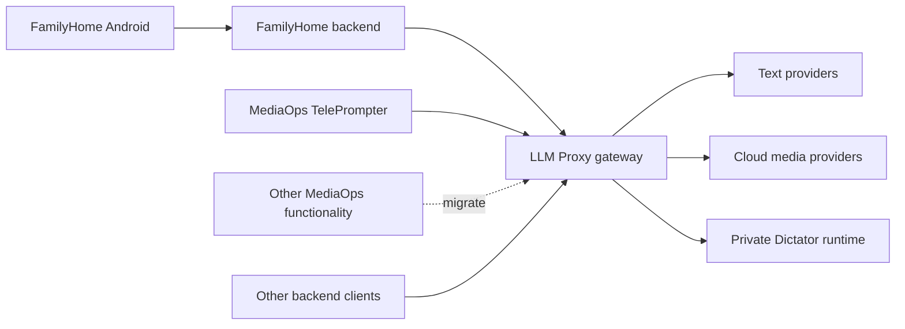

# Media Gateway Consolidation

## Decision And Status

LLM Proxy becomes the shared gateway for text, images, video, speech, and other media capabilities.
MediaOps retains only the TelePrompter application. Other MediaOps functionality moves to LLM Proxy.
The operator confirmed this boundary on 2026-09-14. It replaces the earlier creator-product boundary.
FamilyHome uses the gateway through its backend.
Dictator remains a private runtime behind the gateway.

P011 records this implementation plan on 2026-09-06.
The 2026-09-08 revision adds provider catalog, protocol adapter, and second-provider acceptance requirements.
MediaOps P006 records the earlier plan. This ownership revision supersedes its broader MediaOps retention decision.
F071 owns the remaining application migration. Provider capability issues retain their separate delivery boundaries.
F022 delivered the common durable media service through controlled provider
protocols. It establishes local runtime acceptance for the shared lifecycle.
Live provider acceptance remains with each provider capability issue.

The product has one gateway API, tenant model, credential lifecycle, provider catalog, and usage view.
The gateway can contain separate adapters and workers within the same repository.
The first release extends the existing Go service and its database.
Dictator continues to run in its existing process.

## Ownership And Authentication

| Concern | Owner |
| --- | --- |
| Parent login, family access, calendars, child interface, product budgets | FamilyHome |
| TelePrompter interface, project editing, and user access | MediaOps |
| Other applications, shared narration, composition execution, review, and YouTube workflows | LLM Proxy under F071 |
| Tenant authentication, provider connections, routes, execution, usage | LLM Proxy |
| Speech engines, native jobs, GPU execution | Dictator |

Use an existing managed tenant and client key for each calling backend.
Use separate tenants where environments need independent credentials and usage.
An operator can manage multiple tenants through the existing management interface.
FamilyHome stores its gateway key in backend configuration.
TelePrompter uses a gateway tenant for its required backend operations.
Do not add gateway consumers to MediaOps for functionality that moves into LLM Proxy.
The parent does not configure provider services.

Reuse the existing bearer authentication adapter for the new media routes.
Asset upload, metadata, content, deletion, and official client calls use that
same authentication contract.
Use the same managed key identity and replacement behavior as existing gateway clients.
Authorize every operation, asset, voice, and history read against that tenant.
Return `404` for a resource owned by another tenant.
Keep provider credentials in managed provider connections or private runtime configuration.

FamilyHome maps its own product job to a gateway operation.
It checks family access before it returns status or bytes to Android.
A gateway tenant represents a calling backend. It does not replace family or project authorization.
F071 owns the migrated composition API and its resource authorization.
MediaOps F021 owns only the TelePrompter integration with that API.

## Verified Source And Reuse

The LLM Proxy source baseline is `2da5d87b6b536817bf8100391feb48a3d32208a7`.
Separate, uncommitted provider-audit changes are outside this plan's delivery.
The following paths define the existing foundation or the source to move.

| Source | Required use |
| --- | --- |
| `internal/proxy/management_store.go` | Reuse managed tenants, provider connections, SQLite access, and usage ownership. |
| `internal/proxy/client_protocols.go` | Reuse bearer authentication against managed tenant keys. |
| `internal/proxy/assets.go` | Extend the existing asset identity and byte store with output reads and active references. |
| `internal/proxy/structured_requests.go` | Preserve current text behavior through integration tests before any shared extraction. |
| `internal/proxy/provider_transport.go` | Integrate media network work with I046 capacity limits. |
| `configs/providers.yml` | Extend the canonical catalog with qualified media routes and typed controls. |
| `pkg/llmproxycontract`, `docs/openapi.yaml` | Define the canonical media resources and error shapes. |
| `pkg/llmproxyclient` | Add media methods to the existing official Go client. |
| MediaOps `internal/media/provider` | Move provider request translation, native recovery, and provider-specific tests by capability. |
| MediaOps `internal/media/mcp` | Move shared tool contracts and workflows to LLM Proxy. Retain only helpers required by TelePrompter. |
| MediaOps `internal/mediajobs/api` | Move shared jobs and execution to LLM Proxy. Preserve TelePrompter project references. |
| MediaOps `internal/timelineexport` | Move shared composition and export execution to LLM Proxy. Keep TelePrompter controls in MediaOps. |

The asset store provides authenticated upload, metadata, content, and deletion.
Durable active references prevent deletion while an operation owns an input or
output.
Its metadata uses files. Managed tenant data already uses SQLite.
The structured text store also uses files and a process-local mutex.
Its terminal cleanup and failed-request retry behavior remain separate from paid
media operations. The media operation store owns paid-operation recovery.

## Provider Catalog And Protocol Adapters

This contract applies to every migrated capability and each later provider addition.
The [provider catalog contract](provider-catalog.md) defines the current provider data and the procedure for a compatible provider addition.
The media migration extends that same catalog and registry.
The schema validates provider definitions and transport-component composition.
Executable components implement the supported API behavior.

| Layer | Owner and responsibility |
| --- | --- |
| Provider catalog | `configs/providers.yml` owns provider fields, transports, offerings, operations, controls, limits, prices, and transport-component selection. |
| Request and response codecs | Reusable code owns native request serialization, response parsing, errors, continuation, and usage translation. |
| Authentication components | Reusable code owns credential injection. Credential values remain in managed connection or private runtime storage. |
| Execution components | Reusable code owns synchronous completion, submission, observation, cancellation, and provider recovery. |
| Shared media service | F022 owns tenant authorization, operation storage, worker claims, duplicate prevention, assets, retention, and usage delivery. I046 owns network capacity. |
| Consumer services | TelePrompter, FamilyHome, WriterBlock, and other actual consumers use official gateway clients for their required operations. |

Keep credential values and tenant settings in their existing stores outside the catalog.
Use catalog projections for provider discovery, connection forms, capability validation, routing, and price metadata.
Compose executable routes from the declared request codec, response codec,
authentication, and execution lifecycle.
Keep provider identity as route data in the shared service.
Keep native API behavior inside reusable transport components.

Before each capability slice, record its provider offering, component
composition, supported controls, and required assets.
Classify each addition with the following table.

| Condition | Required change |
| --- | --- |
| Existing components implement the complete contract. | Add catalog data and connection values. Keep production code unchanged. Complete the second-provider acceptance procedure below. |
| The provider needs an unsupported codec variation. | Add or extend the reusable request or response codec and its strict schema contract. Then add the provider definition. |
| The provider needs a new capability or lifecycle. | Add the typed capability or shared execution lifecycle first. Then add its codec and catalog records. |

Compare authentication, request fields, response fields, controls, errors, usage, and execution lifecycle before selecting an adapter.
A shared endpoint name or an OpenAI compatibility claim does not establish that complete match.
Current catalog mappings must match implemented component contracts.
Reject unsupported component declarations and incompatible controls at the applicable startup or request boundary.
Add new behavior through typed code and its schema contract, rather than executable expressions in provider data.

### Acceptance Through A Second Provider

F022 provides the reusable acceptance harness and the shared service boundary.
Each capability issue owns this acceptance for every transport component that it adds or extends.
F024 supplies the first image proof. F039 through F043 and F025 through F027 apply the same requirement to their slices.

1. Start the real service with its YAML loader, SQLite database, filesystem, and official client.
2. Exercise one provider through a controlled implementation of the selected external protocol.
3. Add a second provider identity with the same codecs and lifecycle.
   Use a different supported authentication configuration.
4. Give the second definition distinct connection fields, endpoint values, and upstream model identifiers where the protocol permits them.
5. Supply test credentials through the existing connection contract.
6. Reload the catalog through normal service startup. Use the same service executable, clients, and component implementations for both definitions.
7. Use public HTTP and browser assertions for provider discovery, generated connection forms, and capability metadata.
8. Use public assertions for routing, accepted controls, tenant isolation, artifact downloads, and one execution usage event per operation.
9. Exercise duplicate requests, process restart, cancellation, and result recovery according to the declared protocol contract.
10. Make sure the result records uncertainty or unsupported cancellation when the remote outcome cannot be established.
11. Make sure an invalid adapter declaration stops startup. Make sure an unsupported request causes zero provider dispatch.
12. Record the catalog changes, test configuration, unchanged executable, and public test results in the slice's acceptance evidence.

The second provider requires only catalog data, connection values, and controlled test infrastructure after the components exist.
If that addition requires production changes, complete the missing shared contract before accepting the slice.
Keep fictional provider definitions in test fixtures only.
This procedure proves architectural reuse. Qualify each actual provider separately through authorized live acceptance.

## First API Contract

The first consumer submits one image request, reads its operation, and downloads its result.
Operation creation validates the request and records the selected route before dispatch.
That stored request is the execution contract.
A separate public plan resource is outside the first release.
Exact price estimates are optional catalog evidence, independent from acceptance.

All new media resources use the existing `/model/v1` namespace.
The table specifies planned additions and the asset authorization change.
F022 updated the server, OpenAPI, contract types, and official client together.

| Method and resource | Result |
| --- | --- |
| `GET /model/v1/capabilities` | Tenant-available capabilities, routes, supported controls, and limits. |
| `POST /model/v1/assets` | Existing upload identity with canonical bearer authentication and streaming input. |
| `GET /model/v1/assets/{asset_id}` | Tenant-owned metadata, state, MIME type, byte count, and expiry. |
| `GET /model/v1/assets/{asset_id}/content` | Bounded output or input byte stream. |
| `DELETE /model/v1/assets/{asset_id}` | Existing deletion with active-reference protection. |
| `POST /model/v1/operations` | `202`, an opaque operation identifier, and `Location`. Require `Idempotency-Key`. |
| `GET /model/v1/operations/{operation_id}` | Current state, output asset references, timestamps, and typed error evidence. |
| `PUT /model/v1/operations/{operation_id}/cancellation` | Idempotent cancellation request with its observed outcome. |

Use the existing asset identifier for each generated output.
An artifact is an output asset attached to an operation.
Keep ordered output references in the operation result.
Keep native provider identifiers and byte digests in private records.
The service verifies byte integrity. The client verifies the authenticated transfer and expected byte count.

Use typed capability inputs, including provider, model, prompt, controls, and asset references where required.
Reject unsupported controls before acceptance.
Return the original operation with `200` for the same tenant, key, and request intent.
Return `409` for a different intent under an accepted key.
Resolve accepted requests before current catalog validation, so later catalog changes cannot break retrieval or authorize duplicate work.
Return explicit expiry evidence when output bytes are gone.
Keep the accepted key bound to that operation.

Add typed Go methods for capability discovery, creation, status, cancellation, upload, and download.
A wait timeout must return the accepted operation identifier.
A caller disconnect must stop waiting without cancelling accepted work.
An explicit cancellation request controls cancellation.

## Persistence And Execution Decisions

F022 uses operation, claim, asset-reference, usage-delivery, and tombstone tables
in the existing managed SQLite database.
The first deployment has one API process with bounded in-process workers and the existing persistent asset volume.
The service periodically reads outstanding operations from SQLite. It queues
undispatched work without a live claim. It recovers dispatched work through the
media operation adapter after an expired claim.
Additional process replicas require their own qualification before activation.

Create tables for operations, worker claims, input references, output references, and usage delivery records.
Use a unique tenant-and-key constraint and transactional compare-and-set updates.
Keep the normalized request, selected route, catalog revision, and credential-version reference in the operation record.
Keep credential values outside that record.
A revoked credential prevents a new dispatch through that connection.
Existing provider jobs require an authorized connection to the same provider account for recovery.
The worker compares the current connection identifier and version with the accepted credential reference before dispatch or recovery.
A changed reference prevents adapter execution. Dispatched work remains uncertain when its accepted authority is unavailable.
The adapter receives the checked credential reference.
The service permits one acceptance transaction at a time.
The transaction reads capacity before it inserts the operation.

Persist acceptance and input references before dispatch.
Extend asset deletion and cleanup to consult those durable references.
Coordinate reference creation with byte publication and deletion.
Reconcile interrupted file publication through restart tests with the real database and filesystem.
Keep active inputs and staged outputs until the operation reaches its documented completion boundary.
Active input references prevent upload expiry during reads, timer cleanup, and startup cleanup.
Uncertain operations keep their active inputs. Completion or confirmed cancellation releases input references.
After release, the normal upload expiry applies. Cleanup checks retained expired assets each minute.

Persist dispatch intent before the external call.
Give each worker claim a generation number and expiry.
Require that generation for every state change.
A replacement worker can resume only work that has no dispatch intent.
After dispatch intent, use recorded provider evidence to recover the result.
A stale worker cannot authorize another attempt.

Preserve the provider execution states `not_dispatched`, `dispatched`, `succeeded`, `failed`, and `uncertain` in private evidence.
Expose operation states `queued`, `running`, `succeeded`, `failed`, `cancelled`, and `uncertain` through one closed schema.
Keep cancellation observations separate from provider execution evidence.
Confirm `cancelled` only when work stopped before dispatch or the provider confirmed cancellation.
Keep an unsupported cancellation explicit and continue to observe the provider outcome.

If a response is lost after submission, recover through the provider's documented handle or idempotency mechanism.
If the provider cannot resolve that outcome, keep the operation `uncertain`.
A repeated client request returns that same operation.
A new paid attempt requires a new product action and key.
This contract prevents automatic duplicate submissions. It cannot guarantee provider-side exactly-once execution.

Use these initial values in explicit configuration and deterministic tests:

| Setting | Initial implementation value |
| --- | --- |
| First image operation lifetime | 900 seconds from acceptance |
| Worker claim lifetime and renewal | 60 seconds and 20 seconds |
| Terminal output retention | 172800 seconds, consistent with the existing asset retention |
| Idempotency tombstone retention | Tenant lifetime |
| Accepted media operations | 32 globally and 4 per tenant |
| Active provider HTTP requests | Existing global limit of 4, with at least 1 place reserved for interactive text |

Discard terminal prompts and request bodies after the retention boundary.
Keep only the tenant, key digest, intent digest, operation identifier, and terminal classification in each tombstone.
Keep unresolved operations and their necessary evidence until reconciliation or explicit disposition.
An operation deadline ends local execution authority. It does not prove that a remote provider stopped.
Validate the selected deployment values before activation.

I046 owns bounded queues, tenant fairness, provider-origin limits, and shared provider-account limits.
Distinguish accepted operations, active HTTP requests, polls, and byte transfers.
Release active HTTP capacity between polls.
Reserve bounded progress for text even when text and images use the same upstream origin.
All network work still obeys the configured global ceiling.

Record one execution usage event per accepted operation through a durable delivery record.
Use the operation identifier to deduplicate usage writes after restart.
Status reads and downloads do not create generation charges.
Keep unknown provider cost explicit.

## Delivery Sequence

Execute these slices in order. Each slice has one testable completion boundary.
Implementation starts with a failing test through the relevant public API or product entry point.

| Order | Issues | Delivery and completion boundary |
| --- | --- | --- |
| 0 | P011, MediaOps P006 | Record this plan and align the current migration issues. |
| 1 | F022 | Deliver the operation store, worker, asset reads, REST contract, and official Go client against controlled providers. |
| 2 | I046 | Prove bounded text progress during media saturation, including a shared origin and provider account. |
| 3 | F024 | Move terminal OpenAI image generation behind the tenant API. Qualify one image through the official client. |
| 4 | FamilyHome P003 and its implementation issue | Revise the product plan to call LLM Proxy. Complete backend and Android image acceptance. |
| 5 | MediaOps I009, F039, MediaOps I084 | Inventory source resources, connect required TelePrompter operations, and move the complete OpenAI image capability. |
| 6 | F042, MediaOps I087 | Move Dictator capabilities and retained resources. Migrate shared callers and connect required TelePrompter operations. |
| 7 | F043, F040, MediaOps I085 | Add required Google credentials and staging. Move Vertex image operations. |
| 8 | F041, MediaOps I086 | Move FAL image operations and their result recovery. |
| 9 | F025, MediaOps I010 | Move video capabilities in the provider order below. |
| 10 | F026, MediaOps I011 | Move ElevenLabs speech, music, voices, history, and alignment. |
| 11 | F027, MediaOps I012 | Move HeyGen and remaining Kling account/resource capabilities. |
| 12 | MediaOps I088, I244 | Reconcile provider migration receipts and remove obsolete provider dependencies and temporary import tools. |
| 13 | F071, MediaOps I092 and F021 | Move remaining applications and shared workflows. Verify that MediaOps retains only TelePrompter. |

Complete the provider catalog and protocol adapter acceptance above before each capability's consumer switch.
Keep its evidence with the same slice's migration receipt.

Within F025, use this order: Runway, Vertex, FAL, Kling, then xAI.
Complete each provider's API, official client, consumer switch, and acceptance before the next provider switch.
Each provider slice must preserve the controls currently exposed by MediaOps.
The OpenAI switch includes generation, editing, masks, ordered references, progressive output, and response chains.

F043 is a prerequisite only for a route that requires its staging or Google credential support.
An existing provider-readable HTTP route can use its qualified storage contract.
The first OpenAI generation slice uses the current tenant asset store directly.

F042 keeps `dictator` as the provider identity.
Move MediaOps `internal/media/provider/dictator/audio` into LLM Proxy's private provider implementation.
Expose `audio.transcribe`, `audio.diarize`, `audio.align`, `subtitles.create`, `audio.speech.generate`, and `audio.voice.extract` as durable operations.
Publish transcript, diarization, alignment, subtitle, audio, and timeline results only as tenant assets.
Give preset and extracted voices tenant-owned gateway identifiers.
Do not add a Dictator history resource because MediaOps does not retain Dictator history. F026 owns ElevenLabs history.
Keep native jobs, voice identifiers, engine choices, and runtime credentials private.
Use the current async Dictator routes as the only execution and recovery contract.
Configure each Dictator server through an account-owned provider connection.
Store `grpc_address`, `grpc_auth_token`, and `grpc_tls` in that connection.
Encrypt the bearer token through the current account credential store.
Assign the connection to each tenant that requires it.
Bind accepted work to the connection identity and version before dispatch or recovery.
Keep voice and job references bound to the server connection that created them.
Voice discovery returns only voices with current connection authority.
Address, token, and TLS changes invalidate the previous voice authority.
Reject an obsolete voice reference before operation acceptance.
The dashboard includes Dictator in its provider selector and speech capabilities in its Media tab.
Require a released Dictator SDK that contains the retained preset-voice and text-format fields.
Do not copy protobuf definitions or bind the production adapter to an unreleased pseudo-version.
Prove that a Dictator outage leaves unrelated cloud requests usable.
P008 GPU expansion has a separate delivery boundary.

The gateway accepts the following exact Dictator operation inputs. Each request
also supplies `provider: dictator`, `model: dictator-speech-v1`, and the named
capability. Unknown and irrelevant fields are invalid.

| Capability | Input | Controls |
| --- | --- | --- |
| `audio.transcribe` | `audio_asset_id` | Exactly one of `language` or `detect_language: true` |
| `audio.diarize` | `audio_asset_id` | Language selector, `model_size`, optional `utterance_gap_seconds` |
| `audio.align` | `audio_asset_id`, `transcript` | `language`, optional `remove_punctuation` |
| `subtitles.create` | `audio_asset_id`, optional `transcript` | Language selector, `granularity`, `group_size` |
| `audio.speech.generate` | `text`, opaque gateway `voice_id` | `language`, `text_format`, `sample_rate_hz`, optional duration and timeline controls |
| `audio.voice.extract` | `audio_asset_id`, `transcript`, `display_name`, `language` | `model_size` |

For `audio.diarize`, keep an explicit `utterance_gap_seconds: 0` through storage and the gRPC request.
Omission leaves the optional gRPC field absent and permits the Dictator default.

For `audio.speech.generate`, output ordinal `1` contains the requested timeline as JSON.
The public timeline contains only `textSegments`, with `content`, `start`, and `end` fields.
Times are nonnegative seconds. Each end time is at least its start time.
Validate native timeline fields before publication. Exclude native voice metadata and server paths.

For `audio.align`, output ordinal `0` contains JSON with the language and word timings.
Output ordinal `1` contains the aligned SRT bytes with MIME type `application/x-subrip`.
Both outputs are tenant assets. Native artifact identifiers remain private.

The adapter reads input bytes from the tenant asset store. It records the
native job handle immediately after Dictator accepts the request and before it
polls. Restart recovery and cancellation use only that private handle. It
publishes verified output bytes as tenant assets. A successful voice extraction
also creates one tenant-owned gateway voice and publishes only its public voice
document. Native jobs, source and result artifact identifiers, engine details,
and native voice references do not enter public responses or assets.

The service uses a separate bounded Dictator queue and worker setting. A full or
unavailable Dictator path does not consume the cloud media worker pool.

For each consumer switch, remove direct execution for that capability in the same source change.
Keep one active provider execution owner for that capability during the scheduled runtime switch.
Drain accepted direct work or import its proven recovery records before activation.
Remove a shared provider credential after its last direct capability switches.
Shared MediaOps workflows move to LLM Proxy. TelePrompter calls only the gateway operations required by its user flows.

### Dictator caller inventory

The source audit on 2026-09-14 found these direct callers.
This inventory does not establish production resource counts or complete activation.

| Caller | Source evidence | Required replacement |
| --- | --- | --- |
| MediaOps CLI and MCP | `internal/media/provider/dictator/audio/service.go` | Move retained shared functionality to LLM Proxy. Retire obsolete MediaOps entry points after caller acceptance. |
| MediaOps browser jobs | `internal/webapp/mediajobs_runtime.go`, `internal/mediajobs/api/dictator_speech_service.go` | Move shared execution to LLM Proxy. Connect required TelePrompter flows and preserve word timings and aligned SRT. |
| MediaOps diagnostics | `internal/media/doctor/dictator/service.go` | Retire the provider diagnostic surface after migration. Do not add a MediaOps tenant metrics client. |
| WriterBlock dictation | `internal/app/app.go`, `transcribeWithDictator` | Replace native transcription with the released gateway client. Preserve the `/api/dictate` result. |

The audit used MediaOps commit `547234ddecd7bee8daffa2dfa6ab980029c8bacd` and WriterBlock commit `b6d731411ed8135f13f43c1543d71c5a0bc860a3`.
MediaOps I087 owns the Dictator source migration, retained-data transfer, and required TelePrompter integration.
F042 includes the additional WriterBlock caller.
Preserve required timeline conversion in the migrated workflow. TelePrompter retains its project presentation and editing behavior.
Its extracted voice records are in `<workspace_root>/.mediaops/voices`.
MCP operation records are in `<workspace_root>/.mediaops/mcp/operations`.
The MCP server selects its workspace through `--workspace-root` or its process directory.
The backend YAML does not identify all caller workspaces.
Inventory that configured workspace and active jobs before activation.
Record each resource's tenant and provider connection. Do not infer an empty inventory from source files.
Resource inventory, destination migration, actual consumer integration, client publication, and live acceptance remain open.
A replacement MediaOps metrics client is not a completion requirement.

The revised `mediaops.doctor.dictator` result contains provider identity and route health only.
The operator requires tenant metrics only. MediaOps must not collect or expose Dictator server metrics.

`GET /model/v1/provider-diagnostics/dictator` returns retained operation counts with `scope: tenant`.
The gateway selects records by authenticated tenant and provider. Shared connections do not share these counts.
Each accepted operation counts once. The response counts queued, running, succeeded, failed, cancelled, and uncertain operations.

Terminal detail expiry removes its count. These counts are not lifetime usage or billing totals.
The read requires a current assignment and does not contact Dictator.
Go callers use `GetProviderDiagnostics`. Python callers use `get_provider_diagnostics`.

MediaOps removed native metrics collection. No replacement tenant metrics client is planned in MediaOps.
Tenant metrics remain a LLM Proxy resource. A future TelePrompter metric view requires its own concrete product requirement.

The latest published LLM Proxy module remains `v1.9.1` at this audit.
Its official client has no media operation, voice, or tenant diagnostic methods.
Release required methods before changing WriterBlock or a required TelePrompter client integration.
Publication is not required merely to move source code into LLM Proxy or retire a MediaOps diagnostic.
Do not substitute a direct HTTP client or an unpublished module reference.

## First Consumer Acceptance

FamilyHome P003 still describes Portal-to-MediaOps execution as of this review.
Revise P003 before implementing the image feature.
The current target is Android to FamilyHome backend to LLM Proxy to OpenAI.
FamilyHome retains its separate drawing activity and image-generation product decisions.

Use `provider=openai`, `model=gpt-image-2`, and `quality=low` for the first qualification.
Keep dimensions, format, prompt choices, family budgets, and simultaneous-job limits in FamilyHome configuration.
Close those P003 product decisions before Android acceptance.
Create the corresponding FamilyHome implementation issue after completion of the product plan.

1. Authenticate the parent through FamilyHome's selected family-access contract.
2. Create a FamilyHome image job with one stable product identifier.
3. Submit through the official Go client with that identifier as the gateway idempotency key.
4. Keep the returned operation identifier before the backend returns to Android.
5. Repeat the same request after a simulated lost response and verify one accepted gateway operation.
6. Retrieve the result through the FamilyHome backend after checking family access.
7. Verify that Android displays and saves the image under the selected product contract.
8. Verify rejection with a replaced key and isolation from another tenant and another family.
9. Verify one execution usage event and explicit failure or uncertainty evidence.
10. Record the service revision, client release, backend revision, device build, and provider result separately.

The complete flow proves the first product capability.
API tests alone do not establish Android or production acceptance.

## Data Migration And Source Removal

I009 starts with a read-only inventory of actual consumer workspaces and deployed stores.
Record capability, record count, schema, provider account, resource owner, target tenant, and recovery requirement.
Record retained voices, response chains, provider jobs, history references, and accepted local artifacts separately.
An empty inventory produces a zero-count receipt.

Create a bounded import tool only for records that must remain recoverable.
Require explicit tenant and provider-account mappings.
Preserve native handles without a new paid submission.
Reject incomplete mappings and conflicting ownership.
Map accepted product records to gateway resources before deleting their direct provider path.
Keep completed local artifacts in the product when further provider access is unnecessary.

Each switch produces a receipt with imported, excluded, rejected, and remaining counts.
Record source digests and gateway identifiers in private operator evidence.
I088 reconciles all receipts and proves zero remaining direct provider execution.
I244 removes only the import tools actually introduced by these migrations.
Remove obsolete adapters, provider secrets, recovery code, catalog copies, and provider tests after their new owner passes acceptance.
Move behavior and provider protocol tests with their functionality. Keep TelePrompter interaction tests in MediaOps.

## Validation And Release Gates

F022 must prove concurrent duplicate convergence, intent conflicts, tenant isolation, and zero dispatch for invalid input or credentials.
Use the real HTTP listener, SQLite database, filesystem, and official client.
Use controlled external-provider protocols for repeatable failure tests.
Apply the [second-provider acceptance procedure](#acceptance-through-a-second-provider) to the shared harness and each affected protocol adapter.

Exercise process death before dispatch, after dispatch intent, after provider acceptance, during output transfer, and during usage delivery.
Prove stale-worker rejection and explicit uncertainty where recovery is unavailable.
Exercise byte expiry, active-reference deletion, interrupted downloads, cancellation races, and tombstone retries.
Use controlled clocks and injected boundary failures to make these cases deterministic.

Each slice has four separate evidence records: source CI, client release, service activation, and consumer acceptance.
Qualify actual providers and the Dictator runtime separately from local protocol fixtures.
An operator performs production release and deployment through the existing repository lifecycle.
Record a failed acceptance against its owning slice before the next capability switch.

## Product Position And Remaining Decisions

Position the combined service as one gateway for AI capabilities.
MediaOps retains only TelePrompter. F071 owns migration of its other application functionality into LLM Proxy.
Keep the existing LLM Proxy name through the first consumer release.
A broader brand is a later product decision.

Before external gateway positioning, compare fal, Replicate, and Eden AI on the same representative workloads.
Measure supported controls, result quality, latency, failure recovery, operating cost, and integration effort.
Evaluate an aggregator as an upstream provider where it improves those outcomes.
A unified endpoint by itself is insufficient evidence of a product advantage.
Internal consolidation has an immediate purpose: one maintained tenant and provider boundary for our applications.

The remaining decisions have explicit owners:

- FamilyHome P003: image format, dimensions, input method, save behavior, family limits, and its implementation issue.
- F043: exact staging routes, Google credential mode, and provider-readable URL lifetime.
- F042: capability schemas and the disposition of existing transcription routes before its public release.
- F071: application resource ownership, composition API, and the remaining application migration.
- MediaOps F021: concrete TelePrompter composition flows through the gateway.
- Each activation: credentials, runtime values, retained-data inventory, and measured provider acceptance.

F028, F029, and F030 cover later AvatarV, MiniMax, and Speechify integrations.
MediaOps F022, F023, and F024 apply only to required TelePrompter exposure. Shared capability delivery belongs to LLM Proxy.
F071 inventories remaining creator workflow work, including MediaOps I027, I030, I031, P003, and P005.
Classify each requirement as a TelePrompter concern or functionality to migrate.
MediaOps I089 supplies source acceptance evidence for the temporary HTTP store. Its final owner follows the migrated execution service.
