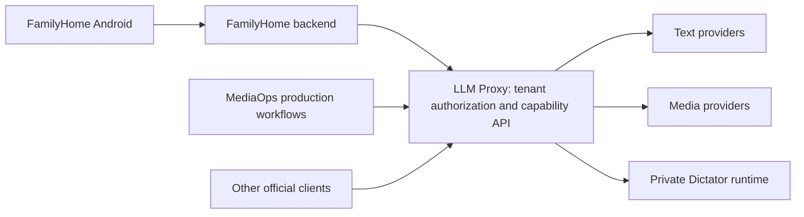

# Media Gateway Consolidation

## Decision And Status

The approved strategy assigns shared media provider access to LLM Proxy.
MediaOps retains production workflows and YouTube channel management.
This document records the strategy on 2026-09-04. The implementation issues remain open.
Source review, published releases, deployment, and consumer acceptance are separate evidence.

LLM Proxy uses its existing users, tenants, client credentials, provider settings, and official clients.
The FamilyHome backend authenticates with its configured LLM Proxy tenant credential.
FamilyHome owns login, families, child profiles, calendars, and product limits.
The gateway owns tenant authorization, provider dispatch, media operations, and provider artifacts.
An authenticated gateway tenant does not automatically authorize access to a production project.

Dictator remains a private media runtime. Its current caller is MediaOps.
After LLM Proxy F042 and MediaOps I087, LLM Proxy owns that internal connection.
Public clients use gateway capabilities. Dictator engines, credentials, native jobs, and artifact identifiers remain private.
The existing Dictator execution service can continue to run as a separate process.

Repository separation for production tools is a later decision.
First establish the ownership boundary and migrate each provider capability through it.

## Reuse The Existing Foundation

The source already has tenant assets, capability catalogs, usage accounting, and structured text request records.
F022 extends these contracts with durable media operations and output artifacts.
It adds methods to the official clients and schemas to `docs/openapi.yaml`.
Ordinary text requests retain their current response behavior.
Public media uses opaque identifiers and semantic metadata, as established by B163.
Byte integrity checks use private server metadata.

The structured text store requires changes before it can govern paid media retries.
Its current failed-request behavior can dispatch again with the same key.
Its retention cleanup can remove the original key record.
Media operations require an explicit contract for retry safety, uncertain dispatch, and expiry.

F043 owns provider-readable staging and typed Google workload credentials.
Providers that require these capabilities depend on F043.
The first OpenAI image operation can use the existing tenant asset store.

## Durable Operation Requirements

F022 must define these observable guarantees before provider implementation:

1. Persist the tenant, request digest, idempotency key, and selected route before provider dispatch.
2. Claim work through durable worker ownership with fencing against expired workers.
3. Record provider handles before later polling or artifact transfer.
4. Reconcile an uncertain submission before authorizing another paid attempt.
5. Reuse the original result for the same accepted request and key.
6. Reject a different request that uses an existing key.
7. Define accepted work lifetime independently from the initiating HTTP connection.
8. Keep cancellation requests separate from confirmed provider cancellation.
9. Protect operation reads, cancellation, artifacts, voices, and retained resources with tenant ownership.
10. Pin required assets until work and artifact transfer reach their documented terminal boundaries.
11. Define artifact retention separately from the idempotency tombstone lifetime.
12. Publish one canonical operation schema through the OpenAPI contract and official clients.

Use the existing five-state vocabulary where its meaning is suitable:
`not_dispatched`, `dispatched`, `succeeded`, `failed`, and `uncertain`.
F022 must decide how confirmed cancellation fits this model before implementation.
Native provider states remain private adapter evidence.

I046 must distinguish operation admission, active HTTP requests, provider polling, and artifact transfer capacity.
Polling waits must release active HTTP capacity.
Tests must cover text and media that share one provider origin.
Limits must also account for tenants that share the same upstream provider account.
Origin fairness alone cannot establish these guarantees.

Usage follows the existing F037 distinction between rejected requests and provider execution outcomes.
Status reads and artifact transfers must not become additional generation charges.
Unknown provider costs remain explicitly unavailable.

## Delivery Map

All identifiers below name issues in the indicated repository.

| Capability | LLM Proxy delivery | MediaOps consumer delivery |
| --- | --- | --- |
| Durable operations and official clients | F022 | I009: common consumer foundation |
| Shared request capacity | I046 | Validate through each consumer release |
| First terminal OpenAI image generation | F024 | FamilyHome first. Full MediaOps switch requires F039. |
| Complete OpenAI image controls | F039 | I084 |
| Vertex images | F040, with F043 | I085 |
| FAL images | F041. F043 where staged inputs are required. | I086 |
| Vertex, Runway, FAL, Kling, and xAI video | F025 | I010 |
| ElevenLabs speech, music, and resources | F026 | I011 |
| HeyGen avatars and Kling account operations | F027 | I012 |
| Dictator capabilities and retained voices | F042 | I087 |
| Provider-readable staging and Google credentials | F043 | Adopt through the relevant provider switch |
| Final migration cleanup | I244, formerly M021 | I088, formerly M001 |
| Later AvatarV integration | F028 | F022, formerly I015 |
| Later MiniMax integration | F029 | F023, formerly I020 |
| Later Speechify integration | F030 | F024, formerly I021 |

The issue graph records local dependencies. Issue bodies record dependencies in the other repository.
Existing completed issues keep their identifiers and resolution history.

## Implementation Sequence

1. Specify and implement F022 through failing public-contract integration tests.
2. Complete the I046 capacity guarantees required by the first media operation.
3. Deliver F024 through the API and official Go client.
4. Verify FamilyHome image generation through its backend and tenant credential.
5. Complete F039, then switch the full MediaOps OpenAI image capability in I084.
6. Deliver F042 and switch MediaOps Dictator calls in I087.
7. Deliver the remaining provider capabilities in product priority order.
8. Complete MediaOps I088 and its migration receipt after all selected consumer switches pass acceptance.
9. Complete LLM Proxy I244 after that receipt reconciles.

MediaOps I009 can start after the required F022 client contract is available.
The first FamilyHome image request explicitly selects `openai`, `gpt-image-2`, and `quality=low`.
Those selections belong to FamilyHome configuration.
Each additional provider issue must name its first supported operation and acceptance boundary.

A provider capability has one active execution owner during its scheduled switch.
The consumer switch removes direct execution for that capability in the same release.
Different capabilities can migrate in separate releases.
Remove a shared provider credential only after its final direct consumer capability switches.
OpenAI generation, editing, and progressive output must reach full parity before the complete MediaOps OpenAI switch.
This preserves the controls already exposed by MediaOps.

P008 remains the plan for additional GPU models and execution infrastructure.
F042 can migrate the existing Dictator capabilities independently of that hardware expansion.
Gateway worker claims and GPU scheduling leases have separate owners and lifetimes.

## Data And Credential Migration

First inventory retained records in each actual consumer workspace and deployed store.
Record counts, schema versions, provider accounts, product owners, and target tenants.
Create an import tool only for data that the inventory proves must move.
An empty inventory produces a zero-count receipt.

Each bounded import requires an explicit mapping to the target tenant and provider account.
Reject conflicting ownership, incomplete mappings, and invalid current records.
Provider reconciliation must preserve existing handles without submitting new paid work.
Remove each temporary importer after its required stores pass acceptance.

Production manifests retain product intent, accepted media, and gateway resource references.
The gateway owns provider recovery records and provider credentials.
Consumer configuration uses the canonical `llm_proxy` block and the official client.
Secrets remain in backend runtime configuration.

## Product Backlog And Open Decisions

MediaOps I027, I030, I031, P003, and P005 remain production workflow work.
MediaOps F021 now covers the production composition API and its public SDK boundary.
It requires a concrete external consumer and a product resource authorization decision before implementation.
FamilyHome image generation can proceed through LLM Proxy independently.

MediaOps I089, formerly B052, covers acceptance of its existing static HTTP temporary store.
The current source already contains that store and its HTTP integration test.
The remaining issue must prove the required caller and cleanup behavior.

LLM Proxy F036 browser controls and additional text-provider features retain their own priorities.
The first Go consumer depends on the media API and client acceptance described above.

The following implementation decisions remain open:

- F022: persistence backend, worker fencing, operation lifetime, artifact retention, and tombstone expiry.
- F022: cancellation representation and recovery after an uncertain submission.
- F042: public provider identifier, capability schemas, transcription routing, and retained voice mapping.
- F043: supported Google credential modes and provider-specific staging requirements.
- MediaOps F021: first composition consumer, resource authorization, and SDK package boundary.
- Each release: concrete runtime values and acceptance evidence through the existing repository lifecycle.

Resolve each decision in its owning issue before the dependent implementation starts.
Passing source tests establishes source validation. Release, deployment, and real consumer acceptance require separate evidence.
